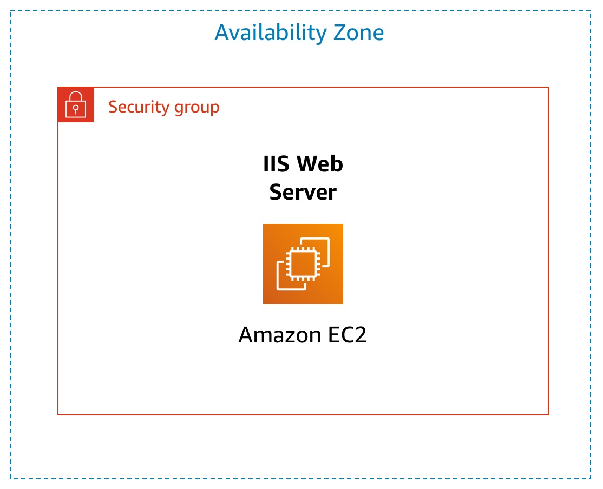
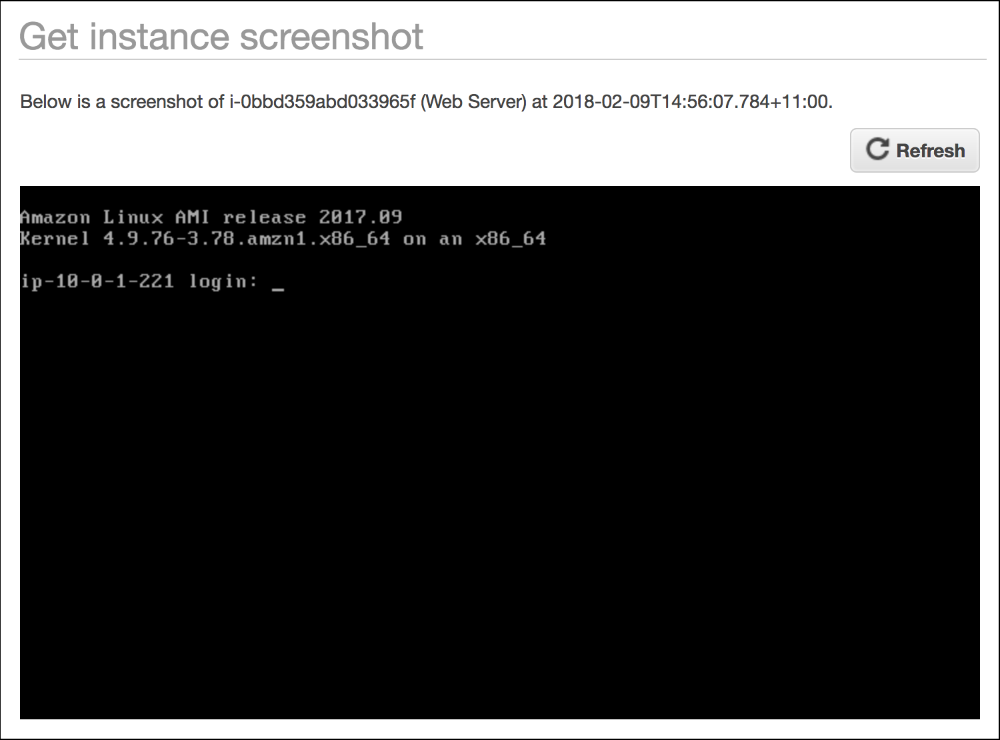

# Introducción a Amazon EC2

## Información general




En este laboratorio, se proporciona información general básica sobre el lanzamiento, la modificación del tamaño, la administración y el monitoreo de una instancia de Amazon EC2.

**Amazon Elastic Compute Cloud (Amazon EC2)** es un servicio web que ofrece capacidad de cómputo modificable en la nube. Está diseñado especialmente para facilitar a los desarrolladores el uso de la informática en la nube a escala de la web.

La sencilla interfaz de servicios web de Amazon EC2 le permite obtener y configurar la capacidad con una fricción mínima. Le brinda el control total de los recursos informáticos y le permite ejecutarlos en el entorno de informática comprobado de Amazon. Amazon EC2 reduce el tiempo necesario para obtener e iniciar nuevas instancias de servidor a tan solo minutos, lo que le permite aumentar o reducir la capacidad rápidamente, a medida que sus requisitos informáticos cambian.

Amazon EC2 cambia la economía de la informática, ya que le permite pagar solo por la capacidad que realmente utiliza. Amazon EC2 ofrece a los desarrolladores las herramientas necesarias para crear aplicaciones resistentes a errores y aislarse de las situaciones comunes de errores.


### Temas

Al final de este laboratorio, podrá hacer lo siguiente:

* Lanzar un servidor web con la protección contra terminación habilitada
* Monitorear la instancia EC2
* Modificar el grupo de seguridad que utiliza el servidor web para permitir el acceso HTTP
* Modificar el tamaño de la instancia de Amazon EC2 a la escala necesaria
* Explorar los límites de EC2
* Probar la protección contra terminación
* Terminar la instancia EC2


### Duración

El tiempo estimado para completar este laboratorio es de **45 minutos** aproximadamente.


## Acceso a AWS Management Console

1. En la parte superior de estas instrucciones, haga clic en <span id="ssb_voc_grey">Start Lab</span> (Iniciar laboratorio) para iniciar su laboratorio.

   Se abrirá el panel “Start Lab” (Iniciar laboratorio), donde se muestra el estado del laboratorio.

2. Espere hasta que aparezca el mensaje “**Lab status: ready**” (Estado del laboratorio: listo) y, luego, haga clic en la **X** para cerrar el panel “Start Lab (Iniciar laboratorio)”.

3. En la parte superior de estas instrucciones, haga clic en <span id="ssb_voc_grey">AWS</span>.

   Esto abrirá AWS Management Console en una nueva pestaña del navegador y el sistema iniciará su sesión automáticamente

   **Sugerencia**: Si no se abre una nueva pestaña del navegador, por lo general habrá un aviso o un ícono en la parte superior, el cual indicará que el navegador impide que el sitio abra ventanas emergentes. Haga clic en el aviso o el ícono y elija “Allow pop ups (Permitir ventanas emergentes)”.

4. Ubique la pestaña de AWS Management Console junto a estas instrucciones. El método más óptimo sería que pudiera ver ambas pestañas del navegador al mismo tiempo para facilitar el seguimiento de los pasos del laboratorio.


## Tarea 1: Lanzar una instancia de Amazon EC2

En esta tarea, lanzará una instancia de Amazon EC2 con _protección de terminación_. La protección de terminación impide que se termine accidentalmente una instancia EC2. Implementará su instancia con un script de datos de usuario que le permitirá implementar un servidor web simple.

5. En el menú **Services** (Servicios) de **AWS Management Console**, haga clic en **EC2**.

6. Haga clic en <span id="ssb_blue">Launch Instance</span> (Lanzar instancia).

### Paso 1: Elegir una imagen de Amazon Machine (AMI)

<i class="fas fa-info-circle"></i> Una **Imagen de Amazon Machine (AMI)** proporciona la información necesaria para lanzar una instancia, que es un servidor virtual en la nube. Una AMI incluye lo siguiente:

* Una plantilla para el volumen raíz de la instancia (por ejemplo, un sistema operativo o un servidor de aplicaciones con aplicaciones)
* Permisos de lanzamiento que controlan qué cuentas de AWS pueden utilizar la AMI para lanzar instancias
* Una asignación de dispositivos de bloques que especifica los volúmenes que deben asociarse a la instancia cuando se lanza

La lista **Quick Start** contiene las AMI más utilizadas. También puede crear su propia AMI o elegir una de AWS Marketplace, una tienda en línea en la que puede vender o comprar software que se ejecuta en AWS.

7. En la parte superior de la lista, haga clic en <span id="ssb_blue">Select</span> (Seleccionar), junto a **Amazon Linux 2 AMI** (AMI de Amazon Linux 2).


### Paso 2: Elegir el tipo de instancia

<i class="fas fa-info-circle"></i> Amazon EC2 ofrece una amplia selección de _tipos de instancias_ optimizados para adaptarse a diferentes casos de uso. Los tipos de instancias comprenden distintas combinaciones de CPU, memoria, almacenamiento y capacidad de red, y le ofrecen la flexibilidad necesaria a fin de elegir la combinación adecuada de recursos para sus aplicaciones. Cada tipo de instancia incluye uno o más _tamaños de instancias_, lo que le permite escalar sus recursos en función de los requisitos de la carga de trabajo de destino.

Utilizará una instancia **t3.micro**, que debería estar seleccionada <i class="fas fa-square" style="color:blue"></i> de forma predeterminada. Este tipo de instancia tiene 1 CPU virtual y 1 GiB de memoria. **NOTA**: Es posible que no pueda utilizar otros tipos de instancias en este laboratorio.

8. Haga clic en <span id="ssb_grey">Next: Configure Instance Details</span> (Siguiente: Configurar detalles de instancia).


### Paso 3: Configurar los detalles de la instancia

Esta página se utiliza para configurar la instancia a fin de que se ajuste a sus requisitos. Esto incluye la configuración de red y de monitoreo.

**Network** (Red) indica en cuál red virtual privada (VPC) desea lanzar la instancia. Puede tener varias redes, como redes diferentes para el desarrollo, las pruebas y la producción.

9. En **Network** (Red), seleccione **Lab VPC**.

   Lab VPC se creó con una plantilla de AWS CloudFormation durante el proceso de configuración del laboratorio. Esta VPC incluye dos subredes públicas en dos zonas de disponibilidad diferentes.

10. En **Enable termination protection** (Habilitar la protección de terminación), seleccione <i class="far fa-check-square"></i> **Protect against accidental termination** (Proteger contra la terminación accidental).

   <i class="fas fa-info-circle"></i> Cuando ya no se necesita una instancia de Amazon EC2, se puede _terminar_, lo que significa que la instancia se detiene y se liberan sus recursos. Una instancia terminar no se puede volver a iniciar. Si desea evitar que la instancia se termine accidentalmente, puede habilitar la opción _protección de terminación_ para la instancia y, de esta forma, impedirá que se termine.

11. Desplácese hacia abajo y, a continuación, expanda <i class="fas fa-caret-right"></i> **Advanced Details** (Detalles avanzados).

    Aparecerá el campo **User data** (Datos de usuario).

    <i class="fas fa-info-circle"></i> Cuando lanza una instancia, puede transmitirle _datos de usuario_, que se pueden utilizar para realizar tareas de configuración automatizadas comunes e, incluso, para ejecutar scripts después de iniciar la instancia.

    Dado que la instancia ejecuta Amazon Linux, tendrá que proporcionar un _script de shell_ que se ejecutará cuando se inicie la instancia.

12. Copie los siguientes comandos y péguelos en el campo **User data** (Datos de usuario):
 
    ```bash
    #!/bin/bash
    yum -y install httpd
    systemctl enable httpd
    systemctl start httpd
    echo '<html><h1>Hello From Your Web Server!</h1></html>' > /var/www/html/index.html
    ```

    El script:
    
    * Instalar un servidor web Apache (httpd)
    * Configurar el servidor web para que se inicie automáticamente al arrancar
    * Activar el servidor web
    * Crear una página web sencilla


13. Haga clic en <span id="ssb_grey">Next: Add Storage</span> (Siguiente: agregar almacenamiento).


### Paso 4: Agregar almacenamiento

<i class="fas fa-info-circle"></i> Amazon EC2 almacena los datos en un disco virtual asociado a la red que se denomina *Elastic Block Store*.

Lanzará la instancia de Amazon EC2 mediante un volumen de disco predeterminado de 8 GiB. Este será su volumen raíz (también conocido como volumen de “arranque”).

14. Haga clic en <span id="ssb_grey">Next: Add Tags</span> (Siguiente: agregar etiquetas).


### Paso 5: Agregar etiquetas

<i class="fas fa-info-circle"></i> Las etiquetas le permiten clasificar sus recursos de AWS de diferentes maneras, por ejemplo, de acuerdo con el propósito, el propietario o el entorno. Esto resulta útil cuando tiene muchos recursos del mismo tipo. Puede identificar un recurso específico rápidamente por las etiquetas que le haya asignado. Cada etiqueta consta de una clave y un valor que usted define.

15. Haga clic en <span id="ssb_grey">Add Tag</span> (Agregar etiqueta) y, luego, configure lo siguiente:

    * **Key** (Clave): `Name (Nombre)`
    * **Value** (Valor): `Web Server (Servidor web)`

16. Haga clic en <span id="ssb_grey">Next: Configure Security Group</span> (Siguiente: Configurar grupo de seguridad).


### Paso 6: Configurar un grupo de seguridad

<i class="fas fa-info-circle"></i> Un _grupo de seguridad_ actúa como un firewall virtual que controla el tráfico de una o más instancias. Cuando se lanza una instancia, usted asocia uno o más grupos de seguridad a la instancia. Agregue _reglas_ a cada grupo de seguridad que permitan el tráfico desde o hacia sus instancias asociadas. Puede modificar las reglas de un grupo de seguridad en cualquier momento. Las nuevas reglas se aplicarán automáticamente a todas las instancias asociadas al grupo de seguridad.

17. En el **Paso 6: Configurar un grupo de seguridad**, establezca los siguientes ajustes:

    * **Security group name** (Nombre del grupo de seguridad): `Web Server security group (Grupo de seguridad del servidor web)`
    * **Description** (Descripción): `Security group for my web server (Grupo de seguridad para mi servidor web)`

    En este laboratorio, no iniciará sesión en su instancia mediante SSH. Eliminar el acceso SSH mejorará la seguridad de la instancia.

18. Elimine <i class="fas fa-times-circle"></i> la regla SSH existente.

19. Haga clic en <span id="ssb_blue">Review and Launch</span> (Revisar y lanzar).


### Paso 7: Revisar el lanzamiento de la instancia

En la página “Review” (Revisar), se muestra la configuración de la instancia que está a punto de lanzar.

20. Haga clic en <span id="ssb_blue">Launch</span> (Lanzar).

    Aparecerá la ventana **Select an existing key pair or create a new key pair** (Seleccionar un par de claves existente o crear un nuevo par de claves).

    <i class="fas fa-info-circle"></i> Amazon EC2 utiliza la criptografía de clave pública para cifrar y descifrar la información de inicio de sesión. Para iniciar sesión en una instancia, debe crear un par de claves. Cuando lance la instancia, deberá especificar el nombre del par de claves y, cada vez que se conecte a dicha instancia, tendrá que proporcionar la clave privada.

    Debido a que en este laboratorio no iniciará sesión en la instancia, no necesita un par de claves.

21. Haga clic en el menú desplegable **Choose an existing key pair** (Elegir un par de claves existente) <i class="fas fa-angle-down"></i> y seleccione *Proceed without a key pair (Continuar sin un par de claves)*.

22. Seleccione <i class="far fa-check-square"></i> **I acknowledge that…** (Acepto que…).

23. Haga clic en <span id="ssb_blue">Launch Instances</span> (Lanzar instancias).

    Ahora se lanzará la instancia.

24. Haga clic en <span id="ssb_blue">View Instances</span> (Ver instancias).

    La instancia aparecerá en estado _pendiente_, lo que significa que se encuentra en la etapa de lanzamiento. A continuación, cambiará al estado _en ejecución_, lo cual indica que la instancia ha comenzado el proceso de arranque. Tendrá que aguardar un momento antes de poder acceder a la instancia.

    La instancia recibe un _nombre de DNS público_ que puede utilizar para contactarla desde Internet.

    Su <i class="fas fa-square" style="color:blue"></i> **Web Server** (Servidor web) debería estar seleccionado. En la pestaña **Description** (Descripción), se incluye información detallada sobre la instancia.

    <i class="fas fa-comment"></i> Para ver más información en la pestaña “Description” (Descripción), arrastre hacia arriba el divisor de la ventana.

    Revise la información que se muestra en la pestaña **Description** (Descripción). Incluye información acerca del tipo de instancia, de la configuración de seguridad y de la configuración de red.

25. Espere a que en la instancia aparezca lo siguiente:

    * **Instance State** (Estado de la instancia): <span style="color:green"><i class="fas fa-circle"></i></span> running (en ejecución)
    * **Status Checks** (Comprobaciones de estado): <span style="color:green"><i class="fas fa-check-circle"></i></span> 2/2 checks passed (2/2 comprobaciones aprobadas)

    <span style="color:blue"><i class="far fa-thumbs-up"></i></span> **¡Felicitaciones!** Ha lanzado correctamente su primera instancia de Amazon EC2.


## Tarea 2: Monitorear la instancia

El monitoreo es un factor importante a la hora de mantener el rendimiento, la disponibilidad y la fiabilidad de las instancias de Amazon Elastic Compute Cloud (Amazon EC2) y las soluciones de AWS.

26. Haga clic en la pestaña **Status Checks** (Comprobaciones de estado).

    <i class="fas fa-info-circle"></i> Con el monitoreo del estado de las instancias, puede determinar rápidamente si Amazon EC2 ha detectado algún problema que pudiera impedir que las instancias ejecuten aplicaciones. Amazon EC2 realiza comprobaciones automatizadas en cada instancia EC2 que está en ejecución para identificar los problemas de hardware y software.

    Observe que se ha aprobado tanto la comprobación de **System reachability** (Accesibilidad del sistema) como la de **Instance reachability** (Accesibilidad de la instancia).

27. Haga clic en la pestaña **Monitoring** (Monitoreo).

    En esta pestaña, se muestran las métricas de Amazon CloudWatch para su instancia. En este momento, no hay muchas métricas para mostrar porque la instancia se lanzó recientemente.

    Puede hacer clic en un gráfico para ver una vista expandida.

    <i class="fas fa-info-circle"></i> Amazon EC2 envía las métricas de sus instancias EC2 a Amazon CloudWatch. El monitoreo básico (cinco minutos) está habilitado de forma predeterminada. Puede habilitar el monitoreo detallado (un minuto).

28. En el menú <span id="ssb_grey">Actions<i class="fas fa-angle-down"></i></span> (Acciones), seleccione **Instance Settings** (Configuración de la instancia) <i class="fas fa-caret-right"></i> **Get System Log** (Obtener registro del sistema).

    El registro del sistema muestra el resultado de consola de la instancia, que es una herramienta valiosa para el diagnóstico de problemas. Resulta especialmente útil para solucionar los problemas de kernel y los problemas de configuración del servicio que podrían hacer que una instancia se termine o se vuelva inaccesible antes de que se pueda iniciar su daemon de SSH. Si no ve un registro del sistema, espere unos minutos y vuelva a intentarlo.

29. Desplácese por el resultado. Observe que se instaló el paquete HTTP a partir de los **user data** (datos de usuario) que agregó cuando creó la instancia.

    

30. Haga clic en <span id="ssb_blue">Close</span> (Cerrar).

31. En el menú <span id="ssb_grey">Actions<i class="fas fa-angle-down"></i></span> (Acciones), seleccione **Instance Settings** (Configuración de la instancia) <i class="fas fa-caret-right"></i> **Get Instance Screenshot** (Obtener captura de pantalla de la instancia).

    Así se vería la consola de la instancia de Amazon EC2 si estuviera asociada a una pantalla.

    

    <i class="fas fa-info-circle"></i> Si no puede acceder a su instancia a través de SSH o RDP, puede efectuar una captura de pantalla de la instancia y verla como una imagen. Esto ofrece visibilidad del estado de la instancia y permite solucionar los problemas más rápido.

32. Haga clic en <span id="ssb_blue">Close</span> (Cerrar).

    <span style="color:blue"><i class="far fa-thumbs-up"></i></span> **¡Felicitaciones!** Ha analizado varias formas de monitorear la instancia.


## Tarea 3: Actualizar el grupo de seguridad y acceder al servidor web

Cuando lanzó la instancia EC2, proporcionó un script que instaló un servidor web y creó una página web sencilla. En esta tarea, accederá al contenido desde el servidor web.


33. Haga clic en la pestaña **Description** (Descripción).

34. Copie la **IPv4 Public IP** (dirección IP pública IPv4) de la instancia en el portapapeles.

35. Abra una nueva pestaña del navegador web, pegue la dirección IP que acaba de copiar y presione **Enter** (Intro).

    **Pregunta:** ¿Puede acceder al servidor web? ¿Por qué no?

    Actualmente, **no** puede acceder al servidor web porque el _grupo de seguridad_ no permite el tráfico entrante en el puerto 80, que se utiliza para las solicitudes web HTTP. Esta es una demostración del uso de un grupo de seguridad como firewall para restringir el tráfico de red que tiene permitido entrar y salir de una instancia.

    Para corregir esta situación, debe actualizar el grupo de seguridad, de manera que permita el tráfico web en el puerto 80.

36. Deje abierta la pestaña del navegador, pero vuelva a la pestaña de la **EC2 Management Console** (consola de administración de EC2).

37. En el panel de navegación de la izquierda, haga clic en **Security Groups** (Grupos de seguridad).

38. Seleccione <i class="fas fa-square" style="color:blue"></i> **Web Server security group** (Grupo de seguridad del servidor web).

39. Haga clic en la pestaña **Inbound** (Entrante).

    Actualmente, el grupo de seguridad no tiene reglas.

40. Haga clic en <span id="ssb_grey">Edit</span> (Editar) y, a continuación, configure lo siguiente:

    * **Type** (Tipo): _HTTP_
    * **Source** (Origen): _Anywhere (Cualquiera)_
    * Haga clic en <span id="ssb_blue">Save</span> (Guardar).

41. Vuelva a la pestaña del servidor web que abrió antes y actualice <i class="fas fa-sync"></i> la página.

    Debería ver este mensaje: _Hello From Your Web Server! (¡Saludos de parte de su servidor web!)_

    <span style="color:blue"><i class="far fa-thumbs-up"></i></span> **¡Felicitaciones!** Ha modificado correctamente su grupo de seguridad para permitir el tráfico HTTP en su instancia de Amazon EC2.


## Tarea 4: Modificar el tamaño de la instancia (tipo de instancia y volumen de EBS)

A medida que cambian sus necesidades, puede notar que su instancia está sobreutilizada (es demasiado pequeña) o infrautilizada (es demasiado grande). Si es así, puede cambiar el _tipo de instancia_. Por ejemplo, si una instancia _t3.micro_ es demasiado pequeña para su carga de trabajo, puede cambiarla a una instancia _m5.medium_. Del mismo modo, puede cambiar el tamaño del disco.


### Detener la instancia

Para poder cambiar el tamaño de una instancia, antes debe _detenerla_.

<i class="fas fa-info-circle"></i> Cuando detiene una instancia, esta se apaga. Una instancia EC2 detenida no genera cargos, pero sí se mantienen los cargos de almacenamiento por los volúmenes de Amazon EBS que están asociados a ella.

42. En la **EC2 Management Console** (consola de administración de EC2), en el panel de navegación izquierdo, haga clic en **Instances** (Instancias).

    <i class="fas fa-square" style="color:blue"></i> **Web Server** (Servidor web) ya debería estar seleccionado.

43. En el menú <span id="ssb_grey">Actions <i class="fas fa-angle-down"></i></span> (Acciones), seleccione **Instance State** (Estado de la instancia)<i class="fas fa-caret-right"></i> **Stop** (Detener)

44. Haga clic en <span id="ssb_blue">Yes, Stop</span> (Sí, detener).

    La instancia se apagará de forma normal y, a continuación, dejará de ejecutarse.

45. Espere a que **Instance State** (Estado de la instancia) se muestre como <span style="color:red"><i class="fas fa-circle"></i></span>stopped (detenida)

### Cambiar el tipo de instancia

46. En el menú <span id="ssb_grey">Actions<i class="fas fa-angle-down"></i></span> (Acciones), seleccione **Instance Settings** (Configuración de la instancia) <i class="fas fa-caret-right"></i> **Change Instance Type** (Cambiar el tipo de instancia) y, a continuación, configure lo siguiente:

    * **Instance Type** (Tipo de instancia): *t3.small*
    * Haga clic en <span id="ssb_blue">Apply</span> (Aplicar).

    Cuando se vuelva a iniciar la instancia, esta será de tipo _t3.small_, que tiene el doble de memoria que una instancia _t3.micro_. **NOTA**: Es posible que no pueda utilizar otros tipos de instancias en este laboratorio.

### Modificar el tamaño del volumen de EBS

47. En el menú de navegación izquierdo, haga clic en **Volumes** (Volúmenes).

48. En el menú <span id="ssb_grey">Actions<i class="fas fa-angle-down"></i></span> (Acciones), seleccione **Modify Volume** (Modificar volumen).

    El volumen del disco tiene actualmente un tamaño de 8 GiB. Ahora aumentará el tamaño de este disco.

49. Cambie el tamaño a `10`. **NOTA**: Es posible que en este laboratorio no se puedan crear volúmenes grandes de Amazon EBS.

50. Haga clic en <span id="ssb_grey">Modify</span> (Modificar)

51. Haga clic en <span id="ssb_blue">Yes</span> (Sí) para confirmar y aumentar el tamaño del volumen.

52. Haga clic en <span id="ssb_blue">Close</span> (Cerrar).

### Iniciar la instancia con tamaño nuevo

A continuación, iniciará nuevamente la instancia, pero ahora con más memoria y más espacio en disco.

53. En el panel de navegación izquierdo, haga clic en **Instances** (Instancias).

54. En el menú <span id="ssb_grey">Actions <i class="fas fa-angle-down"></i></span> (Acciones), seleccione **Instance State** (Estado de la instancia)<i class="fas fa-caret-right"></i> **Start** (Iniciar)

55. Haga clic en <span id="ssb_blue">Yes, Start</span> (Sí, iniciar).

    <span style="color:blue"><i class="far fa-thumbs-up"></i></span> **¡Felicitaciones!** Ha cambiado correctamente el tamaño de la instancia de Amazon EC2. En esta tarea, cambió el tipo de instancia de _t3.micro_ a _t3.small_ y modificó el volumen del disco raíz de 8 GiB a 10 GiB.


## Tarea 5: Explorar los límites de EC2

Amazon EC2 ofrece diferentes recursos que puede utilizar. Estos recursos incluyen imágenes, instancias, volúmenes e instantáneas. Cuando se crea una cuenta de AWS, existen límites predeterminados para estos recursos según la región.

56. En el panel de navegación de la izquierda, haga clic en **Limits** (Límites).

    Tenga en cuenta que hay un límite respecto de la cantidad de instancias que puede lanzar en esta región. Cuando se lanza una instancia, la solicitud no puede provocar que su uso exceda el límite de instancias actual en esa región.

    Puede solicitar un aumento para muchos de estos límites.


## Tarea 6: Probar la protección de la terminación

Puede eliminar su instancia cuando ya no la necesite. Esto se denomina _terminación_ de la instancia. No puede conectarse a una instancia ni reiniciarla una vez que se haya terminado.

En esta tarea, aprenderá a utilizar la _protección de terminación_.

57. En el panel de navegación izquierdo, haga clic en **Instances** (Instancias).

58. En el menú <span id="ssb_grey">Actions <i class="fas fa-angle-down"></i></span> (Acciones), seleccione **Instance State** (Estado de la instancia)<i class="fas fa-caret-right"></i> **Terminate** (Terminar)

    Tenga en cuenta que hay un mensaje que dice: *Estas instancias tienen protección de terminación y no se terminarán. Utilice la opción Cambiar protección de terminación del menú Acciones de la pantalla Instancias para permitir la terminación de estas instancias. *

    Además, el botón <span id="ssb_blue">Yes, Terminate</span> (Sí, terminar) está atenuado y no se puede utilizar.

    Esta es una medida de protección para evitar la terminación accidental de una instancia. Si realmente desea terminarla, deberá desactivar la protección de terminación.

59. Haga clic en <span id="ssl_alexa_ocean">Cancel</span> (Cancelar).

60. En el menú <span id="ssb_grey">Actions<i class="fas fa-angle-down"></i></span> (Acciones), seleccione **Instance Settings** (Configuración de la instancia) <i class="fas fa-caret-right"></i> **Change Termination Protection** (Cambiar protección de terminación).

61. Haga clic en <span id="ssb_blue">Yes, Disable</span> (Sí, deshabilitar).

    Ahora ya puede terminar la instancia.

62. En el menú <span id="ssb_grey">Actions <i class="fas fa-angle-down"></i></span> (Acciones), seleccione **Instance State** (Estado de la instancia)<i class="fas fa-caret-right"></i> **Terminate** (Terminar)

63. Haga clic en <span id="ssb_blue">Yes, Terminate</span> (Sí, terminar).

    <span style="color:blue"><i class="far fa-thumbs-up"></i></span> **¡Felicitaciones!** Ha probado la protección de terminación y ha terminado la instancia correctamente.


## Recursos adicionales

* <a href="https://docs.aws.amazon.com/AWSEC2/latest/UserGuide/LaunchingAndUsingInstances.html" target="_blank">Lanzar la instancia</a>
* <a href="https://aws.amazon.com/ec2/instance-types" target="_blank">Tipos de instancias de Amazon EC2</a>
* <a href="https://docs.aws.amazon.com/AWSEC2/latest/UserGuide/AMIs.html" target="_blank">Imágenes de Amazon Machine (AMI)</a>
* <a href="https://docs.aws.amazon.com/AWSEC2/latest/UserGuide/user-data.html" target="_blank">Amazon EC2: datos de usuario y scripts de shell</a>
* <a href="https://docs.aws.amazon.com/AWSEC2/latest/UserGuide/RootDeviceStorage.html" target="_blank">Volumen de dispositivo raíz de Amazon EC2</a>
* <a href="https://docs.aws.amazon.com/AWSEC2/latest/UserGuide/Using_Tags.html" target="_blank">Etiquetado de los recursos de Amazon EC2</a>
* <a href="https://docs.aws.amazon.com/AWSEC2/latest/UserGuide/using-network-security.html" target="_blank">Grupos de seguridad</a>
* <a href="https://docs.aws.amazon.com/AWSEC2/latest/UserGuide/ec2-key-pairs.html" target="_blank">Pares de claves de Amazon EC2</a>
* <a href="https://docs.aws.amazon.com/AWSEC2/latest/UserGuide/monitoring-system-instance-status-check.html?icmpid=docs_ec2_console" target="_blank">Comprobaciones de estado para sus instancias</a>
* <a href="https://docs.aws.amazon.com/AWSEC2/latest/UserGuide/instance-console.html" target="_blank">Cómo conseguir el resultado de la consola y reiniciar las instancias</a>
* <a href="https://docs.aws.amazon.com/AmazonCloudWatch/latest/monitoring/ec2-metricscollected.html" target="_blank">Dimensiones y métricas de Amazon EC2</a>
* <a href="https://docs.aws.amazon.com/AWSEC2/latest/UserGuide/ec2-instance-resize.html" target="_blank">Cambiar el tamaño de la instancia</a>
* <a href="https://docs.aws.amazon.com/AWSEC2/latest/UserGuide/Stop_Start.html" target="_blank">Detener e iniciar la instancia</a>
* <a href="https://docs.aws.amazon.com/AWSEC2/latest/UserGuide/ec2-resource-limits.html" target="_blank">Service Limits de Amazon EC2</a>
* <a href="https://docs.aws.amazon.com/AWSEC2/latest/UserGuide/terminating-instances.html" target="_blank">Terminar una instancia</a>
* <a href="https://docs.aws.amazon.com/AWSEC2/latest/UserGuide/terminating-instances.html" target="_blank">Protección contra terminación de instancias</a>