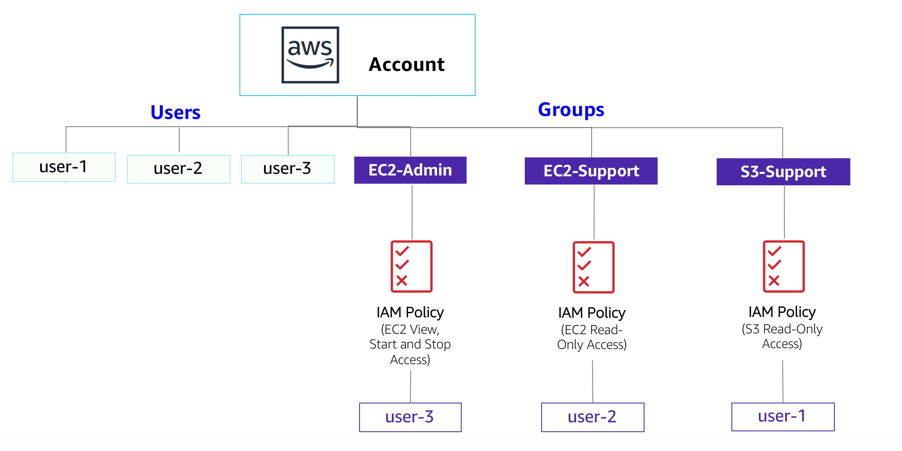
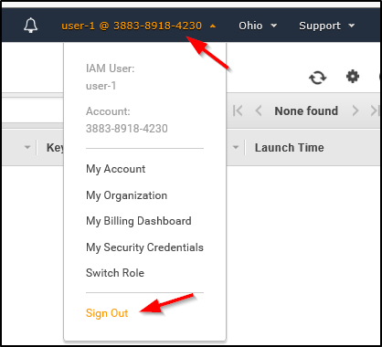
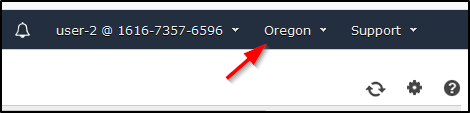
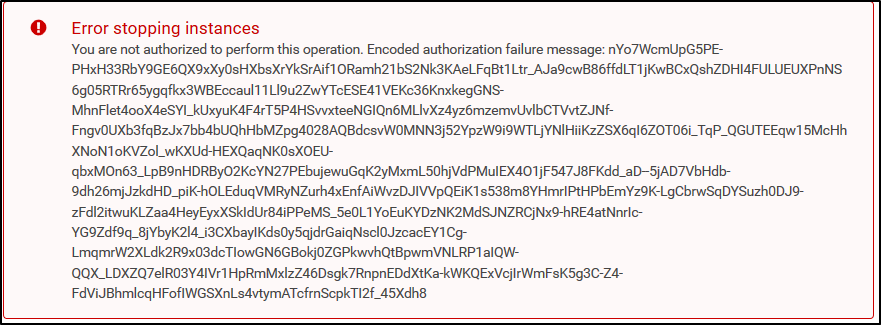
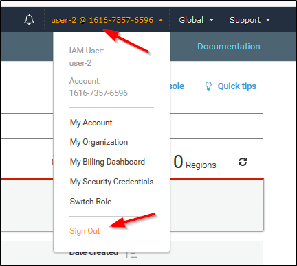

# Introducción a AWS Identity and Access Management (IAM) (Spanish)

En muchos entornos de negocios, el acceso involucra un inicio de sesión único en un equipo o una red de sistemas que proporciona al usuario acceso a todos los recursos de la red. Este acceso incluye los derechos a los archivos personales y compartidos en un servidor de red, intranet de empresas, impresoras y otros recursos y dispositivos de red. Los usuarios no autorizados pueden explotar rápidamente estos mismos recursos si el control de acceso y los procedimientos de autenticación asociados no están configurados correctamente.

En este laboratorio, explorará los usuarios, grupos de usuarios y políticas en el servicio AWS Identity and Access Management (IAM).

### Objetivos

Después de completar este laboratorio, podrá realizar lo siguiente:

 * Crear y aplicar una política de contraseñas de IAM
 * Analizar usuarios y grupos de usuarios de IAM creados previamente
 * Inspeccionar políticas de IAM según se apliquen a los grupos de usuarios creados previamente
 * Agregar usuarios a grupos de usuario con capacidades específicas activas
 * Ubicar y usar la URL de inicio de sesión de la IAM
 * Probar los efectos de las políticas en el acceso a los servicios

*Este es un diagrama del entorno actual con los usuarios de IAM y los grupos de IAM.*

## Otros servicios de AWS

  Durante el laboratorio, es posible que aparezcan mensajes de error cuando intente realizar acciones que no se ajusten a los pasos incluidos en este laboratorio. Los mensajes no afectarán su capacidad para completar el laboratorio.

**IAM**

  IAM se puede usar para lo siguiente:

  * **Administrar usuarios de IAM y su acceso:** puede crear usuarios y asignarles credenciales de seguridad individuales (claves de acceso, contraseñas y dispositivos con Multi-Factor Authentication). Puede administrar los permisos para controlar qué operaciones puede realizar cada usuario.

  * **Administrar roles de IAM y sus permisos:** un rol de IAM es similar a un usuario, ya que un rol es una identidad de AWS con políticas de permisos que establecen qué puede hacer o no la identidad en Amazon Web Services (AWS). Sin embargo, en lugar de estar asociado únicamente a una persona, el objetivo es que cualquiera que necesite el rol pueda asumirlo.

  Administrar usuarios federados y sus permisos: puede activar la identidad federada a fin de permitir que los usuarios existentes de su empresa puedan acceder a la Consola de administración de AWS, llamar a las interfaces de programación de aplicaciones (API) de AWS y acceder a los recursos sin necesidad de crear un usuario de IAM para cada identidad.

## Duración

El tiempo estimado para completar este laboratorio es de **60 minutos**.

## Cómo acceder a la Consola de administración de AWS

1. En la esquina superior derecha de estas instrucciones, seleccione <i class="fas fa-caret-right"></i> **Start Lab** (Comenzar laboratorio). 

    **Consejo para la solución de problemas**: Si aparece el error **Access Denied** (Acceso denegado), cierre el aviso de error y vuelva a seleccionar <i class="fas fa-caret-right"></i> **Start Lab** (Comenzar laboratorio).

2. La siguiente información indica el estado del laboratorio: 

    - Un círculo rojo junto a **<u>AWS <i class="fas fa-circle fa-xs" style="color:#ff0000;"></i></u>** en la esquina superior izquierda de esta página indica que el laboratorio no se ha iniciado.

    - Un círculo amarillo junto a **<u>AWS <i class="fas fa-circle fa-xs" style="color:#fff700;"></i></u>** en la esquina superior izquierda de esta página indica que el laboratorio se está iniciando.

    - Un círculo verde junto a **<u>AWS <i class="fas fa-circle fa-xs" style="color:#00ff7f;"></i></u>** en la esquina superior izquierda de esta página indica que el laboratorio está listo.

   Espere a que el laboratorio se encuentre listo antes de continuar.

3. En la parte superior de estas instrucciones, seleccione el círculo verde junto a **<u>AWS <i class="fas fa-circle fa-xs" style="color:#00ff7f;"></i></u>**

    La Consola de administración de AWS se abrirá en una pestaña nueva del navegador. El sistema iniciará la sesión de forma automática.

    **Sugerencia**: Si no se abre una pestaña nueva del navegador, suele aparecer un anuncio o un ícono en la parte superior de este con un mensaje donde se indica que el navegador impide que el sitio web abra ventanas emergentes. Seleccione el banner o el ícono, y elija **Allow pop ups** (Permitir ventanas emergentes).

4. Si ve un cuadro de diálogo que le indica que debe cambiar al inicio de la nueva consola, seleccione **Switch to the new Console Home** (Cambiar al inicio de la nueva consola).

5. Ajuste la pestaña de la Consola de administración de AWS para que aparezca junto a estas instrucciones. Idealmente, debería poder ver ambas pestañas del navegador al mismo tiempo para seguir los pasos del laboratorio.

    <i class="fas fa-exclamation-triangle"></i> **No cambie la región del laboratorio a menos que se le indique específicamente**.

## Tarea 1: Crear una política de contraseña de cuenta

En esta tarea, creará una política de contraseña personalizada para su cuenta de AWS. Esta política afecta a todos los usuarios asociados con la cuenta.

6. Primero, anote la región en la que se encuentra; por ejemplo, **Oregon** [Oregón]). La esquina superior derecha de la página de la consola muestra su región.

7. En la Consola de administración de AWS, en el cuadro de búsqueda <i class="fas fa-search"></i>, ingrese `IAM` y selecciónelo.

8. En el panel de navegación izquierdo, elija **Account settings** (Configuración de la aplicación).

   Aquí puede ver la política de contraseña predeterminada que está en vigencia actualmente. La empresa en la que está trabajando tiene requisitos mucho más estrictos y tiene que actualizar esta política.

9. Seleccione **Change password policy** (Cambiar política de contraseñas).

10. En **Select your account password policy requirements** (Seleccionar los requisitos de políticas de contraseñas de su cuenta), configure las siguientes opciones:

    - En **Enforce minimum password length** (Aplicar longitud de contraseña mínima), cambie `8` a `10` caracteres.

    - Seleccione todas las casillas excepto la casilla para **Password expiration requires administrator reset** (El vencimiento de contraseña requiere un restablecimiento por el administrador).

    - En **Enable password expiration** (Habilitar vencimiento de contraseña), deje la opción predeterminada de **90** días. 

    - En **Prevent password reuse** (Prevenir reutilización de contraseña), deje la opción predeterminada de **5** contraseñas.

11. Seleccione **Save changes** (Guardar los cambios).

    Estos cambios se aplican en el nivel de cuenta de AWS y se aplican a todos los usuarios asociados con la cuenta.

### Resumen de la Tarea 1

En esta tarea, fortaleció los requisitos de la contraseña al crear una política de contraseñas predeterminada. Las varias opciones de contraseña que seleccionó ahora han hecho que las contraseñas que los usuarios crearán sean mucho más difíciles de vulnerar.

## Tarea 2: Analizar los usuarios y los grupos de usuarios

En esta tarea, analizará los usuarios y grupos de usuarios que ya se crearon para usted en IAM.

12. En el panel de navegación izquierdo, haga clic en **Users** (Usuarios).

    Ya se crearon los siguientes usuarios de IAM para usted:

     * user-1
     * user-2
     * user-3

13. Elija **user-1**.

    Esta opción lo llevará a una página **Summary** (Resumen) para **user-1**. Se muestra la pestaña **Permissions** (Permisos). 
    
    Observe que user-1 no tiene permisos.

14. Seleccione la pestaña **Groups** (Grupos).

    user-1 tampoco es miembro de ningún grupo de usuarios.
    
    <i class="fas fa-info-circle"></i> Un grupo de usuarios consta de varios usuarios que necesitan acceder a los mismos datos. Los privilegios se pueden distribuir al grupo de usuarios completo en lugar de a cada individuo. Esta opción es mucho más eficaz cuando aplica permisos y proporciona un mayor control general del acceso a los recursos que aplicar permisos a los individuos.

15. Elija la pestaña **Security credentials** (Credenciales de seguridad).

    user-1 tiene asignada una **Console password** (Contraseña de consola).

16. En el panel de navegación de la izquierda, elija **User groups** (Grupos de usuarios).

    Los siguientes grupos de usuarios ya están creados:

    * EC2-Admin
    * EC2-Support
    * S3-Support

17. Elija el grupo **EC2-Support**.

    Esta opción le muestra la página **Summary** (Resumen) del grupo **EC2-Support**.

18. Seleccione la pestaña **Permissions** (Permisos).

    Este grupo se encuentra asociado a una política administrada que se llama **AmazonEC2ReadOnlyAccess**. Las políticas administradas son políticas prediseñadas (que creó AWS o sus administradores) que se pueden adjuntar a grupos o grupos de usuarios de IAM. Cuando la política se actualiza, los cambios se implementan inmediatamente en los usuarios y grupos de usuarios adjuntos a ella.

19. Junto a la política **AmazonEC2ReadOnlyAccess**, seleccione el signo más para mostrar la política.

    Una política define qué acciones se permiten o niegan para determinados recursos de AWS. Esta política concede permiso para listar y describir información sobre Amazon Elastic Compute Cloud (EC2), Elastic Load Balancing (ELB), Amazon CloudWatch y Amazon EC2 Auto Scaling. Esta capacidad para ver recursos, pero no para modificarlos, es ideal para asignar a la función de soporte.

    A continuación está la estructura básica de la statements de una política de IAM:

     *  **Effect** (Efecto) indica si **Allow** (Permitir) o **Deny** (Denegar) los permisos.
     *  **Action** (A acción) especifica las llamadas de API que se pueden realizar contra un servicio AWS (por ejemplo, *cloudwatch:ListMetrics*).
     *  **Resource** (Recuurso) define el alcance de las entidades cubiertas porr la regla de política (por ejemplo, un bucket de  Amazon Simple Storage Service [Amazon S3], una instancia de EC2, o * que significa *cualquier recurso*).

20. En el panel de navegación de la izquierda, elija **User groups** (Grupos de usuarios).

21. Elija el grupo **S3-Support**.

22. Seleccione la pestaña **Permissions** (Permisos).

    El grupo S3-Support está asociado a la política **AmazonS3ReadOnlyAccess**.

23. Junto a la política **AmazonS3ReadOnlyAccess**, seleccione el signo más para mostrar la política. 

    La política tiene permisos para obtener y hacer una lista de recursos en Amazon S3.

24. En el panel de navegación de la izquierda, elija **User groups** (Grupos de usuarios).

25. Elija el grupo **EC2-Admin**.

26. Seleccione la pestaña **Permissions** (Permisos).

    Este grupo difiere levemente de los otros dos. En lugar de tener una política administrada, tiene una política **insertada de cliente**, que es una política asignada a un único usuario o grupo. Las políticas insertadas, generalmente, se usan para asignar permisos a situaciones aisladas.

27. Junto a la política **EC2-Admin-Policy**, seleccione el signo más para mostrar la política. 

    La política concede permiso para ver (describir) información acerca de Amazon EC2 y también la capacidad de iniciar o detener instancias.

### Resumen de la Tarea 2

En esta tarea, pudo ver usuarios creados previamente, junto con los grupos de usuarios creados previamente. Aprendió acerca de las políticas adjuntos a los grupos de usuarios y cuáles son las diferencias entre los grupos de usuarios y sus permisos.

28. En **Actions** (Acciones), haga clic en el enlace **Show Policy** (Mostrar política).

    Una política define qué acciones se permiten o niegan para determinados recursos de AWS. Esta política concede permiso para listar y describir información sobre Amazon Elastic Compute Cloud (EC2), Elastic Load Balancing (ELB), Amazon CloudWatch y Amazon EC2 Auto Scaling. Esta capacidad para ver recursos, pero no para modificarlos, es ideal para asignar a la función de soporte.

    A continuación está la estructura básica de la statements de una política de IAM:

     *  **Effect** (Efecto) indica si **Allow** (Permitir) o **Deny** (Denegar) los permisos.
     *  **Action** (A acción) especifica las llamadas de API que se pueden realizar contra un servicio AWS (por ejemplo, *cloudwatch:ListMetrics*).
     *  **Resource** (Recuurso) define el alcance de las entidades cubiertas porr la regla de política (por ejemplo, un bucket de  Amazon Simple Storage Service [Amazon S3], una instancia de EC2, o * que significa *cualquier recurso*).

29. Para cerrar la ventana **Show Policy** (Mostrar política), seleccione <i class="fa fa-times"></i>

30. En el panel de navegación de la izquierda, elija **User groups** (Grupos de usuarios).

31. Elija el grupo **S3-Support**.

    El grupo S3-Support está asociado a la política **AmazonS3ReadOnlyAccess**.

32. Desde el menú **Actions** (Acciones), seleccione el enlace **Show Policy** (Mostrar política).

    La política tiene permisos para obtener y hacer una lista de recursos en Amazon S3.

33. Para cerrar la ventana **Show Policy** (Mostrar política), seleccione <i class="fa fa-times"></i>.

34. En el panel de navegación de la izquierda, elija **User groups** (Grupos de usuarios).

35. Elija el grupo **EC2-Admin**.

    Este grupo difiere levemente de los otros dos. En lugar de tener una política administrada, tiene una política **insertada de cliente**, que es una política asignada a un único usuario o grupo. Las políticas insertadas, generalmente, se usan para asignar permisos a situaciones aisladas.

36. Para ver la política, vaya a **Actions** (Acciones) y seleccione **Show Policy** (Mostrar política).

    La política concede permiso para ver (describir) información acerca de Amazon EC2 y también la capacidad de iniciar o detener instancias.

37. Para cerrar la política, vaya a la parte inferior de la pantalla y haga clic en **Cancel** (Cancelar).

### Resumen de la Tarea 2

En esta tarea, pudo ver usuarios creados previamente, junto con los grupos de usuarios creados previamente. Aprendió acerca de las políticas adjuntos a los grupos de usuarios y las diferencias entre los grupos de usuarios y sus permisos.

## Situación empresarial

Durante el resto del laboratorio, trabajará con estos usuarios y grupos de usuarios para activar los permisos que admiten el siguiente caso empresarial:

Nuestra empresa está ampliando el uso de AWS y utiliza muchas instancias de EC2 y un gran volumen de almacenamiento de Amazon S3. Usted desea otorgar acceso a los nuevos miembros del personal según su función laboral:

|Usuario|En un grupo|Permisos|
|----|--------|-----------|
|user-1|S3-Support|Read-only access to Amazon S3 (Acceso de solo lectura a Amazon S3)|
|user-2|EC2-Support|Read-only access to Amazon S3 (Acceso de solo lectura a Amazon EC2)|
|user-3|EC2-Admin|Ver, iniciar y detener instancias EC2|

## Tarea 3: Agregar usuarios a los grupos de usuarios

Recientemente contrató a **user-1** para un rol que brindará soporte a Amazon S3. Lo agregará al grupo **S3-Support** para que pueda heredar los permisos necesarios mediante la política AmazonS3ReadOnlyAccess adjunta.

<i class="fa fa-comment"></i>Puede ignorar los errores **no autorizados** que aparezcan durante esta tarea. Se provocan porque su cuenta de laboratorio tiene permisos limitados, pero esto no debería afectar su capacidad para completar el laboratorio.

### Agregar a user-1 al grupo S3-Support.

38. En el panel de navegación de la izquierda, elija **User groups** (Grupos de usuarios).

39. Elija el grupo **S3-Support**.

40. Seleccione la pestaña **Users** (Usuarios).

41. En la pestaña **Users** (Usuarios), elija **Add users** (Agregar usuarios).

42. En la ventana **Add users to S3-Support** (Agregar usuarios a S3-Support), configure las siguientes opciones:

    * Seleccione la casilla que corresponde a <i class="fa fa-check-square-o"></i>**user-1**.
    * Seleccione **Add users** (Agregar usuarios).

    En la pestaña **Users** (Usuarios), verá que user-1 se agregó al grupo.

### Agregar a user-2 al grupo EC2-Support.

Contrató a **user-2** con el rol de brindar soporte a Amazon EC2.

43. Usando los pasos anteriores en esta tarea, agregue **user-2** al grupo **EC2-Support**.

    Ahora, user-2 debería formar parte del grupo **EC2-Support**.

### Agregar a user-3 al grupo EC2-Admin

Contrató a **user-3** como administrador de Amazon EC2 para que administre sus instancias EC2.

44. Usando los pasos anteriores en esta tarea, agregue **user-3** al grupo **EC2-Admin**.

    Ahora, user-3 debería formar parte del grupo **EC2-Admin**.

45. En el panel de navegación de la izquierda, elija **User groups** (Grupos de usuarios).

    Cada grupo debería tener un **1** en la columna **Users** (Usuarios) como representación de la cantidad de usuarios de cada grupo.

    Si no hay un **1** junto a cada grupo, revise las instrucciones anteriores en esta tarea para confirmar que cada usuario se encuentre asignado a un grupo, como se muestra en la tabla al principio de la sección **Business scenario** (Situación empresarial).

### Resumen de la Tarea 3

En esta tarea, agregó todos los usuarios asociados a los grupos de usuarios. 

## Tarea 4: Iniciar sesión y probar permisos de usuarios

En esta tarea, probará los permisos de cada usuario de IAM.

46. En el panel de navegación izquierdo, seleccione **Dashboard** (Panel).

    La sección **AWS Account** (Cuenta de AWS) incluye una **URL de inicio de sesión para los usuarios de IAM en esta cuenta**. Este enlace debe tener un aspecto similar al siguiente: **https&#58;//123456789012.signin.aws.amazon.com/console**

    Puede usar este enlace para iniciar sesión en la cuenta de AWS que está usando.

47. Copie la **URL de inicio de sesión para usuarios de IAM en esta cuenta** a un editor de texto.

48. Abra una ventana privada usando las siguientes instrucciones para su navegador web.

    **Mozilla Firefox**

    * Elija las barras de menú <i class="fa fa-bars"></i> de la parte superior derecha de la pantalla.
    * Seleccione **New Private Window** (Nueva ventana privada).

    **Google Chrome**

    * Elija los puntos suspensivos <i class="fa fa-ellipsis-v"></i> de la parte superior derecha de la pantalla.
    * Elija **New incognito window** (Nueva ventana de incógnito).

    **Microsoft Edge**

    * Elija los puntos suspensivos <i class="fa fa-ellipsis-h"></i> de la parte superior derecha de la pantalla.
    * Elija **New InPrivate window** (Nueva ventana InPrivate).

    **Microsoft Internet Explorer**

    * Elija la opción de menú **Tools** (Herramientas).
    * Elija **InPrivate Browsing** (Navegación InPrivate).

49. Pegue la **URL de inicio de sesión para usuarios de IAM en esta cuenta** en la ventana privada y presione Intro.

    Ahora iniciará sesión como **user-1**, a quien se contrató como personal de soporte para el almacenamiento de Amazon S3.

50. Inicie sesión con las siguientes credenciales:

    * **IAM user name (Nombre de usuario AIM):** Ingrese `user-1`
    * **Password (Contraseña):** Ingrese `Lab-Password1`

51. Seleccione **Sign in** (Iniciar sesión).

    Si ve un cuadro de diálogo que le indica que debe cambiar al inicio de la nueva consola, seleccione **Switch to the new Console Home** (Cambiar al inicio de la nueva consola).

52. En el menú **Services** (Servicios), elija **S3**.

53. Haga clic en el nombre de uno de los buckets y busque el contenido.

    Debido a que el usuario forma parte del grupo **S3-Support** en IAM, tiene permiso para ver una lista de buckets de S3 y su contenido.

    Ahora, pruebe si tienen acceso a Amazon EC2.

54. En el menú **Services** (Servicios), seleccione **EC2**.

55. En el panel de navegación izquierdo, elija **Instances** (Instancias).

    No puede ver ninguna instancia. En su lugar, verá un mensaje que dice **You are not authorized to perform this operation** (No está autorizado para realizar esta operación). Este mensaje aparece ya que el usuario no tiene ningún permiso para utilizar Amazon EC2.

    Ahora, iniciará sesión como **user-2**, a quien se contrató como personal de soporte para Amazon EC2.

56. Cierre la sesión de user-1 en la **Consola de administración de AWS** mediante los siguientes pasos:

    * En la parte superior de la pantalla, elija **user-1**.
    * Seleccione **Sign out** (Cerrar sesión).

    

57. Pegue la **URL de inicio de sesión para usuarios de IAM en esta cuenta** en la ventana privada y presione Intro.

    Este enlace debe estar en su editor de texto.

58. Inicie sesión con las siguientes credenciales:

     * **IAM user name (Nombre de usuario AIM):** Ingrese `user-2`
     * **Password (Contraseña):** Ingrese `Lab-Password2`

59. Seleccione **Sign in** (Iniciar sesión).

    Si ve un cuadro de diálogo que le indica que debe cambiar al inicio de la nueva consola, seleccione **Switch to the new Console Home** (Cambiar al inicio de la nueva consola).

60. En el menú **Services** (Servicios), seleccione **EC2**.

61. En el panel de navegación izquierdo, elija **Instances** (Instancias).

    Ahora puede ver una instancia de EC2 porque tiene permisos de solo lectura. Sin embargo, no podrá realizar ninguna modificación en los recursos de Amazon EC2.

    <i class="fa fa-exclamation-triangle"></i> Si la instancia de EC2 no es visible, es posible que la región sea incorrecta. En la parte superior derecha de la pantalla, seleccione el menú **Region** (Región) y seleccione la región que anotó al principio del laboratorio (por ejemplo, **Oregon** [Oregón]).

    

    La instancia de EC2 debe estar seleccionada<i class="fa fa-check-square-o"></i>. Si no lo está, selecciónela <i class="fa fa-check-square-o"></i>.

62. Desde la lista desplegable **Instance state** (Estado de la instancia), seleccione **Stop instance** (Detener instancia).

63. En la ventana **Stop instance?** (¿Detener instancia?), elija **Stop** (Detener).

    

    Recibirá un error que dice, **Failed to stop the instance. You are not authorized to perform this operation** (No se pudo detener la instancia. No está autorizado a realizar la operación). Este mensaje demuestra que la política le otorga el permiso solo para ver información y no para realizar cambios.

64. En la ventana **Stop instances** (Detener instancias), elija **Cancel** (Cancelar).

    Luego, verifique si user-2 puede acceder a Amazon S3.

65. En el menú **Services** (Servicios), elija **S3**.

    Recibirá el mensaje **You don't have permissions to list buckets** (No tiene permisos para listar buckets) porque user-2 no tiene permiso para usar Amazon S3.

    Ahora, iniciará sesión como **user-3**, a quien se contrató como administrador de Amazon EC2.

66. Cierre la sesión de user-2 en la **Consola de administración de AWS** mediante los siguientes pasos:

    * En la parte superior de la pantalla, elija **user-2**.
    * Seleccione **Sign out** (Cerrar sesión).

    

67. Pegue la **URL de inicio de sesión para usuarios de IAM en esta cuenta** en la ventana privada y presione Intro.

    Si este enlace no está en el portapapeles, recupérelo del editor de texto en el que lo pegó anteriormente.

68. Inicie sesión con las siguientes credenciales:

     * **IAM user name (Nombre de usuario AIM):** Ingrese `user-3`
     ***Password (Contraseña)**: Ingrese `Lab-Password3`

69. Seleccione **Sign in** (Iniciar sesión).

    Si ve un cuadro de diálogo que le indica que debe cambiar al inicio de la nueva consola, seleccione **Switch to the new Console Home** (Cambiar al inicio de la nueva consola).

70. En el menú **Services** (Servicios), seleccione **EC2**.

71. En el panel de navegación izquierdo, elija **Instances** (Instancias).

    Como administrador de EC2, debería tener permisos para detener la instancia de EC2. 

    Se debe seleccionar la instancia de EC2<i class="fa fa-check-square-o"></i>. Si no lo está, selecciónela <i class="fa fa-check-square-o"></i>.

    <i class="fa fa-exclamation-triangle"></i> Si la instancia de EC2 no es visible, es posible que la región sea incorrecta. En la parte superior derecha de la pantalla, seleccione el menú **Region** (Región) y seleccione la región que anotó al principio del laboratorio (por ejemplo, **Oregon** [Oregón]).

72. Desde la lista desplegable **Instance state** (Estado de la instancia), seleccione **Stop instance** (Detener instancia).

73. En la ventana **Stop instance?** (¿Detener instancia?), elija **Stop** (Detener).

    La instancia ingresará al estado **Stopping** (Deteniéndose) y se cerrará.

74. Cierre la ventana privada.

### Resumen de la Tarea 4

En esta tarea, pudo iniciar sesión como los tres usuarios. Comprobó que user-1 pudo ver los buckets S3 pero no pudo ver las instancias de EC2. Luego inició sesión como user-2 y comprobó que pudo ver las instancias de EC2 pero no pudo realizar la acción de detención de instancia. user-2 tampoco pudo ver los buckets S3. Después de iniciar sesión como user-3, pudo ver las instancias de EC2 y realizar la acción de detención de instancia.

## Conclusión

<i class="fas fa-flag-checkered"></i> ¡Felicitaciones! Aprendió a realizar correctamente las siguientes tareas:

 - Crear y aplicar una política de contraseñas de IAM

 - Analizar usuarios y grupos de IAM creados previamente

 - Inspeccionar políticas de IAM según se apliquen a los grupos creados previamente

 - Agregar usuarios a grupos de usuario con capacidades específicas activas

 - Ubicar y utilizar la dirección URL de inicio de sesión de IAM

 - Probar los efectos de las políticas en el acceso a los servicios
