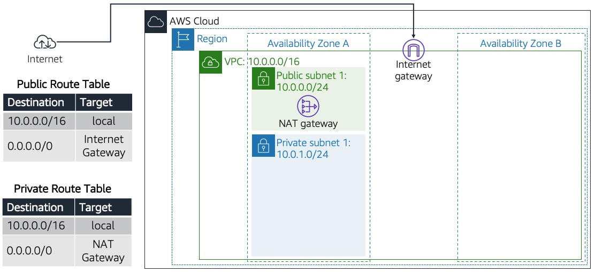
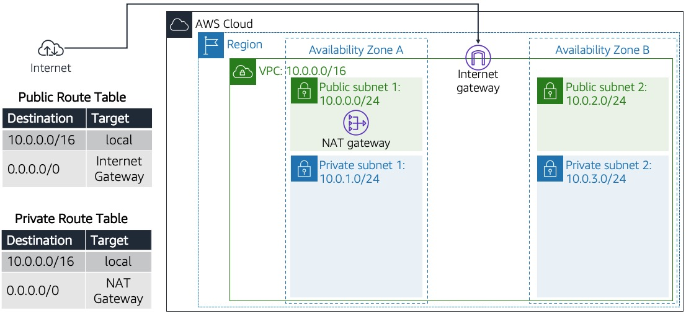
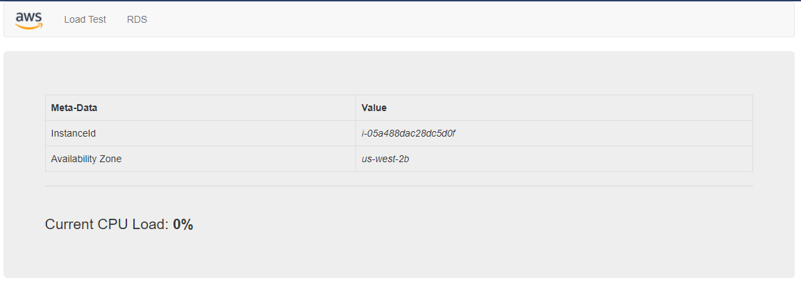

# Creación de una VPC y lanzamiento de un servidor web


### Objetivos

Después de completar este módulo, podrá hacer lo siguiente:

- Crear una Virtual Private Cloud (VPC)
- Crear subredes
- Configurar un grupo de seguridad
- Lanzar una instancia de Amazon Elastic Compute Cloud (Amazon EC2) en la VPC

### Duración

El tiempo estimado para completar este laboratorio es de **45 minutos**.

### Situación

En este laboratorio, deberá utilizar Amazon Virtual Private Cloud (VPC) para crear su propia VPC y agregar componentes adicionales con el fin de producir una red personalizada para una gran empresa. Además, creará grupos de seguridad para su instancia EC2. Deberá configurar y personalizar una instancia EC2 para ejecutar un servidor web y lanzarla en la VPC que se parece al siguiente diagrama del cliente:


### Diagrama del cliente


*Figura: El cliente solicita la creación de esta arquitectura para iniciar correctamente su servidor web.*


## Tarea 1: Crear una VPC

En esta tarea, utilizará el asistente de la VPC para crear una VPC, una puerta de enlace de Internet y dos subredes en una única zona de disponibilidad. Una puerta de enlace de Internet es un componente de la VPC que permite la comunicación entre las instancias de la VPC e Internet.

Después de crear una VPC, puede agregar subredes. Cada subred reside por completo en una zona de disponibilidad y no puede abarcar otras zonas. Si el tráfico de una subred se dirige a una puerta de enlace de Internet, la subred recibe el nombre de subred pública. Si una subred no dispone de una ruta a la puerta de enlace de Internet, la subred recibe el nombre de subred privada.

El asistente también creará una puerta de enlace de NAT, que se utiliza para brindar conectividad a Internet a instancias EC2 en las subredes privadas.

4. En la AWS Management Console, seleccione <i class="fas fa-th"></i> el menú **Services** (Servicios) y, luego, seleccione **VPC** en **Networking & Content Delivery** (Redes y entrega de contenido).

5. En el menú de navegación izquierdo, elija **Elastic IPs** (IP elásticas).

6. Elija **Allocate Elastic IP address** (Asignar dirección IP elástica).

7. En la página **Allocate Elastic IP address**(Asignar dirección IP elástica), deje la configuración como está y elija **Allocate**(Asignar).

8. En el panel de navegación izquierdo, elija **VPC Dashboard** (Panel de la VPC).

9. Elija **Launch VPC Wizard** (Lanzar el asistente de la VPC).

10. En **Step 1: Select a VPC Configuration** (Paso 1: Seleccionar una configuración de la VPC), elija **VPC with Public and Private Subnets** (VPC con subredes públicas y privadas).

11. Elija **Select** (Seleccionar).

12. En **Step 2: VPC with Public and Private Subnets** (Paso 2: VPC con subredes públicas y privadas), configure las siguientes opciones:

    - **VPC name** (Nombre de la VPC): ingrese `Lab VPC`.
    - **Availability Zone** (Zona de disponibilidad): en la lista desplegable, elija la primera zona de disponibilidad.
    - **Public subnet name** (Nombre de subred pública): ingrese `Public Subnet 1`.
    - **Availability Zone** (Zona de disponibilidad): en la lista desplegable, elija la primera zona de disponibilidad (la misma que se utilizó antes).
    - **Private subnet name** (Nombre de subred pública): ingrese `Private Subnet 1`.
    - **Elastic IP Allocation ID:** (ID de asignación de IP elástica) seleccione el cuadro y la dirección IP que se muestra.

13. Elija **Create VPC** (Crear VPC). Pueden pasar unos minutos hasta que la VPC esté disponible.

14. En la página **VPC Successfully Created** (VPC creada correctamente), seleccione **OK** (Aceptar).

    El asistente ha aprovisionado una VPC con una subred pública y una subred privada en la misma zona de disponibilidad, junto con tablas de enrutamiento para cada subred:

    
    *Figura: Las VPC, CIDR y la creación de tablas de enrutamiento públicas y privadas. Creó estas opciones con el asistente de la VPC.*

    La subred pública tiene un enrutamiento entre dominios sin clase (CIDR) de **10.0.0.0/24**, lo que significa que contiene todas las direcciones IP que comienzan con **10.0.0.x**.

    La subred privada tiene un CIDR de **10.0.1.0/24**, lo que significa que contiene todas las direcciones IP que comienzan con **10.0.1.x**.


## Tarea 2: Crear subredes adicionales

En esta tarea, creará dos subredes adicionales en una segunda zona de disponibilidad. Esto resulta útil para crear recursos en varias zonas de disponibilidad con el fin de proporcionar alta disponibilidad.

15. En el panel de navegación izquierdo, haga clic en **Subnets** (Subredes).


16. Para configurar la segunda subred pública, elija <span id="ssb_orange">Create subnet</span> (Crear subred) y configure las siguientes opciones:

    - **VPC ID** (ID de la VPC): en la lista desplegable, elija **Lab VPC** (VPC de laboratorio).
    - **Subnet name** (Nombre de subred): ingrese `Public Subnet 2`.
    - **Availability Zone** (Zona de disponibilidad): en la lista desplegable, elija la segunda zona de disponibilidad.
    - **IPv4 CIDR block** (Bloque de CIDR IPv4): ingrese `10.0.2.0/24`.

17. Elija **Create subnet** (Crear subred).

    La subred tendrá todas las direcciones IP que comiencen con **10.0.2.x**.

18. Para configurar la segunda subred privada, seleccione <span id="ssb_orange">Create subnet</span> (Crear subred) y configure las siguientes opciones:

    - **VPC ID** (ID de la VPC): en la lista desplegable, elija **Lab VPC** (VPC de laboratorio).
    - **Subnet name** (Nombre de subred): ingrese `Private Subnet 2`.
    - **Availability Zone** (Zona de disponibilidad): en la lista desplegable, elija la segunda zona de disponibilidad.
    - **IPv4 CIDR block** (Bloque de CIDR IPv4): ingrese `10.0.3.0/24`.

19. Elija **Create subnet** (Crear subred).

    La subred tendrá todas las direcciones IP que comiencen con **10.0.3.x**.


## Tarea 3: Crear una tabla de enrutamiento

Ahora configurará las subredes privadas para dirigir el tráfico de Internet a la puerta de enlace de NAT a fin de que los recursos de la subred privada puedan conectarse a Internet y, a la vez, mantenerse privados. Para ello, configure una tabla de enrutamiento.

Recuerde que una tabla de enrutamiento contiene una serie de reglas, llamadas rutas, que se usan para determinar hacia dónde se dirige el tráfico de red. Cada subred de una VPC debe estar asociada a una tabla de enrutamiento, que es la que controla el enrutamiento de la subred.

20. En el panel de navegación izquierdo, haga clic en **Route Tables** (Tablas de enrutamiento).

21. Para seleccionar la casilla de verificación de la tabla de enrutamiento, haga clic en **Yes** (Sí) en la columna **Main** (Principal) y en **Lab VPC** (VPC de laboratorio) en la columna **VPC** (si es necesario, expanda la columna **VPC** para ver el nombre de la VPC).

22. En el panel inferior, elija la pestaña **Routes** (Rutas).

    Recuerde que **Destination 0.0.0.0/0** (Destino 0.0.0.0/0) se encuentra establecido en **Target nat-xxxxxxxx** (Objetivo nat-xxxxxxxx). Esto significa que el tráfico destinado a Internet (0.0.0.0/0) se enviará a la puerta de enlace de NAT. Luego, la puerta de enlace de NAT reenviará el tráfico a Internet.

    Por lo tanto, esta tabla de enrutamiento se utiliza para dirigir el tráfico desde subredes privadas.

23. En la columna **Name** (Nombre) de esta tabla de enrutamiento, elija el lápiz <i class="fas fa-pencil-alt"></i>, ingrese `Private Route Table` y, luego, elija **Save** (Guardar).


## Tarea 4: Asociar las subredes y agregar rutas

24. En el panel inferior, haga clic en la pestaña **Subnet associations** (Asociaciones de subredes).

25. En **Subnets without explicit associations** (Subredes sin asociaciones explícitas), elija **Edit subnet associations** (Editar asociaciones de subredes).

26. Seleccione las casillas de verificación de **Private Subnet 1** (Subred privada 1) y **Private Subnet 2** (Subred privada 2).

27. Elija **Save associations** (Guardar asociaciones).

    Ahora configurará la tabla de enrutamiento que utilizan las subredes públicas.

28. Seleccione la casilla de verificación de la tabla de enrutamiento con **No** en la columna **Main** (Principal) y **Lab VPC** (VPC de laboratorio) en la columna **VPC**, y desactive las casillas de verificación de todas las otras tablas de enrutamiento.

29. En la columna **Name** (Nombre) de esta tabla de enrutamiento, elija el lápiz <i class="fas fa-pencil-alt"></i>, ingrese `Public Route Table` y, luego, elija **Save** (Guardar).

30. En el panel inferior, elija la pestaña **Routes** (Rutas).

    Tenga en cuenta que **Destination 0.0.0.0/0** (Destino 0.0.0.0/0) se encuentra establecido en **Target igw-xxxxxxxx** (Objetivo igw-xxxxxxxx), que es la puerta de enlace de Internet. Esto significa que el tráfico de Internet se enviará directamente a Internet mediante la puerta de enlace de Internet.

    Ahora, asociará esta tabla de enrutamiento a las subredes públicas.

31. Elija la pestaña **Subnet Associations** (Asociaciones de subredes).

32. En la sección **Subnets without explicit associations** (Subredes sin asociaciones explícitas), elija **Edit subnet associations** (Editar asociaciones de subredes).

33. Seleccione las casillas de verificación de **Public Subnet 1** (Subred privada 1) y **Subred privada 2** (Subred privada 2).

34. Elija **Save associations** (Guardar asociaciones).

    Ahora la VPC tiene subredes públicas y privadas configuradas en dos zonas de disponibilidad:

    
    *Figura: La creación de recursos de redes y componentes de enrutamiento, y cómo adjuntar estos recursos que hacen que la VPC sea funcional como una red.*


## Tarea 5: Crear un grupo de seguridad de la VPC

En esta tarea, creará un grupo de seguridad de la VPC, que actúa como un firewall virtual para su instancia. Cuando se lanza una instancia, se asocian a ella uno o varios grupos de seguridad. Puede agregar reglas a cada grupo de seguridad que permitan el tráfico hacia las instancias asociadas o desde ellas.

35. En el panel de navegación izquierdo, elija **Security Groups** (Grupos de seguridad).

36. Elija **Create security group** (Crear grupo de seguridad).

37. Configure el grupo de seguridad con las siguientes opciones:

    - **Security group name** (Nombre del grupo de seguridad) ingrese `Web Security Group`.
    - **Description** (Descripción): ingrese `Enable HTTP access`.
    - **VPC:** elija **Lab VPC** (VPC de laboratorio).

38. Elija **Create security group** (Crear grupo de seguridad).

    Ahora agregará una regla al grupo de seguridad para permitir las solicitudes web entrantes.

39. Elija la pestaña **Inbound rules** (Reglas de entrada).

40. Elija <span id="ssb_white">Edit inbound rules</span> (Editar reglas de entrada).

41. Elija **Add rule** (Agregar regla).

42. Configure las siguientes opciones:

    - **Type** (Tipo): elija **HTTP**.
    - **Source** (Fuente): elija **Anywhere** (En cualquier lugar).
    - **Description** (Descripción): ingrese `Permit web requests`.

43. Elija **Save rules** (Guardar reglas).

    En la siguiente tarea, utilizará este grupo de seguridad cuando lance una instancia EC2.


## Tarea 6: Lanzar una instancia de servidor web

En esta tarea, lanzará una instancia EC2 en la VPC nueva. Configurará la instancia para que actúe como un servidor web.


44. En AWS Management Console, seleccione <i class="fas fa-th"></i> el menú **Services** (Servicios) y, luego, seleccione **EC2** en **Compute** (Cómputo).

45. Elija <span id="ssb_orange">Launch instances</span> (Lanzar instancias).

    Primero, seleccione una **Amazon Machine Image (AMI)** que contenga el sistema operativo deseado.

46. En **Step 1: Choose an Amazon Machine Image (AMI)** (Paso 1: Elegir una Amazon Machine Image [AMI]), elija <span id="ssb_blue">Select</span> (Seleccionar) para **Amazon Linux 2 AMI (HVM) - Kernel 5.10, SSD Volume Type** (Amazon Linux 2 AMI [HVM] - Kernel 5.10, Tipo de volumen SSD).

    El tipo de instancia define los recursos del equipo asignados a la instancia.

47. En **Step 2: Choose an Instance Type** (Paso 2: Elegir un tipo de instancia), seleccione la casilla de verificación de **t2.micro**.

48. Elija <span id="ssb_grey">Next: Configure Instance Detail</span> (Siguiente: Configurar los detalles de la instancia).

    Ahora configurará la instancia para lanzarla en una subred pública de la VPC nueva.

49. En **Step 3: Configure Instance Details** (Paso 3: Configurar detalles de la instancia), establezca las siguientes configuraciones:

    - **Network** (Red): elija **Lab VPC** (VPC del laboratorio).
    - **Subnet** (Subred): elija**Public Subnet 2** (Subred pública 2). Tenga cuidado de no elegir la subred pública.
    - **Auto-assign public IP** (Asignar automáticamente la IP pública): elija **Enable** (Habilitar).

50. En la parte inferior de la página, expanda la <i class="fas fa-caret-right"></i> sección **Advanced Details** (Detalles avanzados).

51. Copie y pegue este código en el cuadro **User data** (Datos del usuario):

    ```bash
    #!/bin/bash
    # Install Apache Web Server and PHP
    yum install -y httpd mysql php
    # Download Lab files
    wget %% S3_HTTP_PATH_PREFIX %%/lab-app.zip
    unzip lab-app.zip -d /var/www/html/
    # Turn on web server
    chkconfig httpd on
    service httpd start
    ```

    Este script se ejecutará de forma automática cuando se lance la instancia por primera vez. El script carga y configura una aplicación web PHP.

52. Elija <span id="ssb_grey">Next: Add Storage</span> (Siguiente: Agregar almacenamiento).

53. En **Step 4: Add Storage** (Paso 4: Agregar almacenamiento), utilizará las configuraciones de almacenamiento predeterminadas. Elija <span id="ssb_grey">Next: Add Tags</span> (Siguiente: Agregar etiquetas) para avanzar al siguiente paso.

    Las etiquetas se pueden utilizar para identificar recursos. Utilizará una etiqueta para asignar un nombre a la instancia.

54. En **Step 5: Add Tags** (Paso 5: Agregar etiquetas), elija <span id="ssb_grey">Add Tag</span> (Agregar etiqueta).

55. Configure las siguientes opciones:

    - **Key** (Clave): ingrese `Name`.
    - **Value** (Valor): ingrese `Web Server 1`.

56. Elija <span id="ssb_grey">Next: Configure Security Group</span> (Siguiente: Configurar grupo de seguridad).

    Configurará la instancia para utilizar el **grupo de seguridad web** que creó antes.

57. En **Step 6: Configure Security Group** (Paso 6: Configurar grupo de seguridad), para **Assign a security group** (Asignar un grupo de seguridad), seleccione <i class="far fa-dot-circle"></i> **Select an existing security group** (Seleccionar un grupo de seguridad existente).


58. Seleccione la casilla de verificación del <i class="far fa-check-square"></i> grupo de seguridad **vockey | RSA**.

    Este es el grupo de seguridad que creó en la tarea anterior. Le brindará acceso HTTP a la instancia.

59. Elija <span id="ssb_blue">Review and Launch</span> (Revisar y lanzar).

60. Cuando se muestre un mensaje de advertencia en el que se indique que no podrá conectarse a la instancia mediante el puerto 22, elija <span id="ssb_blue">Continue</span> (Continuar).

61. En **Step 7: Review Instance Launch** (Paso 7: Revisar el lanzamiento de la instancia), revise la información de la instancia y elija <span id="ssb_blue">Launch</span> (Lanzar).

62. En la ventana **Select an existing key pair or create a new key pair** (Seleccionar un par de claves existente o crear uno nuevo), seleccione la casilla de verificación junto a <i class="far fa-check-square"></i> **I acknowledge that I have access to the corresponding private key file, and that without this file, I won't be able to log into my instance** (Doy fe de que tengo acceso al archivo de clave privada correspondiente y que, sin este archivo, no podré iniciar sesión en mi instancia).

63. Elija <span id="ssb_blue">Launch Instances</span> (Lanzar instancias).

64. Elija <span id="ssb_blue">View Instances</span> (Ver instancias).

65. Espere a que **Web Server 1** (Servidor web 1) muestre el mensaje **2/2 checks passed** (2/2 comprobaciones aprobadas) en la columna **Status Checks** (Comprobaciones de estado).

<i class="fas fa-comment"></i> Esto puede tardar algunos minutos. Para actualizar la página, elija actualizar <i class="fas fa-sync"></i> en la parte superior de la página.

    Ahora se conectará al servidor web que se ejecuta en la instancia EC2.

66. Seleccione la casilla de verificación de la instancia y elija la pestaña **Details** (Detalles).

67. Copie el valor de **Public IPv4 DNS** (DNS público de IPv4).

68. Abra una pestaña nueva del navegador web, pegue el valor de **Public DNS** (DNS público) y presione Enter.

La página debería verse de la siguiente manera:

    

    *Figura: La página de éxito cuando se inicia el servidor web.*

    La siguiente es la arquitectura completa que implementó:

    

    *Figura: Una imagen del producto final, que es la entrega de la solicitud exacta del cliente: una VPC completamente funcional con sus recursos (red y seguridad) y un servidor web.*


<h2>Recapitulación</h2>

<details>
<summary>
<strong>En este laboratorio</strong>
</summary>
<p>En este laboratorio, creó una VPC y sus recursos, y logró que se conectara correctamente a un servidor web. ¡Felicitaciones!</p.>
</details>


## Recursos adicionales

- [¿Qué es Amazon VPC?](https://docs.aws.amazon.com/vpc/latest/userguide/what-is-amazon-vpc.html)


## Laboratorio completo <i class="fas fa-graduation-cap"></i>

<i class="fas fa-flag-checkered"></i> ¡Felicitaciones! Ha completado el laboratorio.
