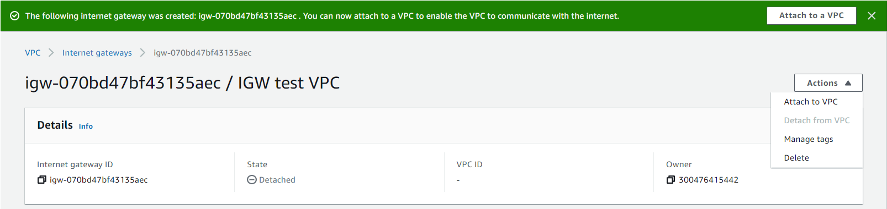
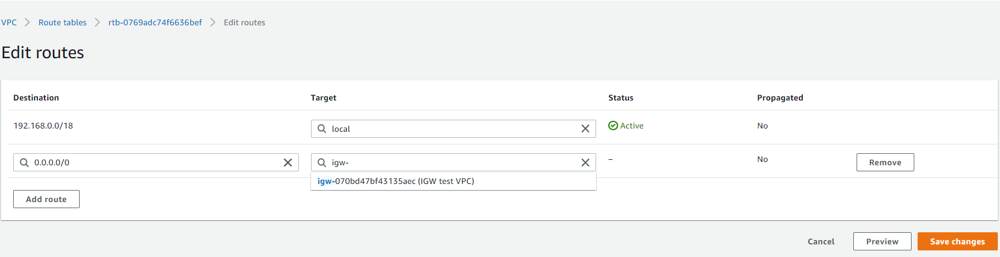
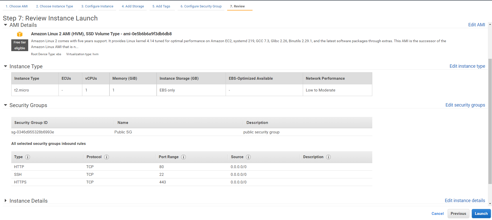

# Creación de recursos de redes en una Amazon Virtual Private Cloud (VPC)


## Objetivos

En esta sesión de laboratorio, hará lo siguiente:

- Resumir la situación del cliente
- Crear una VPC, una puerta de enlace de Internet, una tabla de enrutamiento, un grupo de seguridad, una lista de acceso de redes y una instancia EC2 para generar un red enrutable dentro de la VPC.
- Familiarizarse con la consola
- Desarrollar una solución para el problema del cliente presentado en esta sesión de laboratorio

La sesión de laboratorio se completará una vez que pueda utilizar con éxito el comando ping por fuera de la VPC.


## Duración

La duración total de la sesión es de 60 minutos.


## Situación

Su rol es el de un ingeniero de soporte en la nube en Amazon Web Services (AWS). Durante su turno, un cliente de una empresa emergente solicita asistencia con respecto a un problema de redes que tiene en su infraestructura de AWS. A continuación, se encuentran el correo electrónico y un archivo adjunto de su arquitectura.

### Correo electrónico del cliente

> ¡Hola, equipo de soporte en la nube!
>
> Hace unos días, me puse en contacto con ustedes para solicitar ayuda a fin de configurar mi VPC. Pensé que sabía adjuntar todos los recursos para establecer una conexión a Internet, pero ni siquiera puedo hacer ping por fuera de la VPC. ¡Todo lo que necesito es hacer ping! ¿Me pueden ayudar a configurar mi VPC donde tenga conectividad de red y pueda hacer ping? A continuación, se encuentra la arquitectura. ¡Gracias!
>
> Brock, propietario de la empresa emergente

.
*Arquitectura de VPC del cliente*

## Tarea 1: investigar el entorno del cliente


<details>
<summary>
<strong>Recordatorio</strong>
</summary>
<p>
**Recuerde** los protocolos que se pueden usar directamente con el grupo de seguridad (SG) de AWS y las listas de control de acceso a la red (NACL). Una VPC necesita una puerta de enlace de Internet (IGW) para llegar a Internet, que tiene la ruta establecida como 0.0.0.0/0. Estas rutas pasan por lo que se llama una tabla de enrutamiento, que están asociadas a subredes para que sepan a dónde pertenecen. Como se mencionó en las sesiones de laboratorio anteriores, deberá seguir el orden de la consola de navegación para crear esta VPC y un método de resolución de problemas para crear una VPC con funcionalidad completa. Cuando crea una VPC desde cero, es más fácil trabajar desde la parte superior y moverse hacia abajo, ya que aún no tiene una instancia. Compárelo con un sándwich; la VPC es el pan, y los recursos son todo lo que va en el medio.
</p.>
</details>

Para la tarea 1, analizará la solicitud del cliente y creará una VPC que tenga conectividad de red. La sesión de laboratorio estará completa cuando pueda hacer ping con éxito desde su instancia EC2 hasta Internet, lo que demuestra que la VPC tiene conectividad de red.

En esta situación, Brock, el cliente que solicita asistencia, pidió ayuda para crear los recursos de su VPC a fin de que se puedan enrutar a Internet. Mantenga el CIDR de la VPC en 192.168.0.0/18, y el CIDR de la subred pública en 192.168.1.0/26.


*Imagen: una forma ideal de crear una VPC es seguir el panel de navegación izquierdo, comenzando por “Your VPCs” (Sus VPC) y siguiendo hacia abajo.*


**Antes** de comenzar, revisemos la VPC y sus componentes para que sea compatible con la red.
  -  Una **gateway privada virtual (VPC)** es como un centro de datos, pero en la nube. Está aislada de forma lógica de otras redes virtuales desde las que puede activar y lanzar los recursos de AWS en cuestión de minutos.
  -  Las direcciones de **protocolo de Internet privado (IP)** son la forma en que se comunican entre sí los recursos dentro de la VPC. Una instancia necesita una dirección IP pública para comunicarse por fuera de la VPC. La VPC necesita recursos de red, como una puerta de enlace de Internet (IGW) y una tabla de enrutamiento, para que la instancia llegue a Internet.
  -  La **puerta de enlace de Internet (IGW)** es lo que hace posible que la VPC tenga conectividad a Internet. Tiene dos funciones: hacer la traducción de las direcciones de red (NAT) y ser el objetivo para dirigir el tráfico a Internet para la VPC. La ruta de una IGW en una tabla de enrutamiento siempre es 0.0.0.0/0.
  -  Una **subred** es un rango de direcciones IP que se encuentra dentro de la VPC.
  -  Una **tabla de enrutamiento** contiene rutas para la subred y dirige el tráfico mediante las reglas definidas dentro de la tabla de enrutamiento. Asocie la tabla de enrutamiento a una subred. Si una IGW estuviera en una tabla de enrutamiento, el destino sería 0.0.0.0/0 y, el objetivo, IGW.
  -  Los **grupos de seguridad** y las **listas de control de acceso a la red (NACL)** funcionan como firewall dentro de la VPC. Los grupos de seguridad funcionan al nivel de la instancia y tienen estado, lo que significa que bloquean todo de forma predeterminada. Las NACL funcionan al nivel de la subred y no tienen estado, lo que significa que no bloquean nada de forma predeterminada.

### Pasos

5. Seleccione el botón **AWS** (AWS) ubicado en la parte superior derecha del entorno de inicio de Vocareum. De esta forma, se abrirá la consola de AWS en una nueva pestaña.

6. Una vez que se encuentre en la consola de AWS, haga clic en **VPC**, en **Recently visited services** (Servicios visitados recientemente). Si no está allí, navegue hasta la esquina superior izquierda y seleccione **VPC** (VPC) en **Networking and Content Delivery** (Redes y entrega de contenido), en el panel de navegación **Services** (Servicios).

   
   *Imagen: servicios visitados recientemente en la consola de AWS*


   
   *Imagen: menú desplegable de navegación de servicios*


### Creación de la VPC

<details>
<summary>
<strong>Recordatorio</strong>
</summary>
<p>
**Recuerde** que una VPC es como un centro de datos, pero ubicado en la nube. Se encuentra aislada de forma lógica de otras redes virtuales. Ahora, creará una VPC.
</p.>
</details>

7. Comience por la parte superior del panel de navegación izquierdo, en **Your VPCs** (Sus VPC), y avance hacia abajo. Seleccione **Your VPCs** (Sus VPC), navegue hasta la esquina superior derecha, y seleccione **Create VPC** (Crear VPC).

   > **Nota**
   >
   > Tenga en cuenta que utilizará una teoría de arriba hacia abajo y que la parte superior será la VPC.


   
   *Imagen: navegue hasta “Your VPCs” (Sus VCP) y seleccione “Create VPC” (Crear VPC).*

8. Asigne un nombre a la VPC:`Test VPC`

   Bloque de CIDR IPv4:`192.168.0.0/18`

9. Deje el resto de los parámetros con los valores predeterminados y seleccione **Create VPC** (Crear VPC).

   
   *Imagen: configuración de ajustes de la VPC*


### Creación de subredes
<details>
<summary>
<strong>Recordatorio</strong>
</summary>
<p>
**Recuerde** que una subred es un rango de direcciones IP que se encuentra dentro de la VPC. En la VPC, puede crear una subred pública y privada. Puede separar las subredes según las necesidades de arquitectura específicas. Por ejemplo, si tiene servidores a los que no se debería acceder directamente desde Internet, debe ubicarlos en la subred privada. En el caso de servidores de prueba o instancias que requieren conectividad a Internet, se pueden ubicar en la subred pública. Las empresas también separan las subredes según las oficinas, los equipos o los pisos.
</p.>
</details>

10. Ahora que la VPC está completa, mire el panel de navegación izquierdo y seleccione **Subnets** (Subredes). En la esquina superior derecha, seleccione **Create subnet**(Crear subred).

    > **Nota**
    >
    > Tenga en cuenta que, aunque se puede crear casi todo en cualquier orden, es más fácil abordar un enfoque. Seguir un flujo o un enfoque le servirá para solucionar problemas y garantizar que no se olvide un recurso.

    
    *Imagen: seleccione “Create subnet” (Crear subred)*

11. Establezca la configuración según la siguiente imagen:

    
           *Imagen: configuración de la subred*


### Creación de una tabla de enrutamiento

<details>
<summary>
<strong>Recordatorio</strong>
</summary>
<p>
**Recuerde** que una tabla de enrutamiento contiene las reglas o rutas que determinan a dónde se dirigirá el tráfico de red que se encuentra en la subred y la VPC. Esta controla el tráfico de red como un enrutador y, al igual que uno de estos, almacena direcciones IP dentro de la VPC. Usted debe asociar una tabla de enrutamiento a cada subred y colocar las rutas a las que necesita que la subred pueda llegar. Para este paso, primero creará la tabla de enrutamiento y, luego, agregará las rutas a medida que crea los recursos de AWS para la VPC.
</p>
</details>

12. Navegue hasta el panel de navegación izquierdo y seleccione **Route Tables** (Tablas de enrutamiento). En la esquina superior derecha, seleccione **Create route table**(Crear tabla de enrutamiento).

    
        *Imagen: seleccione “Create route table” (Crear tabla de enrutamiento).*

13. Establezca la configuración según la siguiente imagen:

       
       *Imagen: configuración de la tabla de enrutamiento*


### Creación de una puerta de enlace de Internet y proceso para adjuntarla

<details>
<summary>
<strong>En esta sesión de laboratorio</strong>
</summary>
<p>
**Recuerde** que una IGW es lo que permite que la VPC tenga conectividad a Internet y la comunicación entre los recursos de la VPC e Internet. La IGW se utiliza como destino en la tabla de enrutamiento para dirigir el tráfico enrutable de Internet. También se utiliza con el fin de realizar la traducción de direcciones de red (NAT) para las instancias EC2. La NAT está un poco más allá del alcance de esta sesión de laboratorio, pero se menciona en la sección de referencia en caso de que desee profundizar más.
</p></details>
14. En el panel de navegación izquierdo, seleccione “**Internet Gateways**” (**Puertas de enlace de Internet**). Seleccione “**Create internet gateway**” (Crear puerta de enlace de Internet) en la esquina superior derecha para crear una puerta de enlace de Internet (IGW).

    En esta imagen, se muestra la página de inicio de las puertas de enlace de Internet cuando se hace clic en “Internet Gateways” (Puertas de enlace de Internet). Desde aquí, navegará hasta el botón superior derecho y seleccionará “Create internet gateway” (Crear puerta de enlace de Internet).](images/IGW.png)
        *Imagen: seleccione “Create internet gateway” (Crear puerta de enlace de Internet)*

15. Establezca la configuración según la siguiente imagen:

    
        *Imagen: configuración de la puerta de enlace de Internet*

16. Una vez creada, adjunte la **puerta de enlace de Internet** a la VPC. Para ello, seleccione **Actions** (Acciones) en la esquina superior derecha y haga clic en **Attach to VPC** (Adjuntar a VPC).

    
        *Imagen: adjuntar la IGW que acaba de crear.*

¡Ya se adjuntó su IGW! Ahora debe agregar su ruta a la tabla de enrutamiento y asociar la subred que creó a la tabla de enrutamiento.


### Cómo agregar la ruta a la tabla de enrutamiento y asociar la subred a la tabla de enrutamiento.

17. Navegue hasta la sección **Route Table**(Tabla de enrutamiento), ubicada en el panel de navegación izquierdo. Seleccione **Public Route Tables**(Tablas de enrutamiento públicas), desplácese hasta la parte inferior y seleccione la pestaña **Routes**(Rutas). Seleccione el botón “Edit routes” (Editar rutas), ubicado en la casilla de rutas.

    En la página “Edit routes” (Editar rutas), la primera dirección IP es la ruta local, que no se puede modificar.

    Seleccione **Add route**(Agregar ruta).

      - En la sección **Destination** (Destino), escriba **0.0.0.0/0** en la casilla de búsqueda. Esta es la ruta a la IGW. Se le está indicando a la tabla de enrutamiento que cualquier tráfico que necesite conectarse a Internet usará 0.0.0.0/0 para llegar a la IGW y a Internet.
      - Haga clic en la sección **Target** (Destino) y seleccione **Internet Gateway** (Puerta de enlace de Internet), ya que está dirigiendo todo el tráfico que necesita ir a Internet a la IGW. Una vez que seleccione la IGW, aparecerá su **TEST VPC IGW**(IGW DE LA VPC DE PRUEBA). Seleccione esa IGW, navegue hasta la parte inferior derecha y seleccione **Save changes**(Guardar cambios).

    
    *Imagen: agregar la IGW a la tabla de enrutamiento (0.0.0.0/0 como destino e IGW como objetivo).*

    Ahora el tráfico tiene una ruta a Internet a través de la IGW.

18. En el panel de la tabla de enrutamiento pública, seleccione la pestaña **Subnet associations**(Asociaciones de subred). Seleccione el botón **Edit subnet associations**(Editar asociaciones de subred).

    
    *Imagen: asociar la subred pública y seleccionar “Save association” (Guardar asociación)*

19. Seleccione **Save association** (Guardar asociación).

    > Nota: Todas las tablas de enrutamiento deben estar asociadas a una subred. Ahora, está asociando esta tabla de enrutamiento a esta subred. Como habrá notado, la convención de nomenclatura se mantiene igual (tabla de enrutamiento pública, subred pública, etc.) para asociar los mismos recursos en conjunto. Tenga en cuenta esto cuando aumenten su red y sus recursos. Puede haber varios recursos iguales y, por ende, generarse confusión sobre adónde pertenece cada uno.


### Creación de una ACL de red


<details>
<summary>
<strong>Recordatorio</strong>
</summary>
<p>
**Recuerde** que una NACL (lista de control de acceso a la red) es una capa de seguridad que actúa como un firewall a nivel de subred. Las reglas para configurar una NACL son similares a las de los grupos de seguridad en cuanto a la forma en la que controlan el tráfico. Se aplican las siguientes reglas: las NACL deben estar asociadas a una subred, las NACL no tienen estado y tienen las siguientes partes:
  - Número de regla: primero se evalúa la regla del número más bajo. Tan pronto como una regla coincide con el tráfico, se aplica; por ejemplo: 10 o 100. La regla 10 se evaluaría primero.
  - Tipo de tráfico; por ejemplo: HTTP o SSH
  - Protocolo: puede especificar todos o ciertos tipos aquí
  - Rango de puertos: todos o algunos específicos
  - Destino: solo se aplica a las reglas de salida  
  - Permitir o rechazar el tráfico especificado
</p.>
</details>

20. En el panel de navegación izquierdo, seleccione **Network ACLs**(ACL de red). Navegue hasta la esquina superior derecha y seleccione **Create network ACL**(Crear ACL de red) para crear una lista de control de acceso a la red (NACL).

    
      *Imagen: seleccionar “Create network ACL” (Crear ACL de red)*

    **Entrada** Después de crear la NACL, debería tener el siguiente aspecto. Esto indica que hay un solo número de regla, que es 100, y que establece que todo el tráfico, todos los protocolos y todos los rangos de puerto desde cualquier fuente (0.0.0.0/0) pueden ingresar (entrar) a la subred. El asterisco * indica que se rechaza todo lo que no coincida con esta regla.

    
    *Imagen: configuración de regla de entrada predeterminada para NACL. Esto permitirá todo el tráfico desde cualquier lugar y rechazará todo lo demás que no coincida con esta regla en el nivel de subred.*


    **Salida** ¿Qué cree que dice esta regla?
    
    *Imagen: configuración de la regla de salida predeterminada para NACL. Esto permitirá todo el tráfico desde cualquier lugar y rechazará todo lo demás que no coincida con esta regla en el nivel de subred.*


### Creación de un grupo de seguridad

<details>
<summary>
<strong>Recordatorio</strong>
</summary>
<p>
**Recuerde** que un grupo de seguridad es un firewall virtual a nivel de instancia que controla el tráfico de entrada y de salida. Al igual que una NACL, los grupos de seguridad controlan el tráfico; sin embargo, los grupos de seguridad no pueden rechazar el tráfico. Los grupos de seguridad tienen estado, y usted debe permitir el tráfico a través del grupo de seguridad, ya que este bloquea todo de forma predeterminada. Además, debe estar asociado a una instancia. Un grupo de seguridad tiene las siguientes partes para las reglas de entrada y salida:
  - Fuente de entrada: puede ser una IP o un recurso específico.
  - Destino de salida: puede por una IP como cualquier lugar (0.0.0.0/0).
  - Protocolo: UDP o TCP de ejemplo.
  - Rango de puertos: todo o un rango específico.
  - Descripción: puede ingresar una descripción.
</p>
</details>

21. En el panel de navegación izquierdo, seleccione **Security Groups** (Grupos de seguridad). Navegue hasta la esquina superior derecha y seleccione **Create security group**(Crear grupo de seguridad) para crear uno.

    

    *Imagen: seleccionar “Create security group” (Crear grupo de seguridad)*

    Establezca la configuración según la siguiente imagen de la página “Basic details” (Detalles básicos):

    Nota: En la parte de la VPC, elimine la VPC actual y seleccione **Test VPC**(VPC de prueba).

    
    *Imagen: configurar la página “Basic details” (detalles básicos)*

    A continuación, se muestra el grupo de seguridad completo. Esto indica que, para las **reglas de entrada**, está permitiendo los tipos de tráfico SSH, HTTP y HTTPS, cada uno con sus propios protocolos y rango de puertos. La fuente desde la que este tráfico llega a su instancia se puede originar desde cualquier lugar. En el caso de las **reglas de salida**, está permitiendo todo el tráfico desde afuera de su instancia.

    
    *Imagen: detalles de configuración de las reglas de entrada y salida para el grupo de seguridad*


    Ahora tiene una VPC funcional. La siguiente tarea es lanzar una instancia EC2 para verificar que todo funcione.


## Tarea 2: lanzar la instancia EC2 y establecer una conexión SSH con la instancia

En la tarea 2, lanzará una instancia EC2 desde la subred pública y probará la conectividad mediante la ejecución del comando **ping**. De esta forma, verificará si la infraestructura es correcta, como los grupos de seguridad y las ACL de red, para asegurarse de que no estén bloqueando nada de tráfico de la instancia a Internet y viceversa. Así, verificará si tiene una ruta a la IGW a través de la tabla de enrutamiento y si la IGW está adjunta.

22. Navegue hasta Services (Servicios) en la parte superior izquierda y seleccione **EC2** (EC2). En el panel de EC2, seleccione **Instances**(Instancias).

    
        *Imagen: lanzar una instancia EC2 mediante la selección de “Launch instance” (Lanzar instancia)*

23. Seleccione **Launch instances**(Lanzar instancias) en la esquina superior derecha. Luego, complete los siguientes pasos:

24. Para el paso 1, mantenga los valores predeterminados.

    
    *Imagen: elegir la AMI, Amazon Linux 2 AMI en el paso 1*

25. Para el paso 2, mantenga los valores predeterminados.

    

    *Imagen: elija el tipo de instancia, t3.micro, en el paso 2.*

26. Para el paso 3, configure la instancia como se muestra a continuación:

    

    *Imagen: el paso 3 es configurar los detalles de la instancia. Una nota importante aquí es habilitar la “Auto-assign Public IP” (Autoasignación de IP pública) si desea tener una IP pública para una instancia sin tener que asignar una EIP.*

27. Para el paso 4, mantenga los valores predeterminados.

    

    *Imagen: el paso 4 tiene la opción de agregar más almacenamiento o cambiarlo. Esto se mantendrá en el almacenamiento predeterminado.*


28. Para el paso 5, mantenga los valores como predeterminados.
    

    *Imagen: el paso 5 tiene la opción de agregar etiquetas, lo que aporta a la instancia un nombre y un valor. Sin embargo, dado que estamos lanzando solo una instancia, lo dejaremos en blanco. Esta es una excelente opción cuando tiene varios recursos y necesita asignarles valores y nombres específicos.*

29. Para el paso 6, configure el grupo de seguridad como se muestra a continuación:
    

    *Imagen: en el paso 6, puede crear un nuevo grupo de seguridad o seleccionar uno existente en cualquier momento. Seleccione la opción “Select an existing security group” (Seleccionar un grupo de seguridad existente) y el grupo de seguridad que creó, “public security group” (Grupo de seguridad público).*
30. Para el paso 7, revise la configuración. Debería verse de la siguiente manera:
    
    *Imagen: si siguió todos los pasos como corresponde, la pantalla de revisión debería verse como el ejemplo.*

31. Elija la siguiente clave:
    ![Una vez que se completa el paso 7 y se selecciona la instancia de lanzamiento, aparece una ventana emergente con un mensaje sobre la selección de un par de claves existente. En esta imagen, se muestra que está seleccionando un par de claves existente, que es la clave “vokey | RSA”. También hay una casilla de verificación debajo en la que informa que tiene acceso al archivo de clave privada. Este archivo de clave privada se puede descargar desde la pestaña de detalles de la página de la sesión de laboratorio de Vocareum.](images/keypair.png)

    *Imagen: elegirá un par de claves existente: vockey | RSA. Debe reconocer que tiene el archivo de clave privada correspondiente, que se puede descargar desde la pestaña de detalles de la página de la sesión de laboratorio de Vocreaum.*

    Mientras espera que la instancia entre en estado listo, abra la pestaña “Details” (Detalles), ubicada en la parte superior de la ventana de esta sesión de laboratorio, y descargue el archivo **PPK** (si está en Windows) o el archivo **pem** (si está en Mac).

    SSH en la instancia EC2 mediante PuTTY. Puede seguir estos pasos:


## Conectarse a una instancia EC2 de Amazon Linux mediante SSH
<details>
<summary>
<strong>Formas de conectarse a Amazon Linux EC2</strong>
</summary>
En esta tarea, se conectará a una instancia EC2 de Amazon Linux. Usará una utilidad SSH para llevar a cabo todas estas operaciones.

<!--OPTIONAL section: If students must establish an SSH connection to an EC2 instance (for example, by using PuTTY in Microsoft Windows or by using a terminal from macOS), then follow these instructions. Renumber the steps so that they are in numerical sequence with the rest of the lab.-->


Las siguientes instrucciones varían un poco en función de si utiliza Windows, Mac o Linux.

### <span style="font-size: 30px; color: #0060AA;"><i class="fab fa-windows"></i></span> Usuarios de Windows: conectarse mediante SSH

<i class="fas fa-comment"></i> Estas instrucciones son específicas para los usuarios de Windows. Si utiliza macOS o Linux, <a href="#ssh-MACLinux">pase a la siguiente sección</a>.


32. Seleccione el menú desplegable <span id="ssb_voc_grey">Details</span> (Detalles), que se encuentra arriba de estas instrucciones y, a continuación, seleccione <span id="ssb_voc_grey">Show</span> (Mostrar). Se abrirá la ventana Credentials (Credenciales).
33. Haga clic en el botón **Download PPK** (Descargar PPK) y guarde el archivo **labsuser.ppk**.
    *Por lo general, el navegador lo guardará en el directorio Descargas.*
34. Anote la **PublicInstanceBIP**, la dirección del servidor IPV4 a la que tiene que conectarse.
35. A continuación, haga clic en la **X** para salir del panel Details (Detalles).
36. Descargue **PuTTY** a SSH en la instancia de Amazon EC2. Si no tiene PuTTY instalado en su computadora, <a href="https://the.earth.li/~sgtatham/putty/latest/w64/putty.exe">descárguelo desde aquí</a>.
37. Abra **putty.exe**.


*Imagen: SSH utilizando Putty para Windows.*


38. Configure el tiempo de espera de PuTTY para mantener la sesión de PuTTY abierta durante más tiempo.
    * Seleccione **Connection** (Conexión).
    * Establezca **Seconds between keepalives** (Segundos entre keepalives) en `30`.
39. Configure la sesión de PuTTY de la siguiente manera:
    * Seleccione **Session** (Sesión).
    * **Nombre de host (o dirección IP):** pegue la dirección del servidor de la instancia que anotó antes.
    * Cuando regrese a PuTTY, en la lista **Connection** (Conexión), expanda <i class="far fa-plus-square"></i> **SSH**.
    * Seleccione **Auth** *(Autenticación), pero no lo expanda.*
    * Seleccione **Browse** (Examinar).
    * Busque y seleccione el archivo **labsuser.ppk** que descargó
    * Haga clic en **Open** (Abrir) para seleccionarlo.
    * Seleccione **Open** (Abrir) de nuevo.
40. Seleccione **Yes** (Sí) para validar y conectarse al host.
41. Cuando aparezca **login as** (iniciar sesión como), ingrese: `ec2-user`
    De esta forma, se conectará a la instancia EC2.
42. Usuarios de Windows: <a href="#ssh-after">Haga clic aquí para pasar a la siguiente tarea.</a>

<a id='ssh-MACLinux'></a>
​

### Usuarios de macOS <span style="font-size: 30px; color: #808080;"><i class="fab fa-apple"></i></span> y Linux <span style="font-size: 30px; "><i class="fab fa-linux"></i></span>

Estas instrucciones son exclusivas para usuarios de Mac o Linux. Si es usuario de Windows, <a href="#ssh-after">pase directamente a la siguiente tarea.</a>
​

43. Seleccione el menú desplegable <span id="ssb_voc_grey">Details</span> (Detalles), que se encuentra arriba de estas instrucciones y, a continuación, seleccione <span id="ssb_voc_grey">Show</span> (Mostrar). Se abrirá la ventana Credentials (Credenciales).

44. Presione el botón **Download PEM** (Descargar PEM) y guarde el archivo **labsuser.pem**.

45. Anote la **PublicIP**, la dirección del servidor IPV4 a la que tiene que conectarse.

46. A continuación, haga clic en la **X** para salir del panel Details (Detalles).

47. Abra una ventana de terminal y cambie el directorio `cd` por el directorio donde se descargó el archivo *labsuser.pem*. Por ejemplo, si el archivo *labuser.pem* se guardó en el directorio Descargas, ejecute este comando:

    ```bash
    cd ~/Downloads
    ```

48. Ejecute este comando para cambiar los permisos de la clave a fin de que sean solo de lectura:

    ```bash
    chmod 400 labsuser.pem
    ```

49. Ejecute el siguiente comando *(reemplace **<public-ip\>** por la dirección del servidor que copió antes)*:

    ```bash
    ssh -i labsuser.pem ec2-user@<public-ip>
    ```


*Imagen: SSH utilizando una terminal para Mac.*

​


50. Escriba `yes` cuando se le pregunte si quiere permitir la primera conexión a este servidor SSH remoto.
   Como está usando un par de claves para la autenticación, no se le pedirá una contraseña.

<a id='ssh-after'></a>


## Tarea 3: usar el ping para probar la conectividad a Internet

51. Ejecute el siguiente comando para probar la conectividad a Internet:

    ```bash
    ping google.com
    ```

    Después de unos segundos, salga del ping. Para ello, presione **CTRL+C** en Windows o **CDM+C** en Mac. Debería obtener el siguiente resultado:

    Ping exitoso:
    
    *Ejecute el ping para probar la conectividad. Los resultados anteriores indican que tiene respuestas de google.com y que tiene una pérdida de paquetes del 0 %.*

    Si recibe respuestas, significa que tiene conectividad.


## Sesión de laboratorio completada <i class="fas fa-graduation-cap"></i>

<i class="fas fa-flag-checkered"></i> ¡Felicitaciones! Ha completado la sesión de laboratorio.


## Recapitulación

<details>
<summary>
<strong>En esta sesión de laboratorio</strong>
</summary>
En esta sesión, investigó el entorno del cliente y analizó su solicitud para crear una VPC con completa funcionalidad. A través de esta experiencia, pudo aplicar un enfoque combinado del modelo OSI y conocer cómo la nube de AWS se adapta a este modelo. Creó recursos desde una VPC y avanzó con el panel de navegación izquierdo para ayudar al cliente a que su instancia EC2 se conecte a la red con éxito.
</details>


## Recursos adicionales

[¿Qué es Amazon VPC?](https://docs.aws.amazon.com/vpc/latest/userguide/what-is-amazon-vpc.html)
[Direccionamiento IP en su VPC](https://docs.aws.amazon.com/vpc/latest/userguide/vpc-ip-addressing.html)
[Tablas de enrutamiento para su VPC](https://docs.aws.amazon.com/vpc/latest/userguide/VPC_Route_Tables.html)
[Puertas de enlace de Internet](https://docs.aws.amazon.com/vpc/latest/userguide/VPC_Internet_Gateway.html)
[ACL de red](https://docs.aws.amazon.com/vpc/latest/userguide/vpc-network-acls.html#nacl-rules)
[Grupos de seguridad](https://docs.aws.amazon.com/vpc/latest/userguide/VPC_SecurityGroups.html#VPCSecurityGroups)

