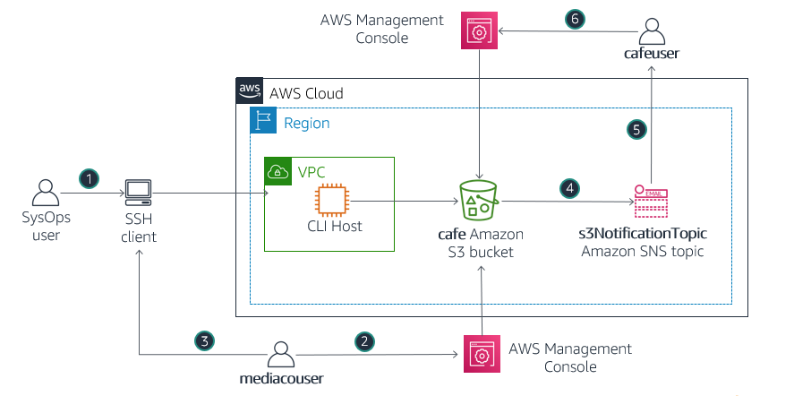

# Trabajo con Amazon S3


## Información general del laboratorio

En este laboratorio, creará y configurará un bucket de Amazon Simple Storage Service (Amazon S3) para compartir imágenes con un usuario externo de una empresa de medios (mediacouser), a quien se contrató para que proporcione fotografías de los productos que vende el café. También puede configurar el bucket de S3 para que envíe automáticamente una notificación por correo electrónico al administrador cuando se modifique el contenido del bucket.



Los siguientes pasos describen el flujo de uso en el diagrama:

1. Cuando haya nuevas fotografías de productos disponibles o cuando las existentes deban actualizarse, un representante de la empresa de medios iniciará sesión en la Consola de administración de AWS como **mediacouser** para cargar, cambiar o eliminar el contenido del bucket.
2. Como alternativa, el usuario **mediacouser** puede utilizar la interfaz de la línea de comandos de AWS (AWS CLI) para cambiar el contenido del bucket de S3.
3. Cuando Amazon S3 detecta un cambio en el contenido del bucket, publica una notificación por correo electrónico en el tema de Amazon Simple Notification Service (Amazon SNS) **s3NotificationTopic**.
4. El administrador, que está suscrito al tema de SNS **s3NotificationTopic**, recibe un correo electrónico que incluye los detalles de los cambios en el contenido del bucket. 

**Nota:** En las implementaciones reales, es posible que los usuarios externos no obtengan acceso directo a CLI Host de la forma que se describe en el diagrama.


##  Objetivos

Al final de este laboratorio, podrá hacer lo siguiente:

- Utilizar los comandos de AWS CLI s3api y s3 para crear y configurar un bucket de S3.
- Verificar los permisos de escritura para un usuario en un bucket de S3.
- Configurar las notificaciones de eventos en un bucket de S3.


## Duración

El tiempo estimado para completar este laboratorio es de **90 minutos**.


## Tarea 1: conectarse la instancia CLI Host de EC2 y configurar la AWS CLI

En esta tarea, se conectará a la instancia CLI Host de EC2 mediante EC2 Instance Connect y configurará la AWS CLI para poder ejecutar los comandos.

### Tarea 1.1: conectarse a la instancia CLI Host de EC2

En esta tarea, usará EC2 Instance Connect para conectarse a la instancia CLI Host de EC2. 

7. En la **Consola de administración de AWS**, en la barra de **búsqueda**, ingrese y seleccione `EC2` para abrir la **Consola de administración de Elastic Compute Cloud**.

8. En el panel de navegación, seleccione **Instancias**.

9. En la lista de instancias, seleccione la instancia **CLI Host**.

10. Elija **Conectar**.

11. En la pestaña **EC2 Instance Connect**, seleccione <span style="ssb_orange">**Conectar**</span>.

    Esta opción hace que se abra una nueva pestaña del navegador con la ventana del terminal de **EC2 Instance Connect**.

    Utilizará esta ventana del terminal para completar las tareas durante todo el laboratorio. Si el terminal deja de responder, vuelva a cargar la página en el navegador o siga los pasos de esta tarea para volver a conectarse.


### Tarea 1.2: configurar la AWS CLI en la instancia CLI Host

12. Para configurar el perfil de la AWS CLI con credenciales, ejecute el siguiente comando en la instancia del terminal de EC2 Instance Connect:

    ```bash
    aws configure
    ```

13. Cuando aparezcan las indicaciones, copie los siguientes valores, que pegó en el editor de texto, y péguelos en la ventana del terminal según se le indique.

    -  **AWS Access Key ID** (ID de clave de acceso de AWS): ingrese el valor de **AccessKey**.
    -  **AWS Secret Access Key** (Clave de acceso secreta de AWS): ingrese el valor de **SecretKey**.
    -  **Default region name** (Nombre predeterminado de la región): ingrese `us-west-2`.
    -  **Default output format** (Formato de resultado predeterminado): ingrese `json`.

    Ahora ya puede ejecutar comandos de AWS CLI para interactuar con servicios de AWS.


## Tarea 2: crear e iniciar el bucket compartido de S3

En esta tarea, utilizará la AWS CLI para crear el bucket compartido de S3 y cargar algunas imágenes. 

Para esto, ejecutará los siguientes comandos en la ventana del terminal de EC2 Instance Connect.

14. Ejecute los siguientes comandos para crear un bucket de S3. En el comando, reemplace *\<cafe-xxxnnn>* por el nombre de su bucket. El nombre de su bucket debe comenzar con **cafe-** y debe incluir una combinación de letras y números que lo conviertan en un nombre de bucket único.

    ```bash
    aws s3 mb s3://<cafe-xxxnnn> --region 'us-west-2'
    ```

    Debería recibir un mensaje similar al que se muestra a continuación: make_bucket: cafe-xxxx9999999

    **Nota:** Los nombres de los bucket no pueden contener mayúsculas. Si aparece un error cuando intenta crear el bucket de S3, asegúrese de que el nombre no incluya mayúsculas.

    A continuación, cargue algunas imágenes en el bucket de S3 con el prefijo /images. Se proporcionan archivos de imágenes de muestra en la carpeta initial-images de CLI Host. 

15. Para cargar imágenes en el bucket, ejecute el siguiente comando. En el comando, reemplace *\<cafe-xxxnnn>* por el nombre de su bucket:

    ```bash
    aws s3 sync ~/initial-images/ s3://<cafe-xxxnnn>/images
    ```

    El resultado del comando es una lista de los archivos de imagen que se están cargando.

16. Para verificar que los archivos se sincronizaron con el bucket de S3, ejecute el siguiente comando. En el comando, reemplace *\<cafe-xxxnnn>* por el nombre de su bucket:

    ```bash
    aws s3 ls s3://<cafe-xxxnnn>/images/ --human-readable --summarize
    ```

    Aparecen los detalles de los archivos de imagen que se cargaron, entre los que se incluyen el número de archivos que se cargaron y el tamaño total de los archivos.


## Tarea 3: revisar el grupo y los permisos de usuario de IAM

A continuación, revise los permisos que se asignaron al grupo de usuarios de IAM mediaco. Este grupo se creó para proporcionarles a los usuarios de la empresa de contenido multimedia una manera de utilizar la consola de administración de AWS o la AWS CLI para cargar y modificar imágenes en el bucket de recursos compartidos de S3. La creación del grupo hace que sea cómodo administrar los permisos de usuario individuales. También puede revisar los permisos que heredó el usuario de mediacouser que es parte del grupo.	

### Tarea 3.1: revisar el grupo de IAM mediaco

En esta sección, revisará los permisos que se asignaron al grupo mediaco.

17. En la **consola de administración de AWS**, en la barra de **búsqueda**, ingrese y seleccione `IAM` para abrir la **consola de administración de IAM**.

18. En el panel de navegación de la izquierda, elija **Grupos de usuarios**.

19. Desde la lista **Grupos de usuarios**, seleccione **mediaco**.

    Se muestra la página **Resumen** del grupo **mediaco**.

20. Seleccione la pestaña **Permisos**.

21. Junto a **IAMUserChangePassword**, seleccione **+** para expandir la política.

    Si es necesario, revise la política administrada por AWS que permite a los usuarios cambiar su propia contraseña.

22. Para contraer la política, seleccione **-**.

23. Junto a **mediaCoPolicy**, seleccione **+** para expandir la política.

    **Nota:** Es posible que deba desplazarse hacia abajo para consultar la política. 

    Tenga presente los siguientes enunciados de esta política:

    - El primer enunciado, identificado por el nombre de clave **Sid** **AllowGroupToSeeBucketListInTheConsole**, define permisos que habilitan al usuario a utilizar la consola de Amazon S3 para ver la lista de buckets de S3 en la cuenta.

    - El segundo enunciado, identificado por el nombre de clave **Sid** **AllowRootLevelListingOfTheBucket**, define permisos que habilitan al usuario a utilizar la consola de Amazon S3 para ver la lista de objetos de primer nivel en el bucket **cafe**, además de otros objetos en el bucket.

    - El tercer enunciado, identificado por el nombre de clave **Sid** **AllowUserSpecificActionsOnlyInTheSpecificPrefix**, define permisos que especifican las acciones que el usuario puede realizar en los objetos de la carpeta **cafe-\*/images/\***. Las operaciones principales son **GetObject**, **PutObject** y **DeleteObject**, que corresponden a los permisos lectura, escritura y eliminación que desea conceder al usuario mediacouser. Se incluyen dos operaciones adicionales para posibles acciones relacionadas con la versión.
    
24. Para contraer la política, seleccione **-**.


### Tarea 3.2: revisar el usuario de IAM mediacouser

En esta sección, revisará las propiedades del usuario mediacouser.

25. En el panel de navegación de la consola de IAM, haga clic en **Usuarios**.

26. En la lista **Usuarios**, seleccione **mediacouser**.

    En la pestaña **Permisos** debería ver dos políticas: **IAMUserChangePassword** y **mediaCoPolicy**. Estas políticas se asignaron al grupo de IAM mediaco que revisó en la tarea anterior.

27. Para verificar que ve el grupo de IAM mediaco, seleccione la pestaña **Grupos**. 

    El usuario mediacouser es miembro de este grupo y, por lo tanto, hereda los permisos que se le asignaron al grupo mediaco.

28. Elija la pestaña **Credenciales de seguridad**.

29. En la sección **Claves de acceso**, seleccione **Crear clave de acceso**.

    - Seleccione **Interfaz de línea de comandos (CLI)**.
    - Seleccione la casilla **Comprendo la recomendación anterior y deseo proceder con la creación de una clave de acceso.**

30. Elija **Siguiente**.

31. Seleccione **Crear clave de acceso**.

    Aparecerá el siguiente mensaje: *Clave de acceso creada*

32. Seleccione **Descargar archivo .csv**.

33. Seleccione **Listo**.

34. En la página **mediacouser** de la pestaña **Credenciales de seguridad**, copie el **enlace de inicio de sesión en la consola**. 

    Utilizará este enlace en la siguiente tarea.


### Tarea 3.3: probar los permisos de mediacouser

En esta tarea, probará los permisos que revisó. Para ello, inicie sesión en la Consola de administración de AWS como mediacouser y realice operaciones de visualización, carga y eliminación del contenido de la carpeta de imágenes en el bucket de recursos compartidos de S3. Estas acciones son los casos prácticos que se espera que el usuario externo de la empresa de medios realice en el bucket. Además, pruebe el caso práctico no autorizado, en el que el usuario externo intenta cambiar los permisos del bucket.

35. Utilice una de las siguientes opciones para iniciar sesión en la Consola de administración de AWS como el usuario mediacouser:

    **Importante**: No cierre la sesión en la que está conectado como **voclabs/user**. En su lugar, elija una de dos opciones:

    - Opción 1: utilice otro navegador.

    - Opción 2: utilice el mismo navegador, pero abra una nueva sesión privada o de incógnito en el navegador. 

       Sin importar la opción que elija, ingrese el **enlace de inicio de sesión en la consola** que copió del paso anterior en la nueva pestaña del navegador. Se abrirá la página de inicio de sesión de la Consola de administración de AWS y el campo **ID de cuenta** ya estará completado.

36. En la página de inicio de sesión, ingrese las siguientes credenciales: 

    - Ingrese las siguientes credenciales:
      - **Nombre de usuario de IAM:** `mediacouser`.
      - **Contraseña:** `Training1!`.

37.	Seleccione **Iniciar sesión**.

38. En la nueva página de la **Consola de administración de AWS**, en la barra de **búsqueda**, ingrese y seleccione `S3` para ir a la **Consola de administración de S3**. 

39. En la lista de bucket, seleccione el bucket que creó anteriormente.

40. Para visualizar la lista de imágenes que se cargaron anteriormente, seleccione **images/**.

41. Para probar el caso práctico **ver**, seleccione **Donuts.jpg** y seleccione **Abrir**.

    Se debería abrir una nueva pestaña del navegador que muestre una imagen con varias donas.
    
    **Sugerencia:** Si no se abre una pestaña nueva del navegador, suele aparecer un anuncio o un ícono en la parte superior de este con un mensaje que indica que el navegador impide que el sitio web abra ventanas emergentes. Seleccione el anuncio o ícono y elija **Permitir ventanas emergentes**.

42. Cierre la pestaña del navegador en la que aparece la imagen Donuts.jpg.

43. Dentro de la pestaña **Consola**, en la ruta de navegación que se ubica en la parte superior, seleccione **images/** para volver a ver el contenido de la carpeta Imágenes.

44. Para probar el caso práctico **cargar**, seleccione **Cargar**. 

45. En la página **Cargar**, seleccione **Agregar archivos** y seleccione cualquier imagen o foto de su equipo local.

46. Seleccione **Cargar**.

47. Para cerrar la página **Cargar: estado**, seleccione **Cerrar**.

48. Seleccione el archivo que cargó y seleccione **Abrir**.

    Se debería abrir una nueva pestaña del navegador en la que aparezca el archivo que cargó.

49. Cierre la pestaña del navegador en la que aparece el archivo que cargó.

50. Para probar el caso práctico **eliminar**, en la pestaña **Consola**, en la lista de imágenes, seleccione la casilla de **Cup-of-Hot-Chocolate.jpg**.

51. Seleccione **Eliminar**.

52. En la página **Eliminar objetos**, en el cuadro **¿Eliminar objetos?**, ingrese `delete`.

53. Seleccione **Eliminar objetos**. 

    El objeto se eliminará y ya no aparecerá en la lista de imágenes.

54. Para cerrar la página **Eliminar objetos: estado**, seleccione **Cerrar**.

    A continuación, pruebe el caso de uso **no autorizado** en el cual el usuario mediacouser intenta modificar los permisos del bucket. 

55. En la ruta de navegación, que se ubica en la parte superior, seleccione su bucket para volver a la lista de contenido del bucket.

56. Seleccione la pestaña **Permisos**. 

    Aquí es donde puede cambiar los permisos de un bucket. 
    
    Tenga presente que aparece el siguiente mensaje de error para **Información general sobre los permisos**: “Permisos insuficientes”. Se evitará que mediacouser cambie los permisos del bucket. También podría intentar cargar un archivo directamente en la raíz del bucket. Esta acción también debería producir un error.

57. Cierre sesión como **mediacouser** en la consola de Amazon S3.

    Creó correctamente un bucket de Amazon S3 y confirmó que está configurado de forma segura para compartir archivos con otro usuario.


## Tarea 4: configurar las notificaciones de eventos en el bucket de recursos compartidos de S3

En esta tarea, configurará el bucket de recursos compartidos de S3 para generar una notificación de eventos para un tema de SNS siempre que cambie el contenido del bucket. Luego el tema de SNS enviará un correo electrónico a los usuarios suscritos con el mensaje de la notificación. En concreto, debe realizar los siguientes pasos:

- Crear el tema de SNS s3NotificationTopic.
- Conceder permiso a Amazon S3 para publicar contenido en el tema.
- Suscribirse a un tema.
- Agregar una configuración de notificación de eventos al bucket de S3.

### Tarea 4.1: crear y configurar el tema de SNS s3NotificationTopic

58. Vuelva a la ventana de la Consola de administración de AWS donde está conectado como **voclabs/user**.

59. En la **Consola de administración de AWS**, ingrese `SNS` en la barra de **búsqueda** y seleccione **Simple Notification Service** para abrir la consola de **Simple Notification Service**.

60. De ser necesario, seleccione el ícono de menú (<i class="fas fa-bars"></i>) a la izquierda para abrir el panel de navegación.

61. En el panel de navegación, seleccione **Temas**.

62. Seleccione **Crear un tema**.

63. Seleccione **Estándar**.

64. En **Nombre**, ingrese `s3NotificationTopic`.

65. Seleccione **Crear un tema**.

    Aparecerá un mensaje en el que se indicará que se creó el tema de SNS s3NotificationTopic correctamente.

66. Desde la página **s3NotificationTopic** de la sección **Detalles**, copie y pegue el valor de **ARN** en un editor de texto. Necesitará este valor más adelante en este laboratorio.

67. Para configurar la política de acceso del tema, seleccione **Editar**.

68. Expanda la sección **Políticas de acceso: _opcional_**.

69. Reemplace el contenido del editor de JSON por la siguiente política: En el objeto JSON, reemplace *&lt;ARN of s3NotificationTopic&gt;* por el valor de ARM que copió anteriormente y *&lt;cafe-xxxnnn&gt;* con el nombre de su bucket de S3. Recuerde que debe eliminar los corchetes angulares delimitadores (&lt; &gt;). 

    ```json
    {
      "Version": "2008-10-17",
      "Id": "S3PublishPolicy",
      "Statement": [
        {
          "Sid": "AllowPublishFromS3",
          "Effect": "Allow",
          "Principal": {
            "Service": "s3.amazonaws.com"
          },
          "Action": "SNS:Publish",
          "Resource": "<ARN of s3NotificationTopic>",
          "Condition": {
            "ArnLike": {
              "aws:SourceArn": "arn:aws:s3:*:*:<cafe-xxxnnn>"
            }
          }
        }
      ]
    }
    ```

    Dedique un momento a revisar la intención de esta política. Le concede al bucket de recursos compartidos de S3 cafe permisos para publicar mensajes en el tema de SNS s3NotificationTopic.

70. Seleccione **Guardar cambios**.

    A continuación, suscríbase al tema para recibir las notificaciones de eventos del bucket de recursos compartidos de S3. 
    
71. En el panel **s3NotificationTopic**, seleccione la pestaña **Suscripciones**.

72. Seleccione **Crear una suscripción**.

73. Seleccione el cuadro **ARN del tema** y seleccione el tema de SNS **s3NotificationTopic** que aparece como una opción.

74. Seleccione **Protocolo** en la lista desplegable, seleccione **Correo electrónico**.

75. En el cuadro **Punto de enlace**, ingrese una dirección de correo electrónico a la que tenga acceso.

76. Seleccione **Crear una suscripción**. 

    Aparecerá un mensaje en el cual se confirma que la suscripción se creó correctamente.

77. Revise la bandeja de entrada de la dirección de correo electrónico que proporcionó. Debería ver un correo electrónico con el asunto *Notificación de AWS: confirmación de la suscripción*.

78. Abra este correo electrónico y haga clic en **Confirmar la suscripción**. Se abrirá una nueva pestaña del navegador y aparecerá una página con el mensaje *Subscription confirmed!* (¡Suscripción confirmada!).


### Tarea 4.2: agregar una configuración de notificación de eventos al bucket de S3

En esta tarea, creará un archivo de configuración de notificaciones de eventos que identifique los eventos que Amazon S3 publicará y el destino del tema al que Amazon S3 enviará las notificaciones de eventos. A continuación, utilizará los comandos de la CLI s3api para asociar este archivo de configuración con el bucket de recursos compartidos de S3.

79. En la ventana del terminal de la instancia CLI Host, ingrese el siguiente comando para editar un archivo nuevo llamado s3EventNotification.json:

    ```bash
    vi s3EventNotification.json
    ```

80. En el editor, presione `i` para cambiar al modo inserción.

81. En el siguiente objeto JSON, reemplace *&lt;ARN of s3NotificationTopic&gt;* por el valor del ARN que registró anteriormente. Recuerde eliminar los corchetes angulares delimitadores (&lt; &gt;). Copie y pegue la configuración JSON personalizada en la ventana del editor. 

  ```json
    {
      "TopicConfigurations": [
        {
          "TopicArn": "<ARN of s3NotificationTopic>",
          "Events": ["s3:ObjectCreated:*","s3:ObjectRemoved:*"],
          "Filter": {
            "Key": {
              "FilterRules": [
                {
                  "Name": "prefix",
                  "Value": "images/"
                }
              ]
            }
          }
        }
      ]
    }
  ```

Dedique un momento a revisar la intención de esta configuración. Solicita que Amazon S3 publique una notificación de evento en el tema de SNS s3NotificationTopic siempre que se realice un evento ObjectCreated u ObjectRemoved en objetos que se encuentren dentro de un recurso de Amazon S3 con un prefijo **images/**.

82. Pulse ESC para salir del modo inserción.

83. Para guardar el archivo y salir del editor, ingrese `:wq` y presione Intro.

84. Para asociar el archivo de configuración de eventos con el bucket de recursos compartidos de S3, ejecute el siguiente comando. En el comando, reemplace *&lt;cafe-xxxnnn&gt;* por el nombre de su bucket de S3:

    ```bash
    aws s3api put-bucket-notification-configuration --bucket <cafe-xxxnnn> --notification-configuration file://s3EventNotification.json
    ```

85. Espere unos minutos y luego revise la bandeja de entrada de la dirección de correo electrónico que utilizó para suscribirse al tema. Debería ver un correo electrónico con el asunto *Notificación de Amazon S3*.

86. Abra el correo electrónico y examine el mensaje de la notificación. Debería ser similar a lo siguiente:

    {"Service":"Amazon S3","Event":"s3:TestEvent","Time":"2019-04-26T06:04:27.405Z","Bucket":"<cafe-xxxnnn>","RequestId":"7A87C25E0323B2F4","HostId":"fB3Z...SD////PWubF3E7RYtVupg="}

    Observe que el valor de la clave **"Event"** es **"s3:TestEvent"**. Amazon S3 envió esta notificación como una prueba de la configuración de notificaciones de eventos que estableció.


## Tarea 5: probar las notificaciones de eventos del bucket de recursos compartidos de S3

En esta tarea, deberá probar la configuración de la notificación de eventos del bucket de recursos compartidos de S3 mediante los casos prácticos que el usuario mediacouser espera realizar en el bucket. Estas acciones incluyen colocar y eliminar objetos en el bucket, lo que hace que se envíen notificaciones por correo electrónico. También puede probar una operación no autorizada para verificar que se rechaza. Utilizará el comando de AWS CLI s3api para realizar estas operaciones en el bucket de recursos compartidos de S3.

87. Para configurar el software cliente de la AWS CLI de CLI Host para utilizar las credenciales de mediacouser, ingrese el siguiente comando en la ventana SSH para la instancia CLI Host:

    ```bash
    aws configure
    ```

88. Cuando se le solicite, escriba lo siguiente:

    - **AWS Access Key ID** (ID de la clave de acceso de AWS): copie y pegue el valor de **Access Key ID** (ID de la clave de acceso) de mediacouser, que se encuentra en el archivo mediacouser_accessKeys.csv que descargó en la Tarea 3.
    - **AWS Secret Access Key** (Clave de acceso secreta de AWS): copie y pegue el valor de **Secret Access Key** (Clave de acceso secreta) del usuario mediacouser, que se encuentra en el mismo archivo que descargó en la Tarea 3.
    - **Default region name** (Nombre de la región predeterminada): presione Intro cuando se le indique para mantener la misma región que seleccionó anteriormente en este laboratorio.
    - **Default output format** (Formato de resultado predeterminado): ingrese `json`.

    A continuación, probará el caso práctico de **put**. Para hacerlo, cargue el archivo de imagen Caramel-Delight.jpg de la carpeta new-images de CLI Host. 
    
89. Para cargar este archivo, ejecute el siguiente comando. En el comando, reemplace *&lt;cafe-xxxnnn&gt;* por el nombre de su bucket de S3:

    ```bash
    aws s3api put-object --bucket <cafe-xxxnnn> --key images/Caramel-Delight.jpg --body ~/new-images/Caramel-Delight.jpg
    ```

    Una vez completado el comando, este devuelve la **ETag** (etiqueta de entidad) del objeto que se cargó.

90. Revise la bandeja de entrada de la dirección de correo electrónico que utilizó para suscribirse al tema de SNS s3NotificationTopic. Debería ver un nuevo correo electrónico con el asunto *Notificación de Amazon S3*.

91. Abra el correo electrónico y examine el mensaje de la notificación. Observe la siguiente información:

    * El valor de la clave **eventName** es **ObjectCreated:Put**.
    * El valor del objeto **key** es **images/Caramel-Delight.jpg**, que es la clave del archivo de imagen que especificó en el comando.

    Esta notificación indica que se agregó (put) un nuevo objeto que contiene una clave **images/Caramel-Delight.jpg** al bucket de recursos compartidos de S3.

    A continuación, probará el caso práctico de **get**. Para hacerlo, obtendrá el objeto con una clave **images/Donuts.jpg** del bucket. 
    
92. Para obtener este objeto ejecute el siguiente comando: En el comando, reemplace *&lt;cafe-xxxnnn&gt;* por el nombre de su bucket de S3:

    ```bash
    aws s3api get-object --bucket <cafe-xxxnnn> --key images/Donuts.jpg Donuts.jpg
    ```
    
    Observe que no se generó un correo electrónico de notificación para esta operación. Esta operación no genera una notificación de correo electrónico, ya que el bucket de recursos compartidos está configurado para enviar notificaciones solamente cuando se crean o se eliminan objetos.

    A continuación, probará el caso práctico de **eliminar**. Para hacerlo, eliminará el objeto con una clave **images/Strawberry-Tarts.jpg** del bucket. 

93. Ejecute el siguiente comando para eliminar este objeto. En el comando, reemplace *&lt;cafe-xxxnnn&gt;* por el nombre de su bucket de S3:

    ```bash
    aws s3api delete-object --bucket <cafe-xxxnnn> --key images/Strawberry-Tarts.jpg
    ```

94. Revise la bandeja de entrada de la dirección de correo electrónico que utilizó para suscribirse al tema de SNS s3NotificationTopic. Debería ver un nuevo correo electrónico con el asunto *Notificación de Amazon S3*.

95. Abra el correo electrónico y examine el mensaje de la notificación. Observe la siguiente información:

    - El valor de la clave **eventName** es **ObjectRemoved:Delete**.
    - El valor del objeto **key** es **images/Strawberry-Tarts.jpg**, que es la clave del archivo de imagen que especificó en el comando.

    Esta notificación indica que el objeto que contiene la clave **images/Strawberry-Tarts.jpg** se eliminó del bucket de recursos compartidos de S3.

    Por último, probará un caso práctico de no autorizado. 

96. Para intentar cambiar el permiso del objeto Donuts.jpg a fin de que se pueda leer públicamente, ejecute el siguiente comando. En el comando, reemplace *&lt;cafe-xxxnnn&gt;* por el nombre de su bucket de S3:

    ```bash
    aws s3api put-object-acl --bucket <cafe-xxxnnn> --key images/Donuts.jpg --acl public-read
    ```

    El comando falla y muestra el siguiente mensaje de error, como se esperaba: “An error occurred (AccessDenied) when calling the PutObjectAcl operation: Access Denied” (Se produjo un error (AccessDenied) al llamar a la operación PutObjectAcl: acceso denegado)
    

## Conclusión

¡Felicitaciones! Realizó correctamente lo siguiente:

- Utilizó los comandos de AWS CLI s3api y s3 para crear y configurar un bucket de S3.
- Verificó los permisos de escritura para un usuario en un bucket de S3.
- Configuró las notificaciones de eventos en un bucket de S3.


## Laboratorio completado

<i class="icon-flag-checkered"></i> ¡Felicitaciones! Completó el laboratorio.

## Recursos adicionales

- [Documentación de la AWS CLI para s3](https://docs.aws.amazon.com/cli/latest/reference/s3/)
- [Documentación de la AWS CLI para s3api](https://docs.aws.amazon.com/cli/latest/reference/s3api/)
