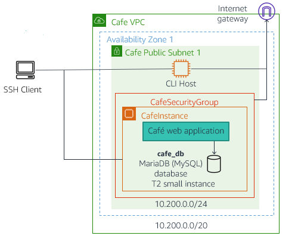

# Migración a Amazon RDS

## Información general del laboratorio

Amazon Relational Database Service (Amazon RDS) facilita la configuración, el funcionamiento y el escalado de una base de datos relacional en la nube. Proporciona capacidad rentable y de tamaño modificable, al mismo tiempo que automatiza las tareas de administración que requieren mucho tiempo, como el aprovisionamiento de hardware, la configuración de bases de datos, la aplicación de parches y las copias de seguridad.

En este laboratorio, migrará una base de datos MySQL que se ejecuta en una instancia EC2 a Amazon RDS. También configurará copias de seguridad automáticas y monitoreo para su nueva instancia RDS.



## Objetivos

Al finalizar este laboratorio, podrá realizar lo siguiente:

- Crear una instancia de base de datos de Amazon RDS
- Configurar grupos de seguridad para permitir el acceso a RDS
- Migrar datos desde una base de datos MySQL local a Amazon RDS
- Configurar copias de seguridad automáticas y ventanas de mantenimiento
- Monitorear el rendimiento de la base de datos con CloudWatch
- Implementar mejores prácticas de seguridad para RDS

## Duración

El tiempo estimado para completar este laboratorio es de **60 minutos**.

## Tarea 1: Crear un grupo de subredes de base de datos

En esta tarea, creará un grupo de subredes de base de datos que especifica las subredes que Amazon RDS puede usar para la instancia de base de datos.

1. En la **Consola de administración de AWS**, busque y seleccione **RDS**.

2. En el panel de navegación izquierdo, elija **Subnet groups** (Grupos de subredes).

3. Elija **Create DB subnet group** (Crear grupo de subredes de BD).

4. Configure el grupo de subredes:
   - **Name** (Nombre): `lab-db-subnet-group`
   - **Description** (Descripción): `Subnet group for RDS lab`
   - **VPC**: Seleccione la VPC del laboratorio

5. En la sección **Add subnets** (Agregar subredes):
   - **Availability Zones**: Seleccione al menos dos zonas de disponibilidad
   - **Subnets**: Seleccione las subredes privadas correspondientes

6. Elija **Create** (Crear).

## Tarea 2: Crear un grupo de seguridad para RDS

Configure un grupo de seguridad que permita el acceso a la base de datos desde las instancias de aplicación.

7. Navegue a **EC2** > **Security Groups** (Grupos de seguridad).

8. Elija **Create security group** (Crear grupo de seguridad).

9. Configure el grupo de seguridad:
   - **Security group name**: `lab-rds-sg`
   - **Description**: `Security group for RDS database`
   - **VPC**: Seleccione la VPC del laboratorio

10. En **Inbound rules** (Reglas de entrada), agregue:
    - **Type**: MySQL/Aurora
    - **Protocol**: TCP
    - **Port**: 3306
    - **Source**: Seleccione el grupo de seguridad de las instancias web

11. Elija **Create security group** (Crear grupo de seguridad).

## Tarea 3: Crear la instancia de Amazon RDS

En esta tarea, creará una instancia de base de datos MySQL en Amazon RDS.

12. Regrese a la consola de **RDS**.

13. En el panel de navegación, elija **Databases** (Bases de datos).

14. Elija **Create database** (Crear base de datos).

15. Configure la base de datos:

    **Engine options**:
    - **Engine type**: MySQL
    - **Version**: MySQL 8.0.35 (o la más reciente)

    **Templates**:
    - Seleccione **Free tier** (Nivel gratuito)

    **Settings**:
    - **DB instance identifier**: `lab-rds-mysql`
    - **Master username**: `admin`
    - **Master password**: `lab-password123`
    - **Confirm password**: `lab-password123`

16. En **Instance configuration**:
    - **DB instance class**: `db.t3.micro`

17. En **Storage**:
    - **Storage type**: General Purpose SSD (gp2)
    - **Allocated storage**: 20 GiB
    - Marque **Enable storage autoscaling**

18. En **Connectivity**:
    - **VPC**: Seleccione la VPC del laboratorio
    - **DB subnet group**: `lab-db-subnet-group`
    - **Public access**: No
    - **VPC security groups**: Elija el grupo existente `lab-rds-sg`

19. En **Additional configuration**:
    - **Initial database name**: `labdb`
    - **Backup retention period**: 7 días
    - **Enable automatic backups**: Sí
    - **Backup window**: Seleccione una ventana apropiada
    - **Enable Enhanced monitoring**: Sí

20. Elija **Create database** (Crear base de datos).

    <i class="fas fa-info-circle" style="color:blue"></i> **Nota**: La creación de la instancia RDS puede tardar varios minutos.

## Tarea 4: Conectarse a la instancia EC2 existente

Mientras la instancia RDS se crea, conéctese a la instancia EC2 que contiene la base de datos MySQL original.

21. Navegue a **EC2** > **Instances** (Instancias).

22. Seleccione la instancia llamada **Web Server** o similar.

23. Elija **Connect** (Conectar) y use **EC2 Instance Connect**.

24. Una vez conectado, verifique que MySQL esté ejecutándose:
    ```bash
    sudo systemctl status mysqld
    ```

25. Conectarse a MySQL y verificar los datos existentes:
    ```bash
    mysql -u root -p
    # Ingrese la contraseña cuando se solicite
    ```

26. Dentro de MySQL, ejecute:
    ```sql
    SHOW DATABASES;
    USE cafe_db;
    SHOW TABLES;
    SELECT * FROM products LIMIT 5;
    EXIT;
    ```

## Tarea 5: Exportar datos de la base de datos local

Cree un dump de la base de datos existente para migrarla a RDS.

27. Desde la instancia EC2, cree un dump de la base de datos:
    ```bash
    mysqldump -u root -p --databases cafe_db > cafe_db_backup.sql
    ```

28. Verifique que el archivo se creó correctamente:
    ```bash
    ls -la cafe_db_backup.sql
    head -20 cafe_db_backup.sql
    ```

## Tarea 6: Migrar datos a Amazon RDS

Una vez que la instancia RDS esté disponible, migre los datos.

29. Regrese a la consola de RDS y verifique que la instancia esté en estado **Available**.

30. Seleccione la instancia `lab-rds-mysql` y copie el **Endpoint**.

31. Desde la instancia EC2, pruebe la conectividad a RDS:
    ```bash
    mysql -h [RDS-ENDPOINT] -u admin -p
    # Use la contraseña: lab-password123
    ```

32. Dentro de MySQL en RDS, verifique que esté funcionando:
    ```sql
    SHOW DATABASES;
    EXIT;
    ```

33. Importe el dump de la base de datos a RDS:
    ```bash
    mysql -h [RDS-ENDPOINT] -u admin -p < cafe_db_backup.sql
    ```

34. Verifique que los datos se importaron correctamente:
    ```bash
    mysql -h [RDS-ENDPOINT] -u admin -p
    ```

35. Dentro de MySQL en RDS:
    ```sql
    SHOW DATABASES;
    USE cafe_db;
    SHOW TABLES;
    SELECT COUNT(*) FROM products;
    SELECT * FROM products LIMIT 5;
    EXIT;
    ```

## Tarea 7: Configurar la aplicación web para usar RDS

Modifique la configuración de la aplicación para usar la nueva base de datos RDS.

36. En la instancia EC2, localice el archivo de configuración de la aplicación:
    ```bash
    sudo find /var/www -name "*.php" -exec grep -l "localhost\|127.0.0.1" {} \;
    ```

37. Edite el archivo de configuración de la base de datos:
    ```bash
    sudo nano /var/www/html/cafe/config.php
    ```

38. Actualice la configuración de conexión:
    ```php
    <?php
    $servername = "[RDS-ENDPOINT]";
    $username = "admin";
    $password = "lab-password123";
    $dbname = "cafe_db";
    ?>
    ```

39. Guarde el archivo y reinicie el servidor web:
    ```bash
    sudo systemctl restart httpd
    ```

40. Pruebe la aplicación web accediendo a la IP pública de la instancia EC2 en su navegador.

## Tarea 8: Configurar monitoreo y alertas

Configure CloudWatch para monitorear el rendimiento de RDS.

41. En la consola de RDS, seleccione su instancia `lab-rds-mysql`.

42. Vaya a la pestaña **Monitoring** (Monitoreo).

43. Revise las métricas disponibles:
    - CPU Utilization
    - Database Connections
    - Free Storage Space
    - Read/Write IOPS

44. Navegue a **CloudWatch** > **Alarms** (Alarmas).

45. Elija **Create alarm** (Crear alarma).

46. Configure una alarma para CPU:
    - **Metric**: RDS > Per-Database Metrics > CPUUtilization
    - **DB Instance**: `lab-rds-mysql`
    - **Threshold**: Mayor que 80%
    - **Actions**: Crear un tema SNS para notificaciones

## Tarea 9: Configurar copias de seguridad automáticas

Verifique y configure las opciones de backup.

47. En la consola de RDS, seleccione su instancia.

48. Elija **Modify** (Modificar).

49. En la sección **Backup**:
    - **Backup retention period**: 7 días
    - **Backup window**: Configure una ventana de bajo tráfico
    - **Copy tags to snapshots**: Habilitado

50. En **Maintenance**:
    - **Auto minor version upgrade**: Habilitado
    - **Maintenance window**: Configure una ventana apropiada

51. Elija **Continue** (Continuar) y **Modify DB instance** (Modificar instancia de BD).

## Tarea 10: Crear un snapshot manual

Cree una copia de seguridad manual para tener un punto de restauración.

52. En la consola de RDS, con la instancia seleccionada, elija **Actions** > **Take snapshot**.

53. Configure el snapshot:
    - **Snapshot identifier**: `lab-rds-mysql-initial-snapshot`
    - **Description**: `Initial snapshot after migration`

54. Elija **Take snapshot** (Tomar snapshot).

55. Navegue a **Snapshots** en el panel izquierdo para ver el progreso.

## Tarea 11: Probar la recuperación ante desastres

Simule una recuperación creando una nueva instancia desde el snapshot.

56. En **Snapshots**, seleccione el snapshot que creó.

57. Elija **Actions** > **Restore snapshot**.

58. Configure la nueva instancia:
    - **DB instance identifier**: `lab-rds-mysql-restored`
    - **DB instance class**: `db.t3.micro`
    - Mantenga las demás configuraciones similares

59. Elija **Restore DB instance** (Restaurar instancia de BD).

60. Una vez disponible, pruebe la conectividad a la instancia restaurada.

## Desafío opcional: Configurar réplica de lectura

Si completa las tareas principales, configure una réplica de lectura.

61. Seleccione la instancia RDS principal.

62. Elija **Actions** > **Create read replica**.

63. Configure la réplica:
    - **DB instance identifier**: `lab-rds-mysql-replica`
    - **Destination region**: Misma región
    - **DB instance class**: `db.t3.micro`

64. Pruebe las consultas de lectura en la réplica.

## Limpieza de recursos

Al finalizar el laboratorio:

65. Elimine las instancias RDS:
    - Réplica de lectura (si la creó)
    - Instancia restaurada
    - Instancia principal

66. Elimine los snapshots manuales.

67. Elimine el grupo de subredes de base de datos.

68. Elimine el grupo de seguridad de RDS.

## Conclusión

En este laboratorio ha aprendido a:

- ✅ Crear y configurar una instancia de Amazon RDS
- ✅ Migrar datos desde MySQL local a RDS
- ✅ Configurar grupos de seguridad para acceso seguro
- ✅ Implementar copias de seguridad automáticas y manuales
- ✅ Configurar monitoreo con CloudWatch
- ✅ Probar recuperación ante desastres
- ✅ Integrar aplicaciones web con RDS

Amazon RDS simplifica significativamente la administración de bases de datos relacionales, proporcionando alta disponibilidad, escalabilidad y seguridad automáticas.

---

## Recursos adicionales

- [Guía del usuario de Amazon RDS](https://docs.aws.amazon.com/rds/latest/userguide/)
- [Mejores prácticas de Amazon RDS](https://docs.aws.amazon.com/rds/latest/userguide/CHAP_BestPractices.html)
- [Migración de bases de datos con AWS DMS](https://docs.aws.amazon.com/dms/latest/userguide/)
- [Monitoreo de RDS con CloudWatch](https://docs.aws.amazon.com/rds/latest/userguide/monitoring-cloudwatch.html)
