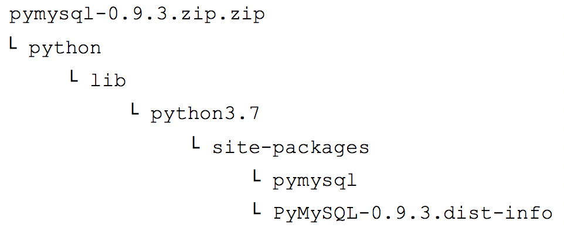
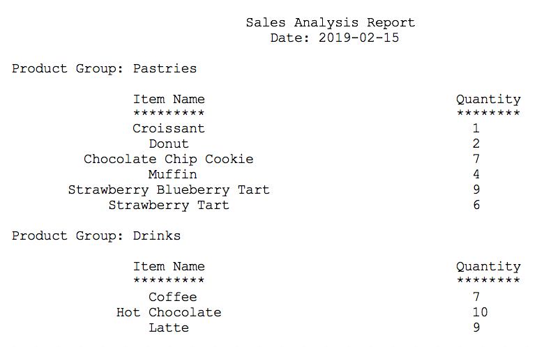

# Trabajo con AWS Lambda

## Información general del laboratorio

En este laboratorio, se implementará y configurará una solución de cómputo sin servidor basada en AWS Lambda. La función de Lambda generará un informe de análisis de ventas extrayendo datos de una base de datos y enviando los resultados por correo electrónico a diario. La información de conexión a la base de datos se almacenará en el almacén de parámetros de AWS Systems Manager. La base de datos en sí se ejecutará en Amazon Elastic Compute Cloud (Amazon EC2) Linux, Apache, MySQL, y una instancia PHP (LAMP).

En el diagrama siguiente se muestra la arquitectura de la solución del informe de análisis de ventas y se presenta el orden en que ocurren las acciones.


El diagrama incluye los siguientes pasos de la función:


| Paso | Detalles                                                      |
| ---- | ------------------------------------------------------------ |
| 1    | Un Evento de Amazon CloudWatch llama a la función de Lambda salesAnalysisReport todos los días, de lunes a sábado a las 20:00 h. |
| 2    | La función de Lambda salesAnalysisReport invoca otra función de Lambda, salesAnalysisReportDataExtractor, para recuperar los datos del informe. |
| 3    | La función salesAnalysisReportDataExtractor ejecuta una consulta analítica en la base de datos de la cafetería (cafe_db). |
| 4    | El resultado de la consulta se devuelve a la función salesAnalysisReport. |
| 5    | La función salesAnalysisReport da formato de mensaje al informe y lo publica en el tema salesAnalysisReportTopic de Amazon Simple Notification Service (Amazon SNS). |
| 6    | El tema de SNS salesAnalysisReportTopic envía el mensaje a través de un correo electrónico al administrador. |

En este laboratorio, se le proporciona el código Python de cada función de Lambda para que pueda centrarse en las tareas de SysOps de implementar, configurar y probar los componentes de la solución sin servidor.


## Objetivos

Después de completar este laboratorio, podrá hacer lo siguiente:

-	Reconocer los permisos de políticas de AWS Identity and Access Management (AWS IAM) necesarios para facilitar una función de Lambda a otros recursos de Amazon Web Services (AWS).
-	Crear una capa de Lambda para dar respuesta a la dependencia de una biblioteca externa.
-	Crear funciones de Lambda que extraigan datos de la base de datos y envíen informes al usuario.
-	Implementar y probar una función de Lambda que se inicie de acuerdo con una programación e invoque otra función.
-	Utilizar Registros de CloudWatch para solucionar problemas de ejecución de una función de Lambda.


## Duración

El tiempo estimado para completar este laboratorio es de **60 minutos**.


## Acceso a la Consola de administración de AWS

1. En la parte superior de estas instrucciones, elija <span id="ssb_voc_grey">Start Lab</span> (Comenzar laboratorio) para iniciar el laboratorio.

	Se abrirá el panel **Start Lab** (Comenzar laboratorio), donde se muestra el estado del laboratorio.

2. Espere hasta que aparezca el mensaje “Lab status: ready” (Estado de la sesión de laboratorio: listo) y, a continuación, elija la **X** para cerrar el panel **Start Lab** (Comenzar laboratorio).

3. En la parte superior de estas instrucciones, seleccione <span id="ssb_voc_grey">AWS</span> para abrir la Consola de administración de AWS en una pestaña nueva del navegador. El sistema iniciará la sesión de forma automática.

    **Sugerencia** Si no se abre una pestaña nueva del navegador, suele aparecer un anuncio o un ícono en la parte superior de este con un mensaje que indica que el navegador impide que el sitio web abra ventanas emergentes. Seleccione el anuncio o ícono y elija **Permitir ventanas emergentes**.

4. Ubique la pestaña de la Consola de administración de AWS de modo que aparezca al lado de estas instrucciones. Lo ideal sería que pudiera ver ambas pestañas del navegador al mismo tiempo para seguir los pasos del laboratorio.

    Deje abierta esta pestaña del navegador. Volverá a utilizarla más adelante en este laboratorio.

    **Importante:** No cambie la región del laboratorio a menos que se le indique específicamente.


## Tarea 1: observar las configuraciones del rol de IAM

En este laboratorio, creará dos funciones de Lambda. Cada una de estas funciones requerirá permisos para acceder a los recursos de AWS con los que interactúan. 

En esta tarea, analiza los roles de IAM y los permisos que otorgarán a las funciones de Lambda salesAnalysisReport y salesAnalysisReportDataExtractor que creará más tarde.


### Tarea 1.1: observar las configuraciones del rol de IAM salesAnalysisReport

5. En la Consola de administración de AWS, elija **Servicios** > **Seguridad, identidad y conformidad** > **IAM**.

6. En el panel de navegación, seleccione **Roles**.

7. En el cuadro de búsqueda, ingrese `sales`.

8. En los resultados filtrados, seleccione el hipervínculo **salesAnalysisReportRole**.

9. Seleccione la pestaña **Relaciones de confianza** y tenga en cuenta que lambda.amazonaws.com aparece como una entidad de confianza, lo que significa que el servicio de Lambda puede utilizar este rol.

10. Haga clic en la pestaña **Permisos** y observe las cuatro políticas asignadas a este rol. Para expandir cada rol y analizar los permisos que otorga cada política, seleccione el ícono **+** al lado de cada rol:

    *	**AmazonSNSFullAccess** proporciona acceso completo a los recursos de Amazon SNS.

    *	**AmazonSSMReadOnlyAccess** proporciona acceso de solo lectura a los recursos de Systems Manager.

    *	**AWSLambdaBasicRunRole** proporciona los permisos de escritura a Registros de CloudWatch (requeridos por cada función de Lambda).

    *	**AWSLambdaRole** otorga a una función de Lambda la capacidad de invocar otra función de Lambda. 
    
    La función de Lambda salesAnalysisReport que creará más adelante en este laboratorio usa el rol salesAnalysisReportRole.


### Tarea 1.2: observar las configuraciones del rol de IAM salesAnalysisReportDERole

11. Elija **Roles** nuevamente.

12. En el cuadro de búsqueda, ingrese `sales`.

13. En los resultados filtrados, seleccione el hipervínculo **salesAnalysisReportDERole**.

14. Seleccione la pestaña **Relaciones de confianza** y observe que lambda.amazonaws.com aparece como una entidad de confianza.

15. Seleccione la pestaña **Permisos** y observe los permisos concedidos a este rol:

    * **AWSLambdaBasicRunRole** proporciona permisos de escritura a Registros de CloudWatch.

    * **AWSLambdaVPCAccessRunRole** proporciona permisos a fin de administrar interfaces de red elástica para conectar una función a una nube virtual privada (VPC).


La función de Lambda salesAnalysisReportDataExtractor que creará a continuación usa el rol salesAnalysisReportDERole.


## Tarea 2: crear una capa de Lambda y una función de Lambda del extractor de datos

En esta tarea, primero creará una capa de Lambda y, a continuación, creará una función de Lambda que utilice la capa.

Comience por descargar los dos archivos que se requieren.

16. Para descargar los archivos del laboratorio que se requieren para esta tarea en su equipo local, seleccione los siguientes enlaces:

    <a href="%% S3_HTTP_PATH_PREFIX %%/pymysql-v3.zip">pymysql-v3.zip</a>

    <a href="%% S3_HTTP_PATH_PREFIX %%/salesAnalysisReportDataExtractor-v3.zip">salesAnalysisReportDataExtractor-v3.zip</a>

    **Nota**: El archivo salesAnalysisReportDataExtractor-v3.zip es una implementación de Python de una función de Lambda que utiliza la biblioteca cliente de código abierto PyMySQL para acceder a la base de datos de la cafetería de MySQL. Esta biblioteca se empaquetó en el archivo pymysql-v3.zip que se cargará en una capa de Lambda a continuación.

### Tarea 2.1: crear una capa de Lambda

En los próximos pasos, creará una capa de Lambda denominada pymysqlLibrary y cargará la biblioteca cliente en ella para que cualquier función que la requiera pueda utilizarla. Las capas de Lambda proporcionan un mecanismo flexible para reutilizar el código entre funciones de modo que no sea necesario incluir el código en el paquete de implementación de cada función.

17. En la Consola de administración de AWS, elija **Servicios** > **Informática** > **Lambda**.

    **Sugerencia:** Si el panel de navegación está cerrado, elija el ícono del menú contraído (tres líneas horizontales) para abrir el panel de **AWS Lambda**.

18. Seleccione **Capas**.

19. Seleccione **Crear una capa**.

20. Configure los siguientes parámetros de la capa:

    - En **Nombre**, ingrese `pymysqlLibrary`.

    - En **Descripción**, ingrese `PyMySQL library modules`.

    - Seleccione **Cargar un archivo .zip**. Para cargar el archivo pymysql-v3.zip, seleccione **Cargar**, diríjase a la carpeta donde descargó el archivo pymysql-v3.zip y ábralo.

    - Para **Tiempos de ejecución compatibles**, seleccione **Python 3.9**.

21. Seleccione **Crear**.

    Se muestra el mensaje “Successfully created layer pymysqlLibrary version 1” (Se creó correctamente la capa pymysqlLibrary versión 1).

    **Sugerencia**: La función de las capas de Lambda requiere que el archivo .zip que contiene el código o la biblioteca se ajuste a una estructura de carpetas específica. El archivo pymysqlLibary.zip que se utilizó en este laboratorio se empaquetó con la siguiente estructura de carpetas:

    
    
    Para obtener más información sobre las rutas de capas, consulte [Incluir dependencias de biblioteca en una capa](https://docs.aws.amazon.com/lambda/latest/dg/configuration-layers.html#configuration-layers-path).


### Tarea 2.2: crear una función de Lambda del extractor de datos

22. En el panel de navegación, seleccione **Funciones** para abrir la página del panel **Funciones**.

23. Seleccione **Crear una función** y configure las siguientes opciones:

    - En la parte superior de la página **Crear una función**, seleccione **Crear desde cero**.

    - En **Nombre de la función**, ingrese `salesAnalysisReportDataExtractor`.

    - En **Tiempo de ejecución**, elija **Python 3.9**.

    - Despliegue **Cambiar el rol de ejecución predeterminado** y configure las siguientes opciones:    

        - En **Rol de ejecución**, elija **Usar un rol existente**.

        - En **Rol existente:**, elija **salesAnalysisReportDERole**.

24. Seleccione **Crear una función**.

    Se abre una página nueva con el siguiente mensaje: “Successfully created the function salesAnalysisReportDataExtractor” (Se creó correctamente la función salesAnalysisReportDataExtractor).


### Tarea 2.3: agregar la capa de Lambda a la función

25. En el panel **Información general de la función**, haga clic en **Capas**.

26. En la parte inferior de la página, en el panel **Capas** seleccione **Añadir una capa**.

27. En la página **Agregar capa**, configure las siguientes opciones:

    - **Elija una capa**: seleccione **Capas personalizadas**.

    - **Capas personalizadas**: seleccione **pymysqlLibrary**.

    - **Versión**: seleccione **1**.

28. Elija **Agregar**.

    El panel **Información general de la función** muestra un recuento de **(1)** en el nodo de **Capas** para la función.

### Tarea 2.4: importar el código de la función de Lambda del extractor de datos

29. Vaya a la página **Lambda** > **Funciones** > **salesAnalysisReportDataExtractor**.

30. En el panel **Configuración del tiempo de ejecución**, seleccione **Editar**.

31. En **Controlador**, ingrese `salesAnalysisReportDataExtractor.lambda_handler`.

32. Seleccione **Guardar**.

33. En el panel **Código fuente**, haga clic en **Cargar desde**.

34. Seleccione **.zip file** (archivo .zip).

35. Seleccione **Cargar**, luego, diríjase hacia donde está el archivo **salesAnalysisReportDataExtractor-v3.zip** que descargó previamente y selecciónelo.

36. Seleccione **Guardar**.

    El código de la función de Lambda se importa y debería aparecer en el panel **Código fuente**. Si es necesario, en el panel de navegación **Entorno**, haga doble clic en **salesAnalysisReportDataExtractor.py** para mostrar el código.

37. Revise el código Python que implementa la función.

    **Nota:** Si el código aún no se muestra en el editor de código de la función, actualice la consola para que se muestre.

    Lea los comentarios incluidos en el código para comprender su flujo lógico. Tenga en cuenta que la función espera recibir información de conexión de la base de datos (dbURL, dbName, dbUser y dbPassword) en el parámetro de entrada del evento.


### Tarea 2.5: establecer la configuración de red para la función

El paso final antes de que pueda probar la función es establecer la configuración de la red. Como se muestra en el diagrama de arquitectura al comienzo de este laboratorio, esta función requiere acceso de red a la base de datos de la cafetería, que se ejecuta en una instancia LAMP de EC2. Por lo tanto, debe especificar la información de la VPC, de la subred y del grupo de seguridad de la instancia en la configuración de la función.

38. Seleccione la pestaña **Configuración** y, luego, seleccione **VPC**.

39. Seleccione **Editar** y configure las siguientes opciones:

    - **VPC**: elija la opción con **Cafe VPC** como **Nombre**.

    - **Subredes**: elija la opción con **Cafe Public Subnet 1** como **Nombre**.

      **Sugerencia**: Puede ignorar la advertencia (si aparece) que recomienda elegir al menos dos subredes para ejecutar en modo de alta disponibilidad porque no es aplicable a la función.

    - **Grupos de seguridad**: elija la opción con **CafeSecurityGroup** como **Nombre**.

    Tenga en cuenta que las reglas de entrada y salida del grupo de seguridad se muestran de forma automática después del campo.

40. Seleccione **Guardar**.


## Tarea 3: probar la función de Lambda del extractor de datos

### Tarea 3.1: iniciar una prueba de la función de Lambda

Ahora está todo listo para realizar una prueba de la función salesAnalysisReportDataExtractor. Para invocarla, debe suministrar valores para los parámetros de conexión de la base de datos de la cafetería. Recuerde que estos se almacenan en el almacén de parámetros.

41. En una pestaña del navegador, abra la Consola de administración de AWS y seleccione **Servicios** > **Administración y gobernanza** > **Systems Manager**.

42. En el panel de navegación, seleccione **Almacén de parámetros**.

43. Seleccione cada uno de los siguientes nombres de parámetro y copie el **Valor** de cada uno y péguelo en un documento de editor de texto:

    -	/cafe/dbUrl

    -	/cafe/dbName

    -	/cafe/dbUser

    -	/cafe/dbPassword

44. Regrese a la pestaña del navegador de la **consola de administración de Lambda**. En la página de la función **salesAnalysisReportDataExtractor**, elija la pestaña **Probar**.

45. Configure el panel **Evento de prueba** de la siguiente manera:

    - En **Acción de evento de prueba**, seleccione **Crear un nuevo evento**.

    - En **Nombre del evento**, ingrese `SARDETestEvent`.

    - En **Plantilla**, elija **hello-world**.

    - En el panel **Evento JSON**, reemplace el objeto JSON por el siguiente objeto JSON:

      ```json
    {
        "dbUrl": "<value of /cafe/dbUrl parameter>",
        "dbName": "<value of /cafe/dbName parameter>",
        "dbUser": "<value of /cafe/dbUser parameter>",
        "dbPassword": "<value of /cafe/dbPassword parameter>"
      }
      ```
    
    - En este código, sustituya el valor de cada parámetro con los valores que pegó en un editor de texto en los pasos anteriores. Ponga estos valores entre comillas.

46. Seleccione **Guardar**.

47. Seleccione **Probar**.

    Después de algunos momentos, la página muestra el mensaje “Resultado de la ejecución: error”. 

### Tarea 3.2: resolver problemas de la función de Lambda del extractor de datos

48.  En el panel **Resultado de la ejecución**, elija **Detalles** para expandirlo y observe que el objeto de error devolvió un mensaje similar al siguiente después de que se ejecutó la función:

    ```json
    {
      "errorMessage": "2019-02-14T04:14:15.282Z ff0c3e8f-1985-44a3-8022-519f883c8412 Task timed out after 3.00 seconds"
    }
    ```

    Este mensaje indica que la función excedió el tiempo después de 3 segundos.

    La sección **Resultado de registro** incluye líneas que comienzan con las siguientes palabras clave:

    -	**START** (Comenzar) indica que la función comenzó a ejecutarse.

    -	**END** (Finalizar) indica que la función terminó de ejecutarse.

    -	**REPORT** (Informar) proporciona un resumen de las estadísticas de rendimiento y utilización de recursos relacionadas con el momento en que se ejecutó la función.

    ¿Qué causó este error?

### Tarea 3.3: analizar y corregir la función de Lambda

49. En esta tarea, analizará y corregirá el problema observado cuando probó la función de Lambda.

    Estos son algunos consejos para ayudarlo a encontrar la solución:

    - Una de las primeras cosas que hace esta función es conectarse a la base de datos MySQL que se ejecuta en una instancia de EC2 separada. Espera una determinada cantidad de tiempo para establecer una conexión correcta. Después de transcurrido este tiempo, si la conexión no se establece, se agota el tiempo de espera de la función.

    - De forma predeterminada, una base de datos MySQL utiliza el protocolo MySQL y escucha en el puerto número 3306 para el acceso de los clientes.

    - Seleccione la pestaña **Configuración** de nuevo y haga clic en **VPC**. Observe las **Reglas de entrada** para el grupo de seguridad que utiliza la instancia de EC2 que ejecuta la base de datos. ¿Aparece el número de puerto (3306) de la base de datos? Puede elegir el enlace del grupo de seguridad si desea editar y agregarle una regla de entrada.

50. Una vez que haya corregido el problema, regrese a la pestaña del navegador con la página de la función **salesAnalysisReportDataExtractor**. Seleccione la pestaña **Probar** y, nuevamente, **Probar**.

    You should now see a green box showing the message “Resultado de la ejecución: correcta (registros).” (Este mensaje indica que la función se ejecutó correctamente).

51. Seleccione **Detalles** para expandirla.

    La función devuelve el siguiente objeto JSON:

    ```json
    {
      "statusCode": 200,
      "body": []
    }
    ```

    El campo del cuerpo, que contiene los datos del informe que extrajo la función, está vacío porque no hay datos de pedidos en la base de datos.

### Tarea 3.4: hacer un pedido y probar nuevamente

En esta tarea, accederá al sitio web de la cafetería y hará algunos pedidos para propagar datos en la base de datos. 

52. Para abrir el sitio web de la cafetería en una pestaña nueva del navegador, encuentre la dirección IP pública de la instancia de EC2 de la cafetería. 

    La URL del sitio web tiene el formato http://publicIP/cafe donde **publicIP** es la dirección IP pública de la instancia de EC2 de la cafetería. Hay dos maneras de encontrar la dirección IP pública:

    Opción 1: 

    - En la Consola de administración de AWS, elija **Servicios** > **Informática** > **EC2**.
    
    - En el panel de navegación, seleccione **Instancias**.

    - Elija **CafeInstance**.

    - Copie la **dirección IPv4 pública** en un editor de texto. 

    - En una nueva pestaña del navegador, ingrese http://publicIP/cafe y reemplace *publicIP* por la dirección IPv4 pública que acaba de copiar en un editor de texto.
    
    - Presione Intro para cargar el sitio web de la cafetería.

    Opción 2:

    - Arriba de estas instrucciones, seleccione <span id="ssb_voc_grey">Details</span> (Detalles) y, a continuación, elija <span id="ssb_voc_grey">Show</span> (Mostrar). 

    - En la ventana **Credentials** (Credenciales), copie la dirección **CafePublicIP** y péguela en un editor de texto.

    - En una nueva pestaña del navegador, ingrese http://publicIP/cafe y reemplace *publicIP* por la dirección IPv4 pública que acaba de copiar en un editor de texto.
    
    - Presione Intro para cargar el sitio web de la cafetería.

53. En el sitio web de la cafetería, seleccione **Menu** (Menu) y realice algunos pedidos para propagar datos en la base de datos. 

    Ahora que hay datos de pedidos en la base de datos, pruebe la función de nuevo. 

54. Vaya a la pestaña del navegador con la página de la función **salesAnalysisReportDataExtractor**.

55. Seleccione la pestaña **Probar** y, luego, **Probar**.

    El objeto JSON devuelto ahora contiene información sobre la cantidad de productos en el campo del cuerpo, de forma similar a la siguiente:

    ```json
    {
      "statusCode": 200,
      "body": [
        {
          "product_group_number": 1,
          "product_group_name": "Pastries",
          "product_id": 1,
          "product_name": "Croissant",
          "quantity": 1
        },
        {
          "product_group_number": 2,
          "product_group_name": "Drinks",
          "product_id": 8,
          "product_name": "Hot Chocolate",
          "quantity": 2
         }
        ]
    }
    ```

    ¡Felicitaciones! Ha creado de manera correcta la función de Lambda salesAnalysisReportDataExtractor.


## Tarea 4: configurar las notificaciones

En esta tarea, creará un tema de SNS y, luego, suscribirá una dirección de correo electrónico al tema.

### Tarea 4.1: crear un tema de SNS

En esta tarea, creará un tema de SNS donde se publica el informe de análisis de ventas y suscribirá una dirección de correo electrónico al tema. El tema es responsable de entregar cualquier mensaje que reciba a todos los suscriptores. Utilizará la consola de Amazon SNS para esta tarea.

56. En la Consola de administración de AWS, elija **Servicios** > **Integración de aplicaciones** > **Simple Notification Service**.

57. En el panel de navegación, elija **Temas** y, luego, seleccione **Crear un tema**.

    **Nota:** Si el enlace de **Temas** no se encuentra visible, elija el ícono de las tres líneas horizontales y, a continuación, seleccione **Temas**.

    Se abre la página **Crear un tema**.

58. Configure las siguientes opciones:

    - **Tipo**: elija **Estándar**.

    - **Nombre:** ingrese `salesAnalysisReportTopic`.

    - **Nombre para visualización**: ingrese `SARTopic`.

59. Seleccione **Crear un tema**.

60. Copie el valor de **ARN** y péguelo en un editor de texto.

    Debe especificar este ARN cuando configure la siguiente función de Lambda.

### Tarea 4.2: suscribirse al tema de SNS

61. Elija **Crear una suscripción** y, luego, configure las siguientes opciones:

    -	**Protocolo**: seleccione **Correo electrónico**.

    -	**Punto de enlace**: escriba una dirección de correo electrónico válida a la que pueda acceder.

62. Seleccione **Crear una suscripción**.

    La suscripción se crea y tiene un **Estado** de *Pendiente de confirmación*.

63. Revise la bandeja de entrada de la dirección de correo electrónico que proporcionó.

    Debería ver un correo electrónico de SARTopic con el asunto “AWS Notification - Subscription Confirmation.” (Notificación de AWS: confirmación de la suscripción).

64. Abra el correo electrónico y seleccione **Confirmar la suscripción**.

    Se abrirá una nueva pestaña del navegador y aparecerá una página con el mensaje “Subscription confirmed!” (¡Suscripción confirmada!).


## Tarea 5: crear la función de Lambda salesAnalysisReport

A continuación, creará y configurará la función de Lambda salesAnalysisReport. Esta función es el impulsor principal del flujo de informe de análisis de ventas. Realiza lo siguiente:

  - Recupera la información de conexión de la base de datos del almacén de parámetros.

  - Invoca la función de Lambda salesAnalysisReportDataExtractor, que recupera los datos del informe de la base de datos.

  - Da formato y publica un mensaje que contiene los datos del informe del tema de SNS.

### Tarea 5.1: conectarse a la instancia CLI Host

En esta tarea, usará EC2 Instance Connect para iniciar sesión en la instancia CLI Host que se ejecuta en su cuenta de AWS y que ya tiene instalada la Interfaz de la línea de comandos de AWS (AWS CLI), así como el código de Python necesario para crear la siguiente función de Lambda. A continuación, ejecutará un comando de la AWS CLI para crear la función de Lambda. Por último, realizará una prueba de unidades de la función con la consola de administración de Lambda.

65. En la **Consola de administración de Elastic Compute Cloud**, en el panel de navegación, seleccione **Instancias**.

66. En la lista de instancias de EC2, elija la casilla de verificación <i class="far fa-check-square" style='color:blue'></i> de la instancia **CLI Host**. 

67. Elija **Conectar**.

68. En la pestaña **EC2 Instance Connect**, elija <span style="ssb_orange">**Conectar**</span> para conectarse a CLI Host.

### Tarea 5.2: configurar la AWS CLI

Las instancias de Amazon Linux tienen la AWS CLI previamente instalada, sin embargo, deberá proveer las credenciales para conectar el cliente AWS CLI a una cuenta de AWS.

69. En la ventana del terminal de EC2 Instance Connect, ejecute el siguiente comando para actualizar el software de la AWS CLI con las credenciales:

    ```plain
    aws configure
    ```

70. Cuando se le solicite, ingrese la siguiente información:

    -  **AWS Access Key ID** (ID de clave de acceso de AWS): en la parte superior de estas instrucciones, elija el menú desplegable <span id="ssb_voc_grey">Details</span> (Detalles) y, luego, <span id="ssb_voc_grey">Show</span> (Mostrar). Se abrirá la ventana **Credentials** (Credenciales). En esta ventana, copie el valor de **AccessKey**, péguelo en la ventana del terminal y presione Intro.

    -  **AWS Secret Access Key** (Clave de acceso secreta de AWS): en la misma ventana **Credentials** (Credenciales), copie el valor de **SecretKey**, péguelo en la ventana del terminal y presione Intro.

    -  **Default region name** (Nombre predeterminado de la región): especifique el código de la región en la que creó la función de Lambda anterior. Para este laboratorio, ingrese el código de la región `us-west-2` en la ventana del terminal y presione Intro. Para encontrar este código, en la esquina superior derecha de la consola de administración de Lambda, elija el menú desplegable Región. 

    -  **Default output format** (Formato de resultado predeterminado): ingrese `json` y, luego, presione Intro.


### Tarea 5.3: crear la función de Lambda salesAnalysisReport con la AWS CLI

71. Para verificar que el archivo salesAnalysisReport-v2.zip que contiene el código para la función de Lambda salesAnalysisReport se encuentre en CLI Host, ejecute los siguientes comandos en el terminal:

    ```
    cd activity-files
    ls
    ```

    **Nota:** Antes de crear la función, debe recuperar el ARN del rol de IAM salesAnalysisReportRole. Lo especificará en los pasos siguientes.

72. Para encontrar el ARN de un rol de IAM, abra la consola de administración de IAM y seleccione **Roles**. 

73. En el cuadro de búsqueda, ingrese **salesAnalysisReportRole** y elija el nombre del rol. La página **Resumen** incluye el **ARN**.

74. Copie el ARN y péguelo en un editor de texto.

75. A continuación, utilice el comando de Lambda create-function para crear la función de Lambda y configúrela a fin de utilizar el rol de IAM salesAnalysisReportRole.

Para ello, en el símbolo del sistema de la ventana del terminal, pegue el siguiente comando. Reemplace *\<salesAnalysisReportRoleARN>* por el valor del ARN de salesAnalysisReportRole ARN que copió en el paso anterior y reemplace *\<region>* por el código de región `us-west-2`. Esta es la región donde creó la función de Lambda anterior. Para encontrar este código, en la esquina superior derecha de la consola de administración de Lambda, elija el menú desplegable Región.


```plain
aws lambda create-function \
--function-name salesAnalysisReport \
--runtime python3.9 \
--zip-file fileb://salesAnalysisReport-v2.zip \
--handler salesAnalysisReport.lambda_handler \
--region <region> \
--role <salesAnalysisReportRoleARN>
```

Una vez que se completa el comando, devuelve un objeto JSON que describe los atributos de la función. Ahora puede completar la configuración y realizar la prueba de unidades.


### Tarea 5.4: configurar la función de Lambda salesAnalysisReport

76. Abra la consola de administración de Lambda.

77. Seleccione **Funciones**, y a continuación, elija **salesAnalysisReport**. 

    Se abre la página **Detalles** de la función.

78. Revise los detalles en los paneles **Información general de la función** y **Código fuente** de la función creada.

    En particular, lea el código de la función y utilice los comentarios incrustados para ayudarlo a entender la lógica.

    Observe en la línea 26 que la función recupera el ARN del tema en el que se publicará, desde una variable de entorno denominada **topicARN**. Por lo tanto, deberá definir esa variable en el panel **Variables de entorno**.

79. Seleccione la pestaña **Configuración** y elija **Variables de entorno**.

80. Seleccione **Editar**.

81. Elija **Agregar variable de entorno** y configure las siguientes opciones:

    - **Clave**: ingrese `topicARN`.

    - **Valor**: pegue el valor del ARN del tema de SNS salesAnalysisReportTopic que copió anteriormente.

82. Seleccione **Guardar**.

    Aparece el siguiente mensaje: “Successfully updated the function salesAnalysisReport.” (Se actualizó correctamente la función salesAnalysisReport).

### Tarea 5.5: probar la función de Lambda salesAnalysisReport

Ahora ya puede probar la función.

83. Seleccione la pestaña **Probar** y configure el evento de prueba de la siguiente manera:

    - En **Acción de evento de prueba**, elija **Crear un nuevo evento**.

    - En **Nombre del evento**, ingrese `SARTestEvent`.

    - En **Plantilla**, elija **hello-world**.

    La función no requiere ningún parámetro de entrada. Deje las líneas de JSON predeterminadas tal como están.

84. Seleccione **Guardar**.

85. Seleccione **Probar**.

    Aparece un cuadro verde con el mensaje “Resultado de la ejecución: correcta (registros)”.

    **Sugerencia:** Si recibe un error del tiempo de espera, vuelva a hacer clic en el botón **Probar**. En ocasiones, cuando se ejecuta por primera vez una función, tarda un poco más en iniciarse y se supera el valor de tiempo de espera predeterminado de Lambda (3 segundos). Normalmente, puede volver a ejecutar la función y el error desaparecerá. Como alternativa, puede aumentar el valor del tiempo de espera. Para hacerlo, siga estos pasos:

    - Seleccione la pestaña **Configuración**.
    
    - Seleccione **Configuración general**.
    
    - Seleccione **Editar**.
    
    - Ajuste el **Tiempo de espera** según sea necesario. 

    - Seleccione **Guardar**.

86. Seleccione **Detalles** para expandirla.

La función debería haber devuelto el siguiente objeto JSON:

```json
{
    "statusCode": 200,
    "body": "\"Sale Analysis Report sent.\""
}
```

87. Revise la bandeja de entrada de su correo electrónico.

    Si no hay errores, debe recibir un correo electrónico de Notificaciones de AWS con el asunto “Daily Sales Analysis Report” (Informe de análisis de ventas diario).

    El correo electrónico debe contener un informe similar a la siguiente imagen en función de los pedidos que realizó en el sitio web de la cafetería:

    

88. Puede hacer más pedidos en el sitio web de la cafetería y probar la función para ver los cambios en el informe que recibe.

    ¡Muy buen trabajo! Ha realizado correctamente una prueba de unidades de la función de Lambda salesAnalysisReport.

### Tarea 5.6: agregar un desencadenador a la función de Lambda salesAnalysisReport

Para completar la implementación de la función salesAnalysisReport, configure el informe a fin de que se inicie cada día de lunes a sábado a las 20.00 h. Para eso, utilice un Evento de CloudWatch como mecanismo desencadenador.

89. En la página **Información general de la función**, elija **Agregar desencadenador**. Se muestra el panel **Agregar desencadenador**.

90. En la página **Agregar desencadenador**, configure las siguientes opciones:

    - En el panel de **Configuración del desencadenador**, en la lista desplegable, elija **EventBridge (CloudWatch Events)** (EventBridge [Eventos de CloudWatch]).

    - En **Regla**, seleccione **Crear una nueva regla**. 

    - En **Nombre de la regla**, ingrese `salesAnalysisReportDailyTrigger`.

    - En **Descripción de regla**, ingrese `Initiates report generation on a daily basis`.

    - En **Tipo de regla**, seleccione **Expresión de programación**.

    - En **Expresión de programación**, especifique el programa que desea mediante una expresión Cron. La sintaxis general de una expresión Cron requiere seis campos separados por espacios de la siguiente manera: 
    
        - cron(minutos horas día-del-mes mes día-de-la-semana año): además, todas las horas de una expresión Cron se basan en la zona horaria UTC.
        
        **Nota:** A modo de prueba, ingrese una expresión que programe el desencadenador a 5 minutos de la hora actual. Puede utilizar los siguientes ejemplos:
        
        - Si se encuentra en Londres (zona horaria UTC) y la hora actual es 11:30 h, ingrese la siguiente expresión:
        
            ` cron(35 11 ? * MON-SAT *) `
        - Si se encuentra en Nueva York (zona horaria UTC - 5 durante la hora estándar del este) y la hora actual es 11:30 h, ingrese la siguiente expresión:
        
            ```cron(35 16 ? * MON-SAT *)```
        
        Esta expresión Cron programa que se invoque el evento a las 11:35 h de lunes a sábado.
    
    **Sugerencia**: Para obtener más información sobre la sintaxis de las expresiones de programación, consulte [Programar expresiones para reglas](https://docs.aws.amazon.com/AmazonCloudWatch/latest/events/ScheduledEvents.html).
    
    Para conocer la hora UTC correcta, diríjase a cualquier navegador y escriba `UTC time`.

91. Elija **Agregar**.

Se crea y se muestra el nuevo desencadenador en el panel **Información general de la función** y en el panel **Desencadenadores**.

92. Considere la siguiente pregunta de desafío, y ajuste la expresión Cron según sea necesario: ¿Cuál debería ser la expresión Cron al implementar la función en producción? Recuerde que debe programar el desencadenador para todos los días, de lunes a sábado. Suponga que se encuentra en la zona horaria UTC.

93. Espere a que pasen 5 minutos y, a continuación, revise la bandeja de entrada de su correo electrónico.

Si no hay errores, debe ver un correo electrónico nuevo de Notificaciones de AWS con el asunto “Daily Sales Analysis Report” (Informe de análisis de ventas diario). Los Eventos de CloudWatch invocaron este mensaje a la hora que especificó en la expresión Cron.


## Conclusión

¡Felicitaciones! Realizó correctamente lo siguiente:

-	Reconoció los permisos de las políticas de IAM necesarios para habilitar una función de Lambda en otros recursos de AWS.
-	Creó una capa de Lambda para dar respuesta a la dependencia de una biblioteca externa.
-	Creó funciones de Lambda que extraen datos de la base de datos y envían informes al usuario.
-	Implementó y probó una función de Lambda que se inicia de acuerdo con una programación y que invoca otra función.
-	Utilizó Registros de CloudWatch para solucionar problemas de ejecución de una función de Lambda.


## Laboratorio completado

<i class="icon-flag-checkered"></i> ¡Felicitaciones! Completó el laboratorio.

94. Seleccione <span id="ssb_voc_grey">End Lab</span> (Finalizar laboratorio) en la parte superior de esta página y, a continuación, seleccione <span id="ssb_blue">Yes</span> (Sí) para confirmar que desea finalizar el laboratorio.

Aparecerá un panel que indica “You may close this message box now. Lab resources are terminating.” (Ya puede cerrar este cuadro de mensaje. Los recursos del laboratorio se están cerrando).

95. Para cerrar el panel **End lab** (Finalizar laboratorio), seleccione la **X** en la esquina superior derecha.


## Recursos adicionales

- [Uso de AWS Lambda con eventos programados](https://docs.aws.amazon.com/lambda/latest/dg/services-cloudwatchevents-tutorial.html)
- [Acceso a Registros de Amazon CloudWatch para AWS Lambda]([Accessing Amazon CloudWatch logs for AWS Lambda - AWS Lambda](https://docs.aws.amazon.com/lambda/latest/dg/monitoring-cloudwatchlogs.html)

Para obtener más información sobre AWS Training and Certification, consulte [AWS Training and Certification](http://aws.amazon.com/training/).

*Sus comentarios son bienvenidos y valorados.*

Si desea compartir alguna sugerencia o corrección, ingrese los detalles en nuestro [Formulario de contacto de AWS Training and Certification](https://support.aws.amazon.com/#/contacts/aws-training).

*© 2023, Amazon Web Services, Inc. o sus filiales. Todos los derechos reservados. Este contenido no puede reproducirse ni redistribuirse, total ni parcialmente, sin el permiso previo por escrito de Amazon Web Services, Inc. Queda prohibida la copia, el préstamo o la venta de carácter comercial.*