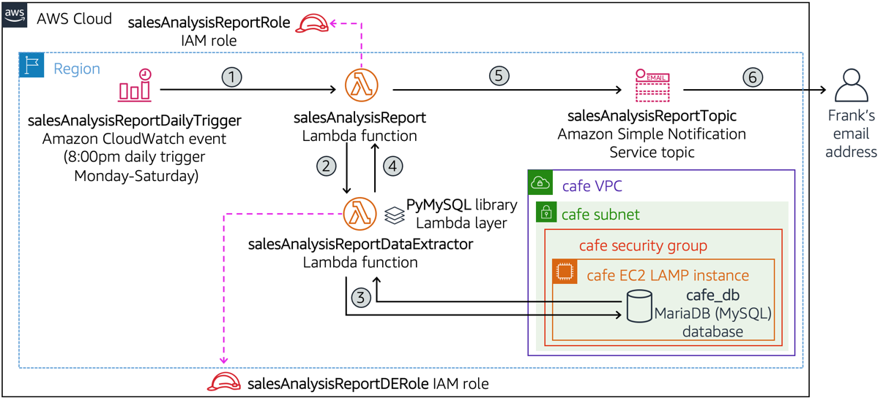

# Trabajo con AWS Lambda

## Información general del laboratorio

AWS Lambda es un servicio de computación serverless que le permite ejecutar código sin aprovisionar ni administrar servidores. Lambda ejecuta su código solo cuando es necesario y escala automáticamente, desde unas pocas solicitudes por día hasta miles por segundo. Solo paga por el tiempo de computación que consume.

En este laboratorio, creará funciones Lambda que responden a eventos, configurará triggers desde diferentes servicios de AWS, y implementará una arquitectura event-driven completa. También explorará el monitoreo y debugging de funciones Lambda.



## Objetivos

Al finalizar este laboratorio, podrá realizar lo siguiente:

- Crear y configurar funciones AWS Lambda
- Implementar triggers de eventos desde múltiples servicios
- Configurar variables de entorno y permisos IAM para Lambda
- Usar AWS Lambda con VPC para acceso a recursos privados
- Implementar logging y monitoreo de funciones Lambda
- Crear layers de Lambda para reutilización de código
- Configurar funciones Lambda para procesamiento de archivos
- Implementar patrones de arquitectura serverless

## Duración

El tiempo estimado para completar este laboratorio es de **60 minutos**.

## Tarea 1: Crear su primera función Lambda

En esta tarea, creará una función Lambda básica para procesar eventos.

1. En la **Consola de administración de AWS**, busque y seleccione **Lambda**.

2. En el panel de Lambda, elija **Create function** (Crear función).

3. Configure la función:
   - Seleccione **Author from scratch** (Crear desde cero)
   - **Function name**: `ProcessOrderFunction`
   - **Runtime**: Python 3.11
   - **Architecture**: x86_64

4. En **Permissions** (Permisos):
   - Seleccione **Create a new role with basic Lambda permissions**

5. Elija **Create function** (Crear función).

6. En el editor de código, reemplace el código predeterminado con:

```python
import json
import boto3
from datetime import datetime

def lambda_handler(event, context):
    """
    Función Lambda para procesar pedidos de una cafetería
    """
    
    # Log del evento recibido
    print(f"Evento recibido: {json.dumps(event)}")
    
    # Extraer información del pedido
    order_id = event.get('order_id', 'unknown')
    customer_name = event.get('customer_name', 'anonymous')
    items = event.get('items', [])
    total = event.get('total', 0)
    
    # Procesar el pedido
    processed_order = {
        'order_id': order_id,
        'customer_name': customer_name,
        'items': items,
        'total': total,
        'status': 'processed',
        'processed_at': datetime.utcnow().isoformat(),
        'processing_region': context.invoked_function_arn.split(':')[3]
    }
    
    # Simular validación de pedido
    if total > 0 and len(items) > 0:
        processed_order['validation'] = 'valid'
        print(f"Pedido {order_id} procesado exitosamente para {customer_name}")
    else:
        processed_order['validation'] = 'invalid'
        processed_order['status'] = 'rejected'
        print(f"Pedido {order_id} rechazado: datos incompletos")
    
    return {
        'statusCode': 200,
        'body': json.dumps(processed_order),
        'headers': {
            'Content-Type': 'application/json'
        }
    }
```

7. Elija **Deploy** (Implementar) para guardar los cambios.

## Tarea 2: Probar la función Lambda

Pruebe su función Lambda con diferentes eventos de prueba.

8. Elija **Test** (Probar).

9. Configure el evento de prueba:
   - **Event name**: `test-order`
   - Reemplace el JSON con:

```json
{
  "order_id": "ORD-001",
  "customer_name": "María García",
  "items": [
    {"name": "Café Americano", "quantity": 2, "price": 3.50},
    {"name": "Croissant", "quantity": 1, "price": 2.75}
  ],
  "total": 9.75
}
```

10. Elija **Save** (Guardar) y luego **Test** (Probar).

11. Revise los resultados:
    - **Response** (Respuesta): Datos del pedido procesado
    - **Function Logs** (Logs de función): Información de debugging
    - **Request ID**: Identificador único de la ejecución

12. Cree otro evento de prueba para un pedido inválido:
    - **Event name**: `invalid-order`
    - JSON:

```json
{
  "order_id": "ORD-002",
  "customer_name": "Juan Pérez",
  "items": [],
  "total": 0
}
```

13. Pruebe con este evento y observe cómo se maneja el caso inválido.

## Tarea 3: Configurar variables de entorno

Configure variables de entorno para hacer su función más flexible.

14. En la función Lambda, vaya a la pestaña **Configuration** (Configuración).

15. Seleccione **Environment variables** (Variables de entorno).

16. Elija **Edit** (Editar) y agregue:
    - **Key**: `STORE_NAME`, **Value**: `Café Central`
    - **Key**: `MIN_ORDER_AMOUNT`, **Value**: `5.00`
    - **Key**: `TAX_RATE`, **Value**: `0.08`

17. Elija **Save** (Guardar).

18. Actualice el código de la función para usar estas variables:

```python
import json
import boto3
import os
from datetime import datetime

def lambda_handler(event, context):
    """
    Función Lambda para procesar pedidos con configuración dinámica
    """
    
    # Obtener variables de entorno
    store_name = os.environ.get('STORE_NAME', 'Cafetería')
    min_order = float(os.environ.get('MIN_ORDER_AMOUNT', '0'))
    tax_rate = float(os.environ.get('TAX_RATE', '0'))
    
    print(f"Procesando pedido para {store_name}")
    
    # Extraer información del pedido
    order_id = event.get('order_id', 'unknown')
    customer_name = event.get('customer_name', 'anonymous')
    items = event.get('items', [])
    subtotal = event.get('total', 0)
    
    # Calcular impuestos y total
    tax_amount = subtotal * tax_rate
    total_with_tax = subtotal + tax_amount
    
    # Procesar el pedido
    processed_order = {
        'order_id': order_id,
        'customer_name': customer_name,
        'store_name': store_name,
        'items': items,
        'subtotal': subtotal,
        'tax_amount': round(tax_amount, 2),
        'total': round(total_with_tax, 2),
        'processed_at': datetime.utcnow().isoformat(),
        'processing_region': context.invoked_function_arn.split(':')[3]
    }
    
    # Validar pedido
    if subtotal >= min_order and len(items) > 0:
        processed_order['status'] = 'approved'
        processed_order['validation'] = 'valid'
        print(f"Pedido {order_id} aprobado para {customer_name} - Total: ${total_with_tax:.2f}")
    else:
        processed_order['status'] = 'rejected'
        processed_order['validation'] = 'invalid'
        processed_order['rejection_reason'] = f'Monto mínimo requerido: ${min_order}'
        print(f"Pedido {order_id} rechazado - Monto insuficiente")
    
    return {
        'statusCode': 200,
        'body': json.dumps(processed_order),
        'headers': {
            'Content-Type': 'application/json'
        }
    }
```

19. Elija **Deploy** y pruebe la función actualizada.

## Tarea 4: Crear un trigger de S3

Configure un trigger para que la función se ejecute cuando se carguen archivos a S3.

20. Navegue a **S3** y cree un bucket:
    - **Bucket name**: `lambda-orders-bucket-[su-nombre]-[fecha]`
    - **Region**: Misma región que su función Lambda

21. Regrese a su función Lambda y elija **Add trigger** (Agregar trigger).

22. Configure el trigger:
    - **Source**: S3
    - **Bucket**: Seleccione el bucket que creó
    - **Event type**: All object create events
    - **Prefix**: `orders/`
    - **Suffix**: `.json`

23. Elija **Add** (Agregar).

24. Actualice el código de la función para manejar eventos de S3:

```python
import json
import boto3
import os
from datetime import datetime
from urllib.parse import unquote_plus

s3_client = boto3.client('s3')

def lambda_handler(event, context):
    """
    Función Lambda para procesar archivos de pedidos desde S3
    """
    
    # Verificar si el evento viene de S3
    if 'Records' in event:
        for record in event['Records']:
            if 's3' in record:
                return process_s3_event(record, context)
    
    # Si no es evento de S3, procesar como pedido directo
    return process_direct_order(event, context)

def process_s3_event(record, context):
    """
    Procesar evento de S3
    """
    bucket_name = record['s3']['bucket']['name']
    object_key = unquote_plus(record['s3']['object']['key'])
    
    print(f"Procesando archivo: {object_key} del bucket: {bucket_name}")
    
    try:
        # Descargar el archivo desde S3
        response = s3_client.get_object(Bucket=bucket_name, Key=object_key)
        file_content = response['Body'].read().decode('utf-8')
        order_data = json.loads(file_content)
        
        # Procesar el pedido
        result = process_direct_order(order_data, context)
        
        # Guardar resultado procesado
        result_key = object_key.replace('.json', '_processed.json')
        s3_client.put_object(
            Bucket=bucket_name,
            Key=f"processed/{result_key}",
            Body=json.dumps(json.loads(result['body']), indent=2),
            ContentType='application/json'
        )
        
        print(f"Resultado guardado en: processed/{result_key}")
        
        return {
            'statusCode': 200,
            'body': json.dumps({
                'message': f'Archivo {object_key} procesado exitosamente',
                'result_location': f"processed/{result_key}"
            })
        }
        
    except Exception as e:
        print(f"Error procesando archivo {object_key}: {str(e)}")
        return {
            'statusCode': 500,
            'body': json.dumps({'error': str(e)})
        }

def process_direct_order(event, context):
    """
    Procesar pedido directo (código anterior)
    """
    store_name = os.environ.get('STORE_NAME', 'Cafetería')
    min_order = float(os.environ.get('MIN_ORDER_AMOUNT', '0'))
    tax_rate = float(os.environ.get('TAX_RATE', '0'))
    
    order_id = event.get('order_id', 'unknown')
    customer_name = event.get('customer_name', 'anonymous')
    items = event.get('items', [])
    subtotal = event.get('total', 0)
    
    tax_amount = subtotal * tax_rate
    total_with_tax = subtotal + tax_amount
    
    processed_order = {
        'order_id': order_id,
        'customer_name': customer_name,
        'store_name': store_name,
        'items': items,
        'subtotal': subtotal,
        'tax_amount': round(tax_amount, 2),
        'total': round(total_with_tax, 2),
        'processed_at': datetime.utcnow().isoformat(),
        'processing_region': context.invoked_function_arn.split(':')[3]
    }
    
    if subtotal >= min_order and len(items) > 0:
        processed_order['status'] = 'approved'
        processed_order['validation'] = 'valid'
    else:
        processed_order['status'] = 'rejected'
        processed_order['validation'] = 'invalid'
        processed_order['rejection_reason'] = f'Monto mínimo requerido: ${min_order}'
    
    return {
        'statusCode': 200,
        'body': json.dumps(processed_order),
        'headers': {
            'Content-Type': 'application/json'
        }
    }
```

25. Elija **Deploy** para actualizar la función.

## Tarea 5: Probar el trigger de S3

Pruebe el trigger cargando un archivo JSON a S3.

26. Cree un archivo JSON de pedido en su computadora local:

```json
{
  "order_id": "ORD-S3-001",
  "customer_name": "Ana Martínez",
  "items": [
    {"name": "Latte", "quantity": 1, "price": 4.50},
    {"name": "Muffin de Arándanos", "quantity": 2, "price": 3.25}
  ],
  "total": 11.00
}
```

27. En la consola de S3, navegue a su bucket.

28. Cree una carpeta llamada `orders/`.

29. Cargue el archivo JSON en la carpeta `orders/` con el nombre `order-001.json`.

30. Regrese a Lambda y verifique los logs de CloudWatch:
    - En la función, vaya a **Monitor** > **View CloudWatch logs**
    - Observe los logs de la ejecución automática

31. En S3, verifique que se creó la carpeta `processed/` con el resultado.

## Tarea 6: Configurar notificaciones SNS

Configure notificaciones por email cuando se procesen pedidos importantes.

32. Navegue a **SNS** y cree un tema:
    - **Name**: `order-notifications`
    - **Type**: Standard

33. Cree una suscripción:
    - **Protocol**: Email
    - **Endpoint**: Su dirección de correo electrónico

34. Confirme la suscripción desde su email.

35. Actualice los permisos de la función Lambda:
    - Vaya a **Configuration** > **Permissions**
    - Elija el rol de ejecución
    - Agregue la política `AmazonSNSPublishPolicy`

36. Actualice el código para enviar notificaciones:

```python
import json
import boto3
import os
from datetime import datetime
from urllib.parse import unquote_plus

s3_client = boto3.client('s3')
sns_client = boto3.client('sns')

# ARN del tema SNS (reemplazar con el suyo)
SNS_TOPIC_ARN = 'arn:aws:sns:us-east-1:123456789012:order-notifications'

def lambda_handler(event, context):
    # ... código anterior ...
    
def process_direct_order(event, context):
    """
    Procesar pedido directo con notificaciones
    """
    store_name = os.environ.get('STORE_NAME', 'Cafetería')
    min_order = float(os.environ.get('MIN_ORDER_AMOUNT', '0'))
    tax_rate = float(os.environ.get('TAX_RATE', '0'))
    
    order_id = event.get('order_id', 'unknown')
    customer_name = event.get('customer_name', 'anonymous')
    items = event.get('items', [])
    subtotal = event.get('total', 0)
    
    tax_amount = subtotal * tax_rate
    total_with_tax = subtotal + tax_amount
    
    processed_order = {
        'order_id': order_id,
        'customer_name': customer_name,
        'store_name': store_name,
        'items': items,
        'subtotal': subtotal,
        'tax_amount': round(tax_amount, 2),
        'total': round(total_with_tax, 2),
        'processed_at': datetime.utcnow().isoformat(),
        'processing_region': context.invoked_function_arn.split(':')[3]
    }
    
    if subtotal >= min_order and len(items) > 0:
        processed_order['status'] = 'approved'
        processed_order['validation'] = 'valid'
        
        # Enviar notificación para pedidos grandes
        if total_with_tax > 50:
            send_notification(order_id, customer_name, total_with_tax, 'large_order')
            
    else:
        processed_order['status'] = 'rejected'
        processed_order['validation'] = 'invalid'
        processed_order['rejection_reason'] = f'Monto mínimo requerido: ${min_order}'
        
        # Enviar notificación para pedidos rechazados
        send_notification(order_id, customer_name, subtotal, 'rejected_order')
    
    return {
        'statusCode': 200,
        'body': json.dumps(processed_order),
        'headers': {
            'Content-Type': 'application/json'
        }
    }

def send_notification(order_id, customer_name, amount, notification_type):
    """
    Enviar notificación SNS
    """
    try:
        if notification_type == 'large_order':
            subject = f"Pedido Grande Procesado - {order_id}"
            message = f"""
            Se ha procesado un pedido grande:
            
            ID del Pedido: {order_id}
            Cliente: {customer_name}
            Total: ${amount:.2f}
            Fecha: {datetime.utcnow().strftime('%Y-%m-%d %H:%M:%S')} UTC
            
            Este pedido requiere atención especial.
            """
        elif notification_type == 'rejected_order':
            subject = f"Pedido Rechazado - {order_id}"
            message = f"""
            Se ha rechazado un pedido:
            
            ID del Pedido: {order_id}
            Cliente: {customer_name}
            Monto: ${amount:.2f}
            Fecha: {datetime.utcnow().strftime('%Y-%m-%d %H:%M:%S')} UTC
            
            Motivo: Monto insuficiente o datos incompletos.
            """
        
        sns_client.publish(
            TopicArn=SNS_TOPIC_ARN,
            Subject=subject,
            Message=message
        )
        
        print(f"Notificación enviada para {notification_type}: {order_id}")
        
    except Exception as e:
        print(f"Error enviando notificación: {str(e)}")
```

37. Actualice el SNS_TOPIC_ARN con el ARN real de su tema.

38. Elija **Deploy** y pruebe con un pedido grande (>$50).

## Tarea 7: Monitorear y optimizar la función

Configure monitoreo avanzado y optimice el rendimiento.

39. En la función Lambda, vaya a **Configuration** > **General configuration**.

40. Ajuste la configuración:
    - **Memory**: 256 MB
    - **Timeout**: 30 segundos
    - **Description**: "Función para procesamiento de pedidos con notificaciones"

41. Configure **Dead letter queue**:
    - Vaya a **Configuration** > **Asynchronous invocation**
    - **Maximum age of event**: 6 horas
    - **Retry attempts**: 2

42. Revise las métricas en **Monitor**:
    - **Invocations**: Número de ejecuciones
    - **Duration**: Tiempo de ejecución
    - **Error rate**: Tasa de errores
    - **Throttles**: Limitaciones de concurrencia

## Desafío opcional: Crear un Lambda Layer

Si completa las tareas principales, cree un layer para compartir código común.

43. Cree un archivo `utils.py` con funciones comunes:

```python
import json
from datetime import datetime

def format_currency(amount):
    """Formatear cantidad como moneda"""
    return f"${amount:.2f}"

def validate_order_data(order_data):
    """Validar estructura de datos del pedido"""
    required_fields = ['order_id', 'customer_name', 'items', 'total']
    
    for field in required_fields:
        if field not in order_data:
            return False, f"Campo requerido faltante: {field}"
    
    if not isinstance(order_data['items'], list) or len(order_data['items']) == 0:
        return False, "El pedido debe tener al menos un item"
    
    if order_data['total'] <= 0:
        return False, "El total debe ser mayor que cero"
    
    return True, "Pedido válido"

def generate_order_summary(processed_order):
    """Generar resumen del pedido"""
    items_summary = []
    for item in processed_order.get('items', []):
        items_summary.append(f"{item['quantity']}x {item['name']} - ${item['price']:.2f}")
    
    return {
        'order_id': processed_order['order_id'],
        'customer': processed_order['customer_name'],
        'items_count': len(processed_order.get('items', [])),
        'items_detail': items_summary,
        'subtotal': format_currency(processed_order['subtotal']),
        'tax': format_currency(processed_order['tax_amount']),
        'total': format_currency(processed_order['total']),
        'status': processed_order['status']
    }
```

44. Cree un layer con este código y úselo en su función.

## Limpieza de recursos

Al finalizar el laboratorio:

45. Elimine la función Lambda.
46. Elimine el bucket S3 y su contenido.
47. Elimine el tema SNS y sus suscripciones.
48. Elimine los logs de CloudWatch si no los necesita.

## Conclusión

En este laboratorio ha aprendido a:

- ✅ Crear y configurar funciones AWS Lambda
- ✅ Implementar triggers desde S3 y otros servicios
- ✅ Usar variables de entorno y permisos IAM
- ✅ Configurar notificaciones con SNS
- ✅ Manejar diferentes tipos de eventos
- ✅ Monitorear y optimizar funciones Lambda
- ✅ Implementar patrones de arquitectura serverless

AWS Lambda es una herramienta poderosa para crear aplicaciones event-driven escalables sin gestionar infraestructura.

---

## Recursos adicionales

- [Guía para desarrolladores de AWS Lambda](https://docs.aws.amazon.com/lambda/latest/dg/)
- [Mejores prácticas de AWS Lambda](https://docs.aws.amazon.com/lambda/latest/dg/best-practices.html)
- [Patrones de arquitectura serverless](https://aws.amazon.com/serverless/patterns/)
- [AWS Lambda con otros servicios](https://docs.aws.amazon.com/lambda/latest/dg/lambda-services.html)
