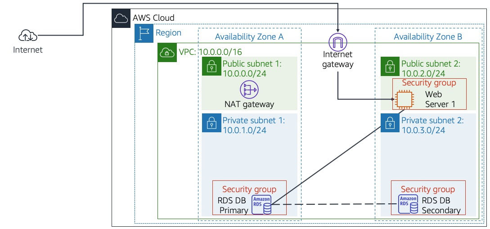

# Escalado y balanceo de carga de una arquitectura

## Información general del laboratorio

El escalado automático y el balanceo de carga son componentes críticos para mantener aplicaciones de Machine Learning altamente disponibles y capaces de manejar cargas variables. Este laboratorio le enseñará a implementar una arquitectura escalable usando Auto Scaling Groups, Elastic Load Balancers y CloudWatch para crear un sistema que se adapte automáticamente a la demanda.

Aprenderá a configurar una arquitectura multi-tier que puede escalar horizontalmente, distribuir la carga de manera eficiente y mantener alta disponibilidad incluso durante picos de tráfico o fallos de instancias.



## Objetivos

Al finalizar este laboratorio, podrá realizar lo siguiente:

- Configurar Application Load Balancer (ALB) para distribución de tráfico
- Implementar Auto Scaling Groups para escalado automático
- Crear Launch Templates para instancias estandarizadas
- Configurar políticas de escalado basadas en métricas
- Implementar health checks y auto-healing
- Configurar balanceo de carga para aplicaciones ML
- Optimizar costos con escalado predictivo
- Implementar deployment strategies (blue/green, rolling)

## Duración

El tiempo estimado para completar este laboratorio es de **45 minutos**.

## Tarea 1: Crear Launch Template para aplicaciones ML

Primero, crearemos un template estandarizado para nuestras instancias de ML.

1. **Navegue a EC2** en la consola de AWS.

2. **Cree un Launch Template**:
   - Elija **Launch Templates** > **Create launch template**
   - **Launch template name**: `ml-app-template`
   - **Template version description**: `ML application template v1.0`

3. **Configure la AMI y tipo de instancia**:
   - **AMI**: Amazon Linux 2 AMI (HVM)
   - **Instance type**: t3.medium
   - **Key pair**: Seleccione su key pair existente

4. **Configure almacenamiento**:
   - **Volume 1**: 20 GiB, gp3, encrypted
   - **Delete on termination**: Yes

5. **Configure redes**:
   - **Subnet**: No especificar (se configurará en ASG)
   - **Security groups**: Cree un nuevo SG llamado `ml-app-sg`
   - **Auto-assign public IP**: Enable

6. **Configure el Security Group**:
   - **Inbound rules**:
     - HTTP (80) from 0.0.0.0/0
     - HTTPS (443) from 0.0.0.0/0
     - SSH (22) from your IP
     - Custom TCP (8080) from 0.0.0.0/0 (para health checks)

7. **Agregue User Data Script**:
   ```bash
   #!/bin/bash
   yum update -y
   yum install -y python3 python3-pip docker git htop
   
   # Instalar dependencias de Python
   pip3 install flask boto3 scikit-learn numpy pandas requests
   
   # Crear directorio de aplicación
   mkdir -p /opt/ml-app
   cd /opt/ml-app
   
   # Crear aplicación ML simple
   cat > app.py << 'EOF'
   from flask import Flask, request, jsonify
   import boto3
   import json
   import time
   import random
   import numpy as np
   from sklearn.ensemble import RandomForestClassifier
   from sklearn.datasets import make_classification
   import logging
   from datetime import datetime
   import os
   import socket
   
   app = Flask(__name__)
   
   # Configurar logging
   logging.basicConfig(level=logging.INFO)
   logger = logging.getLogger(__name__)
   
   # Variables globales
   model = None
   instance_id = None
   
   def get_instance_metadata():
       """Obtener metadatos de la instancia"""
       try:
           response = requests.get(
               'http://169.254.169.254/latest/meta-data/instance-id',
               timeout=2
           )
           return response.text
       except:
           return socket.gethostname()
   
   def initialize_model():
       """Inicializar modelo ML"""
       global model, instance_id
       
       logger.info("Inicializando modelo ML...")
       
       # Obtener ID de instancia
       instance_id = get_instance_metadata()
       
       # Crear dataset sintético
       X, y = make_classification(
           n_samples=1000, n_features=20, n_informative=10,
           n_redundant=10, random_state=42
       )
       
       # Entrenar modelo
       model = RandomForestClassifier(n_estimators=50, random_state=42)
       model.fit(X, y)
       
       logger.info(f"Modelo inicializado en instancia {instance_id}")
   
   @app.route('/health')
   def health_check():
       """Health check endpoint"""
       return jsonify({
           'status': 'healthy',
           'instance_id': instance_id,
           'timestamp': datetime.utcnow().isoformat(),
           'model_loaded': model is not None
       })
   
   @app.route('/predict', methods=['POST'])
   def predict():
       """Endpoint de predicción"""
       start_time = time.time()
       
       try:
           if model is None:
               return jsonify({'error': 'Model not loaded'}), 500
           
           # Obtener datos del request
           data = request.get_json()
           features = data.get('features', [])
           
           if len(features) != 20:
               return jsonify({'error': 'Expected 20 features'}), 400
           
           # Simular latencia variable (para demostrar balanceo)
           if random.random() < 0.1:  # 10% de requests lentos
               time.sleep(random.uniform(0.5, 2.0))
           
           # Realizar predicción
           prediction = model.predict([features])[0]
           probability = model.predict_proba([features])[0].max()
           
           latency = time.time() - start_time
           
           response = {
               'prediction': int(prediction),
               'probability': float(probability),
               'instance_id': instance_id,
               'latency_ms': round(latency * 1000, 2),
               'timestamp': datetime.utcnow().isoformat()
           }
           
           logger.info(f"Prediction made: {response}")
           return jsonify(response)
           
       except Exception as e:
           logger.error(f"Error in prediction: {str(e)}")
           return jsonify({'error': str(e)}), 500
   
   @app.route('/load-test')
   def load_test():
       """Endpoint para generar carga CPU"""
       duration = int(request.args.get('duration', 30))
       
       start_time = time.time()
       while time.time() - start_time < duration:
           # Operación intensiva en CPU
           sum(i*i for i in range(10000))
       
       return jsonify({
           'message': f'Load test completed for {duration} seconds',
           'instance_id': instance_id
       })
   
   @app.route('/info')
   def instance_info():
       """Información de la instancia"""
       return jsonify({
           'instance_id': instance_id,
           'hostname': socket.gethostname(),
           'timestamp': datetime.utcnow().isoformat(),
           'model_loaded': model is not None,
           'python_version': sys.version
       })
   
   if __name__ == '__main__':
       initialize_model()
       app.run(host='0.0.0.0', port=80, debug=False)
   EOF
   
   # Crear servicio systemd
   cat > /etc/systemd/system/ml-app.service << 'EOF'
   [Unit]
   Description=ML Application
   After=network.target
   
   [Service]
   Type=simple
   User=root
   WorkingDirectory=/opt/ml-app
   ExecStart=/usr/bin/python3 /opt/ml-app/app.py
   Restart=always
   RestartSec=10
   
   [Install]
   WantedBy=multi-user.target
   EOF
   
   # Habilitar e iniciar servicio
   systemctl daemon-reload
   systemctl enable ml-app.service
   systemctl start ml-app.service
   
   # Instalar CloudWatch agent
   wget https://s3.amazonaws.com/amazoncloudwatch-agent/amazon_linux/amd64/latest/amazon-cloudwatch-agent.rpm
   rpm -U ./amazon-cloudwatch-agent.rpm
   
   # Configurar CloudWatch agent básico
   cat > /opt/aws/amazon-cloudwatch-agent/etc/amazon-cloudwatch-agent.json << 'EOF'
   {
       "agent": {
           "metrics_collection_interval": 60
       },
       "metrics": {
           "namespace": "MLApplication",
           "metrics_collected": {
               "cpu": {
                   "measurement": ["cpu_usage_idle", "cpu_usage_user", "cpu_usage_system"],
                   "metrics_collection_interval": 60
               },
               "mem": {
                   "measurement": ["mem_used_percent"],
                   "metrics_collection_interval": 60
               }
           }
       }
   }
   EOF
   
   # Iniciar CloudWatch agent
   /opt/aws/amazon-cloudwatch-agent/bin/amazon-cloudwatch-agent-ctl \
       -a fetch-config -m ec2 \
       -c file:/opt/aws/amazon-cloudwatch-agent/etc/amazon-cloudwatch-agent.json -s
   EOF
   ```

8. **Cree el Launch Template**.

## Tarea 2: Configurar Application Load Balancer

Configure un ALB para distribuir tráfico entre instancias.

9. **Cree un Application Load Balancer**:
   - Navegue a **EC2** > **Load Balancers**
   - Elija **Create Load Balancer** > **Application Load Balancer**

10. **Configure el load balancer básico**:
    - **Name**: `ml-app-alb`
    - **Scheme**: Internet-facing
    - **IP address type**: IPv4

11. **Configure listeners**:
    - **Protocol**: HTTP
    - **Port**: 80

12. **Configure Availability Zones**:
    - **VPC**: Default VPC
    - **Availability Zones**: Seleccione al menos 2 AZs
    - **Subnets**: Seleccione subredes públicas

13. **Configure Security Groups**:
    - Cree un nuevo security group: `alb-sg`
    - **Inbound rules**:
      - HTTP (80) from 0.0.0.0/0
      - HTTPS (443) from 0.0.0.0/0

14. **Configure Target Group**:
    - **Target type**: Instances
    - **Target group name**: `ml-app-targets`
    - **Protocol**: HTTP
    - **Port**: 80
    - **VPC**: Default VPC

15. **Configure Health Checks**:
    - **Health check path**: `/health`
    - **Health check interval**: 30 seconds
    - **Healthy threshold**: 2
    - **Unhealthy threshold**: 5
    - **Timeout**: 5 seconds
    - **Success codes**: 200

16. **Complete la creación** del ALB.

## Tarea 3: Crear Auto Scaling Group

Configure un ASG para escalado automático basado en demanda.

17. **Cree un Auto Scaling Group**:
    - Navegue a **EC2** > **Auto Scaling Groups**
    - Elija **Create Auto Scaling group**

18. **Configure el ASG**:
    - **Auto Scaling group name**: `ml-app-asg`
    - **Launch template**: Seleccione `ml-app-template`
    - **Version**: Latest

19. **Configure instance launch options**:
    - **VPC**: Default VPC
    - **Availability Zones and subnets**: Seleccione múltiples AZs
    - **Instance type requirements**: Override to use t3.medium, t3.large

20. **Configure advanced options**:
    - **Load balancing**: Attach to an existing load balancer
    - **Target groups**: Seleccione `ml-app-targets`
    - **Health checks**: Turn on ELB health checks
    - **Health check grace period**: 300 seconds

21. **Configure group size and scaling policies**:
    - **Desired capacity**: 2
    - **Minimum capacity**: 1
    - **Maximum capacity**: 6

22. **Configure scaling policies**:
    
    **Policy 1: Scale out based on CPU**
    - **Policy type**: Target tracking scaling
    - **Scaling policy name**: `cpu-scale-out`
    - **Metric type**: Average CPU utilization
    - **Target value**: 70%

    **Policy 2: Scale out based on ALB requests**
    - **Policy type**: Target tracking scaling
    - **Scaling policy name**: `alb-requests-scale`
    - **Metric type**: ALB request count per target
    - **Target value**: 100

23. **Configure notifications** (opcional):
    - Cree un tema SNS para notificaciones de escalado

24. **Review and create** el Auto Scaling Group.

## Tarea 4: Probar el escalado automático

Genere carga para probar las políticas de escalado.

25. **Espere a que las instancias estén en servicio**:
    ```bash
    # Verificar estado del target group
    aws elbv2 describe-target-health --target-group-arn arn:aws:elasticloadbalancing:region:account:targetgroup/ml-app-targets/...
    ```

26. **Obtenga la URL del Load Balancer**:
    ```bash
    # Obtener DNS name del ALB
    aws elbv2 describe-load-balancers --names ml-app-alb
    ```

27. **Pruebe la aplicación**:
    ```bash
    # Test básico
    curl http://your-alb-dns-name.region.elb.amazonaws.com/health
    
    # Test de predicción
    curl -X POST http://your-alb-dns-name.region.elb.amazonaws.com/predict \
         -H "Content-Type: application/json" \
         -d '{"features": [1,2,3,4,5,6,7,8,9,10,11,12,13,14,15,16,17,18,19,20]}'
    ```

28. **Genere carga para trigger escalado**:
    ```python
    # load_generator.py
    import requests
    import threading
    import time
    import random
    import json
    
    ALB_URL = "http://your-alb-dns-name.region.elb.amazonaws.com"
    
    def generate_predictions():
        """Generar predicciones continuamente"""
        while True:
            try:
                features = [random.uniform(-1, 1) for _ in range(20)]
                response = requests.post(
                    f"{ALB_URL}/predict",
                    json={"features": features},
                    timeout=10
                )
                print(f"Response from {response.json().get('instance_id', 'unknown')}: {response.status_code}")
                time.sleep(random.uniform(0.1, 0.5))
            except Exception as e:
                print(f"Error: {e}")
                time.sleep(1)
    
    def generate_cpu_load():
        """Generar carga CPU"""
        while True:
            try:
                duration = random.randint(10, 60)
                response = requests.get(f"{ALB_URL}/load-test?duration={duration}")
                print(f"Load test completed: {response.status_code}")
                time.sleep(random.uniform(5, 15))
            except Exception as e:
                print(f"Load test error: {e}")
                time.sleep(5)
    
    def monitor_instances():
        """Monitorear instancias activas"""
        seen_instances = set()
        while True:
            try:
                response = requests.get(f"{ALB_URL}/info")
                instance_id = response.json().get('instance_id', 'unknown')
                if instance_id not in seen_instances:
                    seen_instances.add(instance_id)
                    print(f"🆕 Nueva instancia detectada: {instance_id}")
                time.sleep(10)
            except Exception as e:
                print(f"Monitor error: {e}")
                time.sleep(10)
    
    if __name__ == "__main__":
        print("🚀 Iniciando generador de carga...")
        
        # Crear threads para diferentes tipos de carga
        threads = []
        
        # 5 threads para predicciones
        for i in range(5):
            t = threading.Thread(target=generate_predictions)
            t.daemon = True
            t.start()
            threads.append(t)
        
        # 2 threads para carga CPU
        for i in range(2):
            t = threading.Thread(target=generate_cpu_load)
            t.daemon = True
            t.start()
            threads.append(t)
        
        # 1 thread para monitoreo
        monitor_thread = threading.Thread(target=monitor_instances)
        monitor_thread.daemon = True
        monitor_thread.start()
        
        try:
            # Ejecutar por 10 minutos
            time.sleep(600)
        except KeyboardInterrupt:
            print("🛑 Deteniendo generador de carga...")
    ```

29. **Ejecute el generador de carga**:
    ```bash
    python3 load_generator.py
    ```

30. **Monitoree el escalado**:
    - Vaya a **EC2** > **Auto Scaling Groups**
    - Observe la pestaña **Activity** para ver eventos de escalado
    - Verifique **CloudWatch** > **Metrics** para métricas de CPU y ALB

## Tarea 5: Configurar escalado predictivo

Configure escalado basado en patrones históricos.

31. **Habilite escalado predictivo**:
    ```bash
    # Crear política de escalado predictivo
    aws autoscaling put-scaling-policy \
        --policy-name "predictive-scaling-policy" \
        --auto-scaling-group-name "ml-app-asg" \
        --policy-type "PredictiveScaling" \
        --predictive-scaling-configuration '{
            "MetricSpecifications": [
                {
                    "TargetValue": 70.0,
                    "PredefinedMetricSpecification": {
                        "PredefinedMetricType": "ASGAverageCPUUtilization"
                    }
                }
            ],
            "Mode": "ForecastAndScale",
            "SchedulingBufferTime": 300,
            "MaxCapacityBreachBehavior": "HonorMaxCapacity",
            "MaxCapacityBuffer": 10
        }'
    ```

## Tarea 6: Implementar deployment strategies

Configure estrategias de deployment para actualizaciones sin downtime.

32. **Cree una nueva versión del Launch Template**:
    ```bash
    # Crear nueva versión con aplicación actualizada
    aws ec2 create-launch-template-version \
        --launch-template-name ml-app-template \
        --source-version 1 \
        --version-description "Updated ML app v2.0" \
        --launch-template-data '{
            "UserData": "base64-encoded-updated-user-data"
        }'
    ```

33. **Configure rolling deployment**:
    ```python
    # rolling_deployment.py
    import boto3
    import time
    
    def rolling_deployment(asg_name, new_template_version, batch_size=1):
        """
        Implementar rolling deployment
        """
        asg_client = boto3.client('autoscaling')
        ec2_client = boto3.client('ec2')
        
        # Obtener configuración actual del ASG
        response = asg_client.describe_auto_scaling_groups(
            AutoScalingGroupNames=[asg_name]
        )
        asg = response['AutoScalingGroups'][0]
        current_capacity = asg['DesiredCapacity']
        
        print(f"🔄 Iniciando rolling deployment para {asg_name}")
        print(f"📊 Capacidad actual: {current_capacity}")
        
        # Actualizar launch template version
        asg_client.update_auto_scaling_group(
            AutoScalingGroupName=asg_name,
            LaunchTemplate={
                'LaunchTemplateName': 'ml-app-template',
                'Version': str(new_template_version)
            }
        )
        
        # Obtener instancias actuales
        instances = asg['Instances']
        
        # Rolling update por batches
        for i in range(0, len(instances), batch_size):
            batch = instances[i:i+batch_size]
            
            print(f"🔄 Procesando batch {i//batch_size + 1}")
            
            # Terminar instancias del batch
            instance_ids = [inst['InstanceId'] for inst in batch]
            
            for instance_id in instance_ids:
                print(f"🔄 Terminando instancia {instance_id}")
                asg_client.terminate_instance_in_auto_scaling_group(
                    InstanceId=instance_id,
                    ShouldDecrementDesiredCapacity=False
                )
            
            # Esperar a que las nuevas instancias estén en servicio
            wait_for_instances_in_service(asg_name, current_capacity)
            
            print(f"✅ Batch {i//batch_size + 1} completado")
            time.sleep(30)  # Pausa entre batches
        
        print("🎉 Rolling deployment completado")
    
    def wait_for_instances_in_service(asg_name, expected_capacity):
        """Esperar a que todas las instancias estén en servicio"""
        asg_client = boto3.client('autoscaling')
        
        while True:
            response = asg_client.describe_auto_scaling_groups(
                AutoScalingGroupNames=[asg_name]
            )
            asg = response['AutoScalingGroups'][0]
            
            in_service = len([i for i in asg['Instances'] if i['LifecycleState'] == 'InService'])
            
            print(f"📊 Instancias en servicio: {in_service}/{expected_capacity}")
            
            if in_service >= expected_capacity:
                break
            
            time.sleep(30)
    
    # Ejecutar rolling deployment
    if __name__ == "__main__":
        rolling_deployment("ml-app-asg", "2", batch_size=1)
    ```

## Tarea 7: Configurar monitoreo avanzado

Configure métricas y alertas específicas para la arquitectura escalable.

34. **Cree dashboard de monitoreo**:
    ```python
    # create_dashboard.py
    import boto3
    import json
    
    cloudwatch = boto3.client('cloudwatch')
    
    dashboard_body = {
        "widgets": [
            {
                "type": "metric",
                "properties": {
                    "metrics": [
                        ["AWS/ApplicationELB", "RequestCount", "LoadBalancer", "app/ml-app-alb/..."],
                        ["AWS/ApplicationELB", "TargetResponseTime", "LoadBalancer", "app/ml-app-alb/..."],
                        ["AWS/ApplicationELB", "HTTPCode_Target_2XX_Count", "LoadBalancer", "app/ml-app-alb/..."]
                    ],
                    "period": 300,
                    "stat": "Sum",
                    "region": "us-east-1",
                    "title": "ALB Metrics"
                }
            },
            {
                "type": "metric",
                "properties": {
                    "metrics": [
                        ["AWS/AutoScaling", "GroupDesiredCapacity", "AutoScalingGroupName", "ml-app-asg"],
                        ["AWS/AutoScaling", "GroupInServiceInstances", "AutoScalingGroupName", "ml-app-asg"],
                        ["AWS/AutoScaling", "GroupTotalInstances", "AutoScalingGroupName", "ml-app-asg"]
                    ],
                    "period": 300,
                    "stat": "Average",
                    "region": "us-east-1",
                    "title": "Auto Scaling Metrics"
                }
            },
            {
                "type": "metric",
                "properties": {
                    "metrics": [
                        ["MLApplication", "PredictionLatency"],
                        ["MLApplication", "PredictionCount"],
                        ["MLApplication", "PredictionErrors"]
                    ],
                    "period": 300,
                    "stat": "Average",
                    "region": "us-east-1",
                    "title": "ML Application Metrics"
                }
            }
        ]
    }
    
    response = cloudwatch.put_dashboard(
        DashboardName='ML-Scalable-Architecture',
        DashboardBody=json.dumps(dashboard_body)
    )
    
    print("✅ Dashboard creado exitosamente")
    ```

35. **Configure alertas para la arquitectura escalable**:
    ```bash
    # Alerta para alta latencia en ALB
    aws cloudwatch put-metric-alarm \
        --alarm-name "ALB-High-Response-Time" \
        --alarm-description "ALB response time is high" \
        --metric-name TargetResponseTime \
        --namespace AWS/ApplicationELB \
        --statistic Average \
        --period 300 \
        --threshold 1.0 \
        --comparison-operator GreaterThanThreshold \
        --evaluation-periods 2
    
    # Alerta para escalado máximo alcanzado
    aws cloudwatch put-metric-alarm \
        --alarm-name "ASG-Max-Capacity-Reached" \
        --alarm-description "Auto Scaling Group reached maximum capacity" \
        --metric-name GroupTotalInstances \
        --namespace AWS/AutoScaling \
        --statistic Maximum \
        --period 300 \
        --threshold 6 \
        --comparison-operator GreaterThanOrEqualToThreshold \
        --evaluation-periods 1
    ```

## Tarea 8: Optimización de costos

Configure optimizaciones para reducir costos operativos.

36. **Configure Spot Instances en ASG**:
    ```bash
    # Actualizar ASG para usar mix de On-Demand y Spot
    aws autoscaling update-auto-scaling-group \
        --auto-scaling-group-name ml-app-asg \
        --mixed-instances-policy '{
            "LaunchTemplate": {
                "LaunchTemplateSpecification": {
                    "LaunchTemplateName": "ml-app-template",
                    "Version": "$Latest"
                },
                "Overrides": [
                    {"InstanceType": "t3.medium"},
                    {"InstanceType": "t3.large"},
                    {"InstanceType": "m5.large"}
                ]
            },
            "InstancesDistribution": {
                "OnDemandBaseCapacity": 1,
                "OnDemandPercentageAboveBaseCapacity": 25,
                "SpotAllocationStrategy": "diversified"
            }
        }'
    ```

37. **Configure scheduled scaling para patrones predecibles**:
    ```bash
    # Escalado programado para horas pico
    aws autoscaling put-scheduled-update-group-action \
        --auto-scaling-group-name ml-app-asg \
        --scheduled-action-name "scale-up-morning" \
        --recurrence "0 8 * * MON-FRI" \
        --desired-capacity 4 \
        --min-size 2 \
        --max-size 6
    
    # Escalado programado para horas valle
    aws autoscaling put-scheduled-update-group-action \
        --auto-scaling-group-name ml-app-asg \
        --scheduled-action-name "scale-down-evening" \
        --recurrence "0 20 * * *" \
        --desired-capacity 2 \
        --min-size 1 \
        --max-size 6
    ```

## Desafío opcional: Blue/Green Deployment

Si completa las tareas principales, implemente blue/green deployment.

38. **Implemente blue/green deployment**:
    ```python
    # blue_green_deployment.py
    import boto3
    import time
    
    def blue_green_deployment(current_asg, new_template_version):
        """
        Implementar blue/green deployment
        """
        asg_client = boto3.client('autoscaling')
        elbv2_client = boto3.client('elbv2')
        
        # Crear nuevo ASG (Green)
        green_asg_name = f"{current_asg}-green"
        
        print(f"🟢 Creando Green ASG: {green_asg_name}")
        
        # Obtener configuración del ASG actual
        response = asg_client.describe_auto_scaling_groups(
            AutoScalingGroupNames=[current_asg]
        )
        blue_asg = response['AutoScalingGroups'][0]
        
        # Crear Green ASG con nueva versión
        asg_client.create_auto_scaling_group(
            AutoScalingGroupName=green_asg_name,
            LaunchTemplate={
                'LaunchTemplateName': 'ml-app-template',
                'Version': str(new_template_version)
            },
            MinSize=blue_asg['MinSize'],
            MaxSize=blue_asg['MaxSize'],
            DesiredCapacity=blue_asg['DesiredCapacity'],
            VPCZoneIdentifier=blue_asg['VPCZoneIdentifier'],
            TargetGroupARNs=blue_asg['TargetGroupARNs']
        )
        
        # Esperar a que Green esté listo
        wait_for_asg_ready(green_asg_name)
        
        # Realizar health checks en Green
        if perform_health_checks(green_asg_name):
            print("✅ Green deployment exitoso, cambiando tráfico...")
            
            # Cambiar tráfico de Blue a Green
            switch_traffic(blue_asg['TargetGroupARNs'][0], current_asg, green_asg_name)
            
            # Esperar y verificar
            time.sleep(300)  # 5 minutos de observación
            
            if verify_green_health():
                print("🎉 Blue/Green deployment completado")
                # Opcional: eliminar Blue ASG
                cleanup_blue_asg(current_asg)
            else:
                print("❌ Rollback necesario")
                rollback_to_blue(blue_asg['TargetGroupARNs'][0], current_asg, green_asg_name)
        else:
            print("❌ Green deployment falló, eliminando...")
            asg_client.delete_auto_scaling_group(
                AutoScalingGroupName=green_asg_name,
                ForceDelete=True
            )
    ```

## Limpieza de recursos

Al finalizar el laboratorio:

39. **Elimine recursos en orden**:
    ```bash
    # Eliminar Auto Scaling Group
    aws autoscaling delete-auto-scaling-group \
        --auto-scaling-group-name ml-app-asg \
        --force-delete
    
    # Eliminar Load Balancer
    aws elbv2 delete-load-balancer \
        --load-balancer-arn arn:aws:elasticloadbalancing:...
    
    # Eliminar Target Group
    aws elbv2 delete-target-group \
        --target-group-arn arn:aws:elasticloadbalancing:...
    
    # Eliminar Launch Template
    aws ec2 delete-launch-template \
        --launch-template-name ml-app-template
    ```

## Conclusión

En este laboratorio ha aprendido a:

- ✅ Configurar Application Load Balancer para distribución de tráfico
- ✅ Implementar Auto Scaling Groups con políticas inteligentes
- ✅ Crear Launch Templates estandarizados para aplicaciones ML
- ✅ Configurar escalado basado en múltiples métricas
- ✅ Implementar health checks y auto-healing
- ✅ Optimizar costos con Spot Instances y scheduled scaling
- ✅ Configurar deployment strategies para actualizaciones sin downtime
- ✅ Monitorear arquitecturas escalables con CloudWatch

Una arquitectura escalable bien diseñada es fundamental para mantener aplicaciones de ML funcionando de manera eficiente y rentable en producción.

---

## Recursos adicionales

- [Guía de Auto Scaling](https://docs.aws.amazon.com/autoscaling/)
- [Application Load Balancer](https://docs.aws.amazon.com/elasticloadbalancing/latest/application/)
- [EC2 Launch Templates](https://docs.aws.amazon.com/ec2/latest/userguide/ec2-launch-templates.html)
- [Mejores prácticas de escalado](https://docs.aws.amazon.com/autoscaling/ec2/userguide/auto-scaling-benefits.html)
